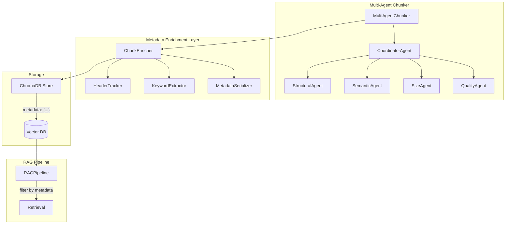

# Design Document: Chunk Metadata Enrichment

## Overview

This design describes how to enrich text chunks with structured JSON metadata to improve RAG retrieval quality. The system integrates with the existing Multi-Agent Chunker architecture, adding a new MetadataAgent and ChunkEnricher component that work alongside existing agents.

The metadata enrichment happens as a post-processing step after chunks are created, ensuring backward compatibility with existing chunks while providing rich contextual information for new chunks.

## Architecture



## Components and Interfaces

### 1. ChunkMetadata Dataclass

```python
@dataclass
class ChunkMetadata:
    """Structured metadata for a chunk."""
    # Identification
    chunk_id: str                          # UUID format
    
    # Header context
    parent_header: Optional[str]           # Immediate parent header
    section_title: Optional[str]           # Current section title
    header_hierarchy: List[str]            # Full path: ["Ch1", "Sec1.1", "Sub1.1.1"]
    
    # Content analysis
    keywords: List[str]                    # Max 10 keywords
    chunk_type: str                        # "content", "header", "list", "table", etc.
    
    # Document context
    document_title: Optional[str]          # From first h1 or filename
    page_number: Optional[int]             # If available
    language: str                          # Detected language code
    
    # Statistics
    char_count: int
    word_count: int
    
    # Relationships
    previous_chunk_id: Optional[str]
    next_chunk_id: Optional[str]
    sibling_chunk_ids: List[str]           # Chunks with same parent_header
    
    def to_flat_dict(self) -> Dict[str, Any]:
        """Serialize to ChromaDB-compatible flat dict."""
        return {
            "chunk_id": self.chunk_id,
            "parent_header": self.parent_header or "",
            "section_title": self.section_title or "",
            "header_hierarchy_json": json.dumps(self.header_hierarchy),
            "keywords_json": json.dumps(self.keywords),
            "chunk_type": self.chunk_type,
            "document_title": self.document_title or "",
            "page_number": self.page_number or -1,
            "language": self.language,
            "char_count": self.char_count,
            "word_count": self.word_count,
            "previous_chunk_id": self.previous_chunk_id or "",
            "next_chunk_id": self.next_chunk_id or "",
            "sibling_chunk_ids_json": json.dumps(self.sibling_chunk_ids)
        }
    
    @classmethod
    def from_flat_dict(cls, data: Dict[str, Any]) -> "ChunkMetadata":
        """Deserialize from ChromaDB flat dict."""
        return cls(
            chunk_id=data.get("chunk_id", ""),
            parent_header=data.get("parent_header") or None,
            section_title=data.get("section_title") or None,
            header_hierarchy=json.loads(data.get("header_hierarchy_json", "[]")),
            keywords=json.loads(data.get("keywords_json", "[]")),
            chunk_type=data.get("chunk_type", "content"),
            document_title=data.get("document_title") or None,
            page_number=data.get("page_number") if data.get("page_number", -1) >= 0 else None,
            language=data.get("language", "auto"),
            char_count=data.get("char_count", 0),
            word_count=data.get("word_count", 0),
            previous_chunk_id=data.get("previous_chunk_id") or None,
            next_chunk_id=data.get("next_chunk_id") or None,
            sibling_chunk_ids=json.loads(data.get("sibling_chunk_ids_json", "[]"))
        )
```

### 2. HeaderTracker Component

```python
class HeaderTracker:
    """Tracks header hierarchy during document processing."""
    
    def __init__(self):
        self.header_stack: List[Tuple[int, str]] = []  # (level, text)
        self.document_title: Optional[str] = None
    
    def process_header(self, header_text: str, level: int) -> None:
        """Update stack when a header is encountered."""
        # Pop headers at same or lower level
        while self.header_stack and self.header_stack[-1][0] >= level:
            self.header_stack.pop()
        
        # Push new header
        self.header_stack.append((level, header_text))
        
        # Set document title from first h1
        if level == 1 and self.document_title is None:
            self.document_title = header_text
    
    def get_hierarchy(self) -> List[str]:
        """Get current header hierarchy as list."""
        return [h[1] for h in self.header_stack]
    
    def get_parent_header(self) -> Optional[str]:
        """Get the most recent (deepest) header."""
        return self.header_stack[-1][1] if self.header_stack else None
    
    def reset(self) -> None:
        """Reset for new document."""
        self.header_stack = []
        self.document_title = None
```

### 3. KeywordExtractor Component

```python
class KeywordExtractor:
    """Extracts keywords from chunk text."""
    
    STOPWORDS = {
        "tr": {"ve", "ile", "bir", "bu", "için", "de", "da", ...},
        "en": {"the", "a", "an", "is", "are", "was", "were", ...}
    }
    
    def __init__(self, use_llm: bool = False, llm_model: str = None):
        self.use_llm = use_llm
        self.llm_model = llm_model
    
    def extract(self, text: str, language: str = "auto", max_keywords: int = 10) -> List[str]:
        """Extract keywords from text."""
        word_count = len(text.split())
        
        # Limit keywords for short chunks
        if word_count < 20:
            max_keywords = min(3, max_keywords)
        
        if self.use_llm:
            keywords = self._extract_with_llm(text, max_keywords)
        else:
            keywords = self._extract_with_tfidf(text, max_keywords)
        
        # Filter stopwords and normalize
        stopwords = self.STOPWORDS.get(language, set())
        keywords = [
            kw.lower().strip() 
            for kw in keywords 
            if kw.lower().strip() not in stopwords
        ]
        
        return keywords[:max_keywords]
    
    def _extract_with_tfidf(self, text: str, max_keywords: int) -> List[str]:
        """Extract using TF-IDF scoring."""
        # Simple word frequency approach
        words = re.findall(r'\b\w{3,}\b', text.lower())
        word_freq = Counter(words)
        return [word for word, _ in word_freq.most_common(max_keywords)]
    
    def _extract_with_llm(self, text: str, max_keywords: int) -> List[str]:
        """Extract using LLM for semantic keywords."""
        prompt = f"Extract {max_keywords} key concepts from this text as a JSON array: {text[:500]}"
        # Call LLM and parse response
        ...
```

### 4. ChunkEnricher Component

```python
class ChunkEnricher:
    """Main component for enriching chunks with metadata."""
    
    def __init__(self, config: EnricherConfig = None):
        self.config = config or EnricherConfig()
        self.header_tracker = HeaderTracker()
        self.keyword_extractor = KeywordExtractor(
            use_llm=self.config.use_llm_keywords,
            llm_model=self.config.llm_model
        )
        self.chunk_registry: Dict[str, ChunkMetadata] = {}
    
    def enrich_chunks(
        self, 
        chunks: List[MultiAgentChunk],
        document_title: Optional[str] = None,
        page_numbers: Optional[List[int]] = None
    ) -> List[MultiAgentChunk]:
        """Enrich a list of chunks with metadata."""
        
        self.header_tracker.reset()
        enriched_chunks = []
        chunk_ids = []
        
        # First pass: generate IDs and track headers
        for i, chunk in enumerate(chunks):
            chunk_id = str(uuid.uuid4())
            chunk_ids.append(chunk_id)
            
            # Detect and process headers in chunk
            self._process_chunk_headers(chunk.text)
        
        # Reset for second pass
        self.header_tracker.reset()
        
        # Second pass: create metadata
        for i, chunk in enumerate(chunks):
            # Process headers again
            self._process_chunk_headers(chunk.text)
            
            # Detect chunk type
            chunk_type = self._detect_chunk_type(chunk.text)
            
            # Detect language
            language = self._detect_language(chunk.text)
            
            # Extract keywords
            keywords = self.keyword_extractor.extract(
                chunk.text, 
                language=language,
                max_keywords=10
            )
            
            # Create metadata
            metadata = ChunkMetadata(
                chunk_id=chunk_ids[i],
                parent_header=self.header_tracker.get_parent_header(),
                section_title=self._get_section_title(chunk.text),
                header_hierarchy=self.header_tracker.get_hierarchy().copy(),
                keywords=keywords,
                chunk_type=chunk_type,
                document_title=document_title or self.header_tracker.document_title,
                page_number=page_numbers[i] if page_numbers and i < len(page_numbers) else None,
                language=language,
                char_count=len(chunk.text),
                word_count=len(chunk.text.split()),
                previous_chunk_id=chunk_ids[i-1] if i > 0 else None,
                next_chunk_id=chunk_ids[i+1] if i < len(chunks)-1 else None,
                sibling_chunk_ids=[]  # Populated in third pass
            )
            
            # Attach metadata to chunk
            chunk.metadata = metadata.to_flat_dict()
            enriched_chunks.append(chunk)
            self.chunk_registry[chunk_ids[i]] = metadata
        
        # Third pass: populate sibling relationships
        self._populate_siblings(enriched_chunks)
        
        return enriched_chunks
    
    def _detect_chunk_type(self, text: str) -> str:
        """Detect the type of chunk content."""
        text_lower = text.strip().lower()
        
        if text.strip().startswith('#'):
            return "header"
        elif re.match(r'^[\d\-\*\•]\s', text.strip()):
            return "list"
        elif '|' in text and text.count('|') > 2:
            return "table"
        elif re.search(r'```|def |class |function ', text):
            return "code"
        elif re.search(r'\d+[\.\)]\s+.*\?', text):
            return "question"
        elif '' in text_lower or 'figure' in text_lower:
            return "image_caption"
        else:
            return "content"
    
    def _detect_language(self, text: str) -> str:
        """Detect text language."""
        # Simple heuristic based on character patterns
        turkish_chars = set('çğıöşüÇĞİÖŞÜ')
        if any(c in text for c in turkish_chars):
            return "tr"
        return "en"
```

### 5. Integration with MultiAgentChunker

```python
# Updated MultiAgentChunk dataclass
@dataclass
class MultiAgentChunk:
    """A chunk produced by multi-agent system."""
    text: str
    start_pos: int
    end_pos: int
    
    # Quality metrics
    quality_score: float = 0.0
    confidence: float = 0.0
    
    # Agent decisions
    structural_decision: str = ""
    semantic_decision: str = ""
    size_decision: str = ""
    quality_decision: str = ""
    
    # Metadata (NEW)
    metadata: Dict[str, Any] = field(default_factory=dict)
    
    # Statistics
    word_count: int = 0
    char_count: int = 0
    improvement_iterations: int = 0
    processing_time: float = 0.0
    reasoning: str = ""


# Updated MultiAgentChunker
class MultiAgentChunker:
    def __init__(self, config: MultiAgentConfig = None):
        self.config = config or MultiAgentConfig()
        self.coordinator = CoordinatorAgent(...)
        
        # NEW: Initialize enricher
        self.enricher = ChunkEnricher(EnricherConfig(
            use_llm_keywords=self.config.use_llm,
            llm_model=self.config.llm_model
        ))
    
    def chunk_text(self, text: str, document_title: str = None) -> ChunkingResult:
        """Chunk text with metadata enrichment."""
        # ... existing chunking logic ...
        
        # NEW: Enrich chunks with metadata
        enriched_chunks = self.enricher.enrich_chunks(
            final_chunks,
            document_title=document_title
        )
        
        # Calculate metadata statistics
        metadata_stats = self._calculate_metadata_stats(enriched_chunks)
        
        return ChunkingResult(
            chunks=enriched_chunks,
            total_processing_time=total_time,
            agent_metrics=agent_metrics,
            quality_summary=quality_summary,
            metadata_stats=metadata_stats  # NEW
        )
```

## Data Models

### EnricherConfig

```python
@dataclass
class EnricherConfig:
    """Configuration for chunk enrichment."""
    use_llm_keywords: bool = False
    llm_model: str = "llama-3.1-8b-instant"
    max_keywords: int = 10
    detect_language: bool = True
    track_relationships: bool = True
```

### MetadataStats

```python
@dataclass
class MetadataStats:
    """Statistics about metadata in a chunking result."""
    total_chunks: int
    chunks_with_headers: int
    header_coverage_percent: float
    avg_keywords_per_chunk: float
    language_distribution: Dict[str, int]
    chunk_type_distribution: Dict[str, int]
```

## Correctness Properties

*A property is a characteristic or behavior that should hold true across all valid executions of a system—essentially, a formal statement about what the system should do. Properties serve as the bridge between human-readable specifications and machine-verifiable correctness guarantees.*

### Property 1: Metadata Structure Completeness

*For any* chunk produced by ChunkEnricher, the metadata SHALL contain all required fields (chunk_id, parent_header, section_title, header_hierarchy, keywords, chunk_type, document_title, page_number, language, char_count, word_count, previous_chunk_id, next_chunk_id, sibling_chunk_ids) with valid types.

**Validates: Requirements 1.1, 1.2, 1.3, 1.5**

### Property 2: Chunk ID Uniqueness

*For any* set of chunks produced from a document, all chunk_ids SHALL be unique and in valid UUID format.

**Validates: Requirements 1.2**

### Property 3: Header Hierarchy Consistency

*For any* chunk with a non-empty header_hierarchy, the parent_header SHALL equal the last element of header_hierarchy, and the hierarchy SHALL be ordered from root to leaf.

**Validates: Requirements 2.3, 2.4**

### Property 4: Keyword Constraints

*For any* chunk, the keywords list SHALL contain at most 10 items, all in lowercase, and none matching stopwords for the detected language. For chunks with fewer than 20 words, keywords SHALL be limited to 3.

**Validates: Requirements 1.4, 3.3, 3.4, 3.5**

### Property 5: Document Title Propagation

*For any* set of chunks from the same document, all chunks SHALL have the same document_title value.

**Validates: Requirements 4.2**

### Property 6: Chunk Relationship Consistency

*For any* chunk at position i in a sequence, if i > 0 then previous_chunk_id SHALL reference chunk at position i-1, and if i < n-1 then next_chunk_id SHALL reference chunk at position i+1.

**Validates: Requirements 5.1, 5.2**

### Property 7: Metadata Serialization Round-Trip

*For any* ChunkMetadata object, calling to_flat_dict() followed by from_flat_dict() SHALL produce an equivalent object.

**Validates: Requirements 7.1, 7.2, 7.4**

### Property 8: Backward Compatibility

*For any* chunk retrieved from ChromaDB that lacks enriched metadata fields, the RAG_Pipeline SHALL process it without errors using only the text field.

**Validates: Requirements 6.1, 6.2, 6.5**

### Property 9: Chunk Type Classification

*For any* chunk, the chunk_type SHALL be one of the allowed values: "content", "header", "list", "table", "code", "question", "image_caption".

**Validates: Requirements 1.5**

### Property 10: Sibling Relationship Symmetry

*For any* two chunks A and B, if A.sibling_chunk_ids contains B.chunk_id, then B.sibling_chunk_ids SHALL contain A.chunk_id.

**Validates: Requirements 5.5**

## Error Handling

| Error Scenario | Handling Strategy |
|----------------|-------------------|
| Header parsing fails | Use empty header_hierarchy, log warning |
| Keyword extraction fails | Return empty keywords list, log warning |
| Language detection fails | Default to "auto" |
| UUID generation fails | Fallback to timestamp-based ID |
| Missing document title | Use "Unknown" as default |
| ChromaDB metadata size limit | Truncate keywords/hierarchy if needed |
| Invalid chunk text (empty) | Skip enrichment, use minimal metadata |

## Testing Strategy

### Unit Tests
- Test HeaderTracker with various header sequences
- Test KeywordExtractor with different text lengths and languages
- Test ChunkMetadata serialization/deserialization
- Test chunk type detection for each type
- Test language detection accuracy

### Property-Based Tests
- Property 1: Metadata structure completeness (100+ iterations)
- Property 2: Chunk ID uniqueness across large batches
- Property 3: Header hierarchy consistency with random documents
- Property 4: Keyword constraints with various text lengths
- Property 5: Document title propagation across chunk sets
- Property 6: Chunk relationship consistency
- Property 7: Serialization round-trip
- Property 8: Backward compatibility with legacy chunks
- Property 9: Chunk type classification validity
- Property 10: Sibling relationship symmetry

### Integration Tests
- End-to-end: Document → MultiAgentChunker → Enriched Chunks → ChromaDB
- RAG retrieval with metadata filtering
- Migration utility for existing chunks
