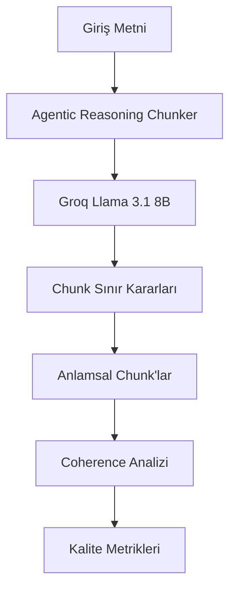

# Agentic Chunking Sistemi - Teknik Rehber

## 🎯 Genel Bakış

Agentic Chunking, geleneksel sabit boyutlu chunking yöntemlerinin aksine, **yapay zeka tabanlı akıllı karar verme** ile metinleri anlamsal olarak tutarlı parçalara bölen gelişmiş bir sistemdir. Bu sistem, **Groq Llama 3.1 8B** modelini kullanarak her chunk sınırını akıllıca belirler.

## 🧠 Agentic Mantığı Nedir?

### Geleneksel vs Agentic Yaklaşım

**Geleneksel Chunking:**
```
Metin → Sabit boyut (örn: 512 token) → Chunk'lar
```
- Cümle ortasında kesilir
- Anlamsal bütünlük göz ardı edilir
- Mekanik, esnek olmayan yaklaşım

**Agentic Chunking:**
```
Metin → LLM Analizi → Akıllı Karar → Anlamsal Chunk'lar
```
- Her chunk sınırı için LLM'den görüş alınır
- Anlamsal tutarlılık öncelikli
- Dinamik, içerik-farkında yaklaşım

## 🔍 Sistem Mimarisi

### 1. Ana Bileşenler



### 2. Temel Akış

1. **Metin Hazırlama**: Giriş metni temizlenir ve normalize edilir
2. **Sliding Window**: Metin üzerinde kayan pencere ile ilerler
3. **LLM Consultation**: Her potansiyel chunk sınırı için LLM'ye danışır
4. **Karar Verme**: LLM'nin önerisi doğrultusunda chunk sınırı belirlenir
5. **Coherence Hesaplama**: Oluşan chunk'ların anlamsal tutarlılığı ölçülür

## 🤖 LLM Reasoning Süreci

### Prompt Yapısı

Sistem, her chunk sınırı kararı için LLM'ye şu bilgileri sunar:

```python
prompt = f"""
Sen bir metin analiz uzmanısın. Verilen metin parçasını analiz et ve 
bu noktada chunk sınırı olup olmayacağına karar ver.

MEVCUT CHUNK:
{current_chunk}

SONRAKİ CÜMLE:
{next_sentence}

KARAR VER:
1. Bu noktada chunk'ı sonlandır mı?
2. Neden bu kararı verdin?

JSON formatında yanıtla:
{{
    "should_end_chunk": true/false,
    "reasoning": "Karar gerekçesi"
}}
"""
```

### LLM'nin Değerlendirme Kriterleri

LLM şu faktörleri göz önünde bulundurur:

1. **Anlamsal Bütünlük**: Mevcut chunk'ın konusu tamamlandı mı?
2. **Konu Geçişi**: Sonraki cümle yeni bir konuya mı geçiyor?
3. **Mantıksal Akış**: Chunk'ın mantıksal bir sonucu var mı?
4. **Boyut Optimizasyonu**: Chunk çok küçük veya çok büyük mü?

### Örnek LLM Reasoning

```json
{
    "should_end_chunk": true,
    "reasoning": "Mevcut chunk fotosintez sürecinin temel aşamalarını tamamlamış. Sonraki cümle hücresel solunum konusuna geçiş yapıyor. Bu noktada chunk'ı sonlandırmak anlamsal tutarlılığı koruyacaktır."
}
```

## 📊 Coherence (Tutarlılık) Analizi

### Semantic Coherence Nedir?

**Semantic Coherence**, bir chunk içindeki cümlelerin anlamsal olarak ne kadar tutarlı ve birbiriyle ilişkili olduğunu ölçen bir metriktir.

### Hesaplama Yöntemi

1. **Embedding Üretimi**: Her cümle için Alibaba-NLP/gte-multilingual-base modeli ile embedding üretilir
2. **Cosine Similarity**: Cümleler arası benzerlik hesaplanır
3. **Ortalama Coherence**: Tüm cümle çiftlerinin benzerlik ortalaması alınır

```python
def calculate_semantic_coherence(sentences):
    embeddings = [get_embedding(sentence) for sentence in sentences]
    similarities = []
    
    for i in range(len(embeddings)):
        for j in range(i+1, len(embeddings)):
            similarity = cosine_similarity(embeddings[i], embeddings[j])
            similarities.append(similarity)
    
    return np.mean(similarities)
```

### Coherence Skorları

- **0.8 - 1.0**: Mükemmel tutarlılık (Çok yüksek anlamsal bağlantı)
- **0.6 - 0.8**: İyi tutarlılık (Güçlü anlamsal bağlantı)
- **0.4 - 0.6**: Orta tutarlılık (Orta düzey anlamsal bağlantı)
- **0.0 - 0.4**: Düşük tutarlılık (Zayıf anlamsal bağlantı)

## 🔧 Teknik Implementasyon

### Ana Sınıf: AgenticReasoningChunker

```python
class AgenticReasoningChunker:
    def __init__(self):
        self.llm_client = GroqClient()
        self.embedding_model = "Alibaba-NLP/gte-multilingual-base"
        
    def chunk_text(self, text: str) -> List[Chunk]:
        sentences = self.split_into_sentences(text)
        chunks = []
        current_chunk = []
        
        for sentence in sentences:
            # LLM'ye danış
            decision = self.consult_llm(current_chunk, sentence)
            
            if decision["should_end_chunk"] and current_chunk:
                # Chunk'ı sonlandır
                chunk = self.create_chunk(current_chunk, decision["reasoning"])
                chunks.append(chunk)
                current_chunk = [sentence]
            else:
                current_chunk.append(sentence)
        
        return chunks
```

### LLM Consultation

```python
def consult_llm(self, current_chunk: List[str], next_sentence: str) -> dict:
    prompt = self.build_prompt(current_chunk, next_sentence)
    
    response = self.llm_client.chat.completions.create(
        model="llama-3.1-8b-instant",
        messages=[{"role": "user", "content": prompt}],
        response_format={"type": "json_object"}
    )
    
    return json.loads(response.choices[0].message.content)
```

## 📈 Kalite Metrikleri

### 1. Chunk Seviyesi Metrikler

- **Boyut**: Token/karakter sayısı
- **Cümle Sayısı**: Chunk içindeki cümle adedi
- **Coherence Skoru**: Anlamsal tutarlılık değeri
- **Reasoning Quality**: LLM'nin karar kalitesi

### 2. Genel Test Metrikleri

- **Toplam Chunk Sayısı**: Üretilen chunk adedi
- **Ortalama Chunk Boyutu**: Chunk'ların ortalama uzunluğu
- **Genel Coherence**: Tüm chunk'ların ortalama tutarlılığı
- **İşlem Süresi**: Chunking işleminin toplam süresi

## 🎯 Avantajlar

### Geleneksel Yöntemlere Göre Üstünlükler

1. **Anlamsal Farkındalık**: İçeriği anlayarak böler
2. **Dinamik Boyutlama**: İçeriğe göre optimal boyut
3. **Konu Tutarlılığı**: Her chunk tek bir konuya odaklanır
4. **Kalite Garantisi**: LLM tabanlı kalite kontrolü

### RAG Sistemlerinde Faydalar

1. **Daha İyi Retrieval**: Anlamsal tutarlı chunk'lar daha iyi eşleşir
2. **Gelişmiş Context**: LLM'ye daha tutarlı bağlam sağlar
3. **Azaltılmış Noise**: İlgisiz bilgi karışımı minimize edilir
4. **Artırılmış Doğruluk**: Daha doğru ve tutarlı yanıtlar

## 🔍 Örnek Çalışma Senaryosu

### Giriş Metni
```
Fotosintez, bitkilerin güneş ışığını kullanarak gıda ürettiği süreçtir. 
Bu süreç kloroplastlarda gerçekleşir. Işık reaksiyonları tilakoidlerde, 
karanlık reaksiyonları ise stromada meydana gelir. Hücresel solunum 
ise gıdaların parçalanarak enerji üretildiği süreçtir.
```

### Agentic Chunking Süreci

1. **İlk Cümle Analizi**:
   - LLM: "Fotosintez konusu başlıyor, devam et"
   - Karar: `should_end_chunk: false`

2. **İkinci Cümle Analizi**:
   - LLM: "Fotosintez detayları devam ediyor"
   - Karar: `should_end_chunk: false`

3. **Üçüncü Cümle Analizi**:
   - LLM: "Fotosintez süreç detayları tamamlandı"
   - Karar: `should_end_chunk: false`

4. **Dördüncü Cümle Analizi**:
   - LLM: "Yeni konu (hücresel solunum) başlıyor, chunk'ı sonlandır"
   - Karar: `should_end_chunk: true`

### Sonuç Chunk'ları

**Chunk 1** (Coherence: 0.85):
```
Fotosintez, bitkilerin güneş ışığını kullanarak gıda ürettiği süreçtir. 
Bu süreç kloroplastlarda gerçekleşir. Işık reaksiyonları tilakoidlerde, 
karanlık reaksiyonları ise stromada meydana gelir.
```

**Chunk 2** (Coherence: 0.92):
```
Hücresel solunum ise gıdaların parçalanarak enerji üretildiği süreçtir.
```

## 🚀 Gelecek Geliştirmeler

1. **Multi-Modal Support**: Görsel içerik analizi
2. **Domain-Specific Models**: Alan özel LLM'ler
3. **Real-time Processing**: Canlı metin işleme
4. **Advanced Metrics**: Daha sofistike kalite metrikleri

## 📚 Sonuç

Agentic Chunking sistemi, geleneksel metin bölme yöntemlerinin ötesinde, yapay zeka destekli akıllı karar verme ile anlamsal olarak tutarlı ve kaliteli chunk'lar üretir. Bu sistem, RAG uygulamalarında daha iyi performans ve doğruluk sağlar.