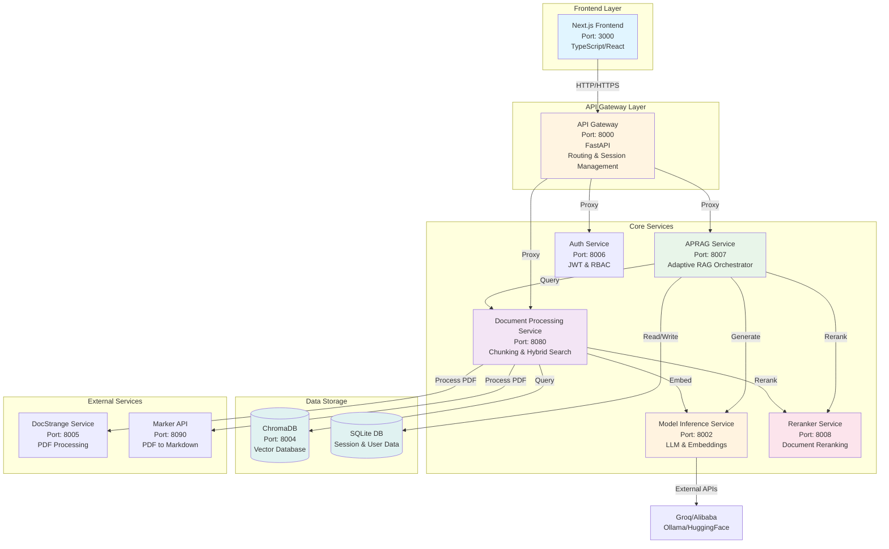
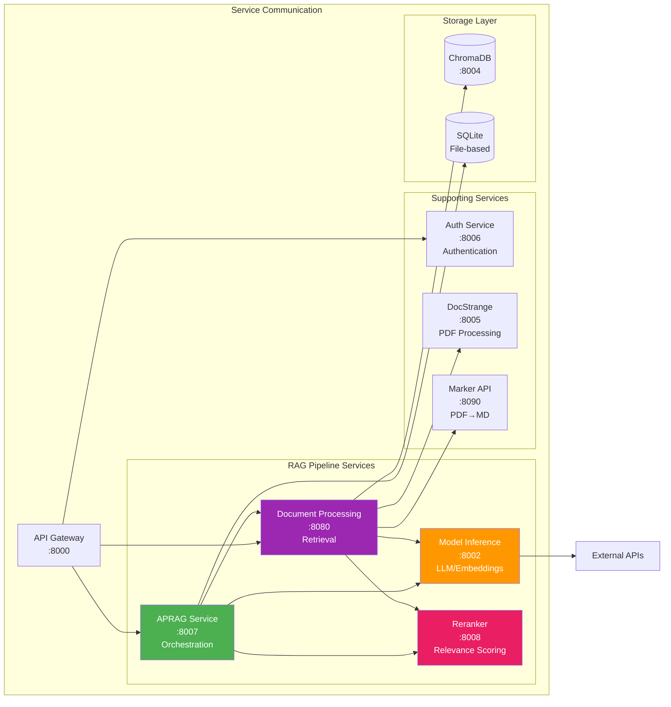
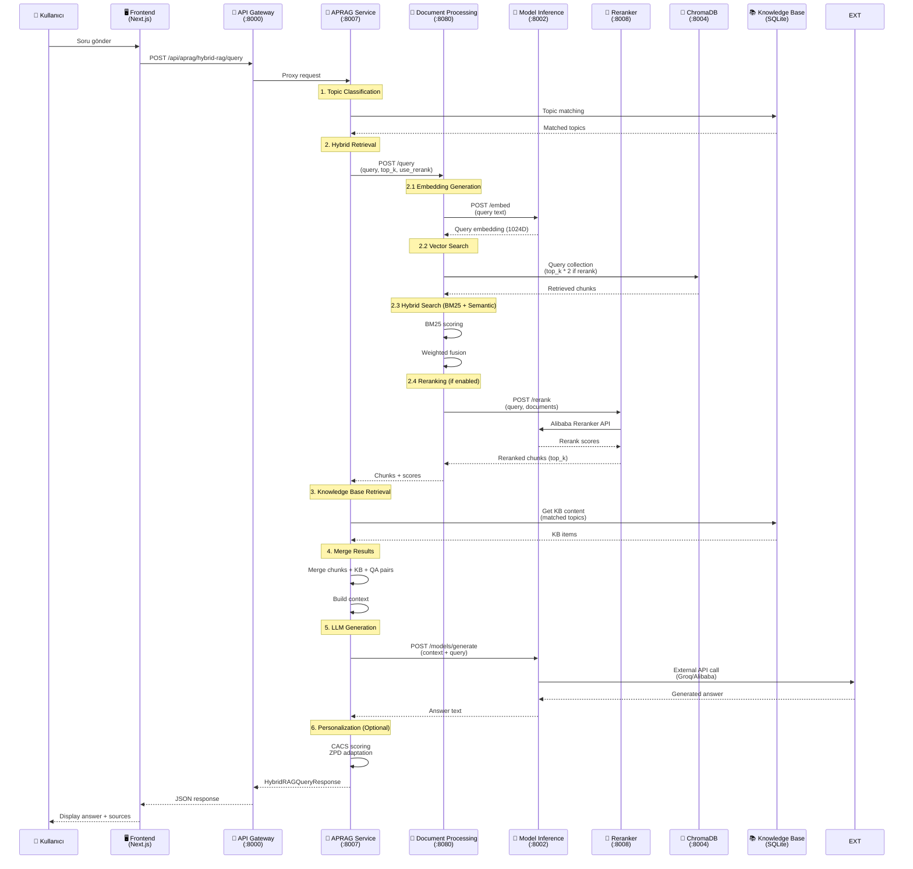
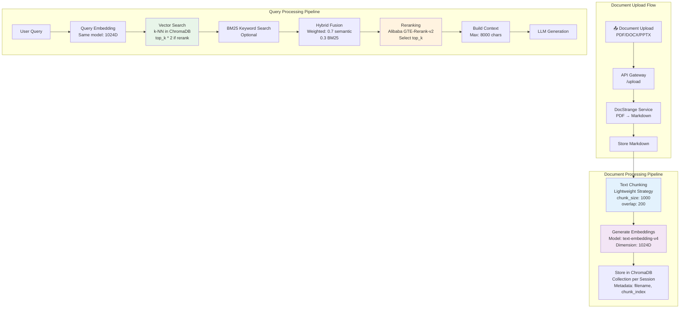
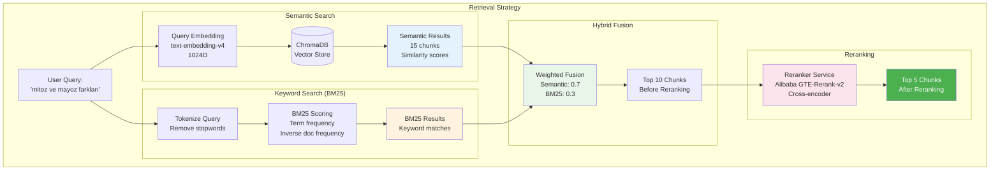
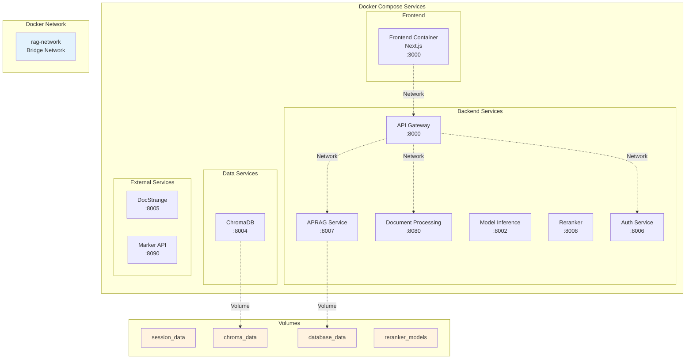

# 🏗️ RAG Altyapısı - Detaylı Görsel Analiz ve Şematizasyon

## 📋 İçindekiler
1. [Genel Sistem Mimarisi](#genel-sistem-mimarisi)
2. [Mikroservis Yapısı](#mikroservis-yapısı)
3. [RAG Query Akış Diyagramı](#rag-query-akış-diyagramı)
4. [Document Processing Pipeline](#document-processing-pipeline)
5. [Hybrid Retrieval Sistemi](#hybrid-retrieval-sistemi)
6. [APRAG (Adaptive Personalized RAG) Mimarisi](#aprag-mimarisi)
7. [Veri Akış Şeması](#veri-akış-şeması)

---

## 🏛️ Genel Sistem Mimarisi

---

## 🔧 Mikroservis Yapısı

---

## 🔄 RAG Query Akış Diyagramı

---

## 📥 Document Processing Pipeline

---

## 🔍 Hybrid Retrieval Sistemi

---

## 🎯 APRAG (Adaptive Personalized RAG) Mimarisi

```mermaid
graph TB
    subgraph "APRAG Service Architecture"
        INPUT[User Query + Session ID]
        
        subgraph "Topic Classification"
            TC[Topic Classifier<br/>Keyword + LLM<br/>Confidence Score]
            INPUT --> TC
            TC --> TOPICS[Matched Topics<br/>+ Confidence]
        end
        
        subgraph "Hybrid Knowledge Retriever"
            HKR[Hybrid Knowledge Retriever]
            TOPICS --> HKR
            
            subgraph "Retrieval Sources"
                CHUNKS[Document Chunks<br/>from ChromaDB]
                KB[Knowledge Base<br/>from SQLite]
                QA[QA Pairs<br/>from SQLite]
            end
            
            HKR --> CHUNKS
            HKR --> KB
            HKR --> QA
        end
        
        subgraph "Reranking"
            RERANK[Reranker<br/>Alibaba API]
            CHUNKS --> RERANK
            RERANK --> RERANKED[Reranked Chunks<br/>top_k]
        end
        
        subgraph "Context Building"
            MERGE[Merge Results<br/>Chunks + KB + QA]
            RERANKED --> MERGE
            KB --> MERGE
            QA --> MERGE
            MERGE --> CONTEXT[Context String<br/>Max 8000 chars]
        end
        
        subgraph "LLM Generation"
            LLM[LLM Call<br/>Groq/Alibaba<br/>qwen-plus/llama-3.1]
            CONTEXT --> LLM
            LLM --> ANSWER[Generated Answer]
        end
        
        subgraph "Personalization (Optional)"
            CACS[CACS Scoring<br/>Conversation-Aware]
            ZPD[ZPD Adaptation<br/>Zone of Proximal Dev]
            BLOOM[Bloom Level<br/>Classification]
            COG[Cognitive Load<br/>Assessment]
            
            ANSWER --> CACS
            CACS --> ZPD
            ZPD --> BLOOM
            BLOOM --> COG
            COG --> PERSONALIZED[Personalized Response]
        end
        
        subgraph "Response"
            RESPONSE[HybridRAGQueryResponse<br/>Answer + Sources + Debug]
            PERSONALIZED --> RESPONSE
            ANSWER --> RESPONSE
        end
    end
    
    style TC fill:#e3f2fd
    style HKR fill:#f3e5f5
    style RERANK fill:#fff3e0
    style LLM fill:#e8f5e9
    style CACS fill:#fce4ec
    style RESPONSE fill:#4caf50,color:#fff
```

---

## 📊 Veri Akış Şeması

```mermaid
flowchart TD
    subgraph "Data Flow: Document Processing"
        PDF[PDF Document] --> MARKDOWN[Markdown Text]
        MARKDOWN --> CHUNKS[Text Chunks<br/>1000 chars each<br/>200 overlap]
        CHUNKS --> EMBEDDINGS[Embeddings<br/>1024D vectors]
        EMBEDDINGS --> CHROMA[(ChromaDB<br/>Collection per Session)]
    end
    
    subgraph "Data Flow: Query Processing"
        QUERY[User Query] --> Q_EMBED[Query Embedding<br/>1024D]
        Q_EMBED --> RETRIEVE[Retrieve from ChromaDB<br/>top_k * 2]
        RETRIEVE --> RERANK[Rerank to top_k]
        RERANK --> MERGE[Merge with KB + QA]
        MERGE --> CONTEXT[Context String]
        CONTEXT --> LLM_GEN[LLM Generation]
        LLM_GEN --> RESPONSE[Final Answer]
    end
    
    subgraph "Data Storage"
        CHROMA
        SQLITE[(SQLite<br/>Sessions<br/>Users<br/>KB<br/>QA Pairs)]
    end
    
    style CHROMA fill:#e0f2f1
    style SQLITE fill:#e0f2f1
    style RESPONSE fill:#4caf50,color:#fff
```

---

## 🔑 Önemli Teknik Detaylar

### Embedding Model
- **Model**: `text-embedding-v4` (Alibaba)
- **Dimension**: 1024D
- **Provider**: Alibaba DashScope API
- **Collection Dimension**: 1024D (ChromaDB)

### LLM Models
- **Primary**: `qwen-plus` (Alibaba)
- **Fallback**: `llama-3.1-8b-instant` (Groq)
- **Provider**: Groq API / Alibaba DashScope

### Reranker
- **Model**: `gte-rerank-v2` (Alibaba)
- **Type**: Cross-encoder
- **Service**: Dedicated Reranker Service (Port 8008)

### Chunking Strategy
- **Method**: Lightweight (regex-based)
- **Chunk Size**: 1000 characters
- **Overlap**: 200 characters
- **Strategy**: Semantic-aware splitting

### Hybrid Search
- **Semantic Weight**: 0.7
- **BM25 Weight**: 0.3
- **Top K Before Rerank**: `top_k * 2`
- **Top K After Rerank**: `top_k` (default: 5)

### Knowledge Base Integration
- **Storage**: SQLite database
- **Topics**: Topic-based organization
- **Retrieval**: Topic classification → KB matching
- **Confidence Threshold**: 0.7

---

## 📈 Performans Metrikleri

### Response Times (Typical)
- **Topic Classification**: ~100-200ms
- **Vector Search**: ~200-500ms
- **Reranking**: ~500-1000ms
- **LLM Generation**: ~1000-3000ms
- **Total Query Time**: ~2-5 seconds

### Throughput
- **Concurrent Queries**: Supports multiple concurrent users
- **Rate Limiting**: 300 RPM (Auth Service)
- **Caching**: No explicit caching (stateless design)

---

## 🛠️ Deployment Architecture

---

## 📝 Sonuç

Bu görselleştirme, mevcut RAG altyapısının tüm bileşenlerini, veri akışını ve servisler arası iletişimi detaylı bir şekilde göstermektedir. Sistem, mikroservis mimarisi üzerine kurulu, ölçeklenebilir ve modüler bir yapıya sahiptir.

### Ana Özellikler:
- ✅ **Mikroservis Mimarisi**: Her servis bağımsız çalışır
- ✅ **Hybrid Retrieval**: Semantic + BM25 + Reranking
- ✅ **Knowledge Base Integration**: Topic-based KB retrieval
- ✅ **Adaptive Personalization**: CACS, ZPD, Bloom, Cognitive Load
- ✅ **Multi-Model Support**: Groq, Alibaba, Ollama, HuggingFace
- ✅ **Scalable Design**: Docker Compose ile kolay deployment

---

*Son Güncelleme: 26 Kasım 2025*

