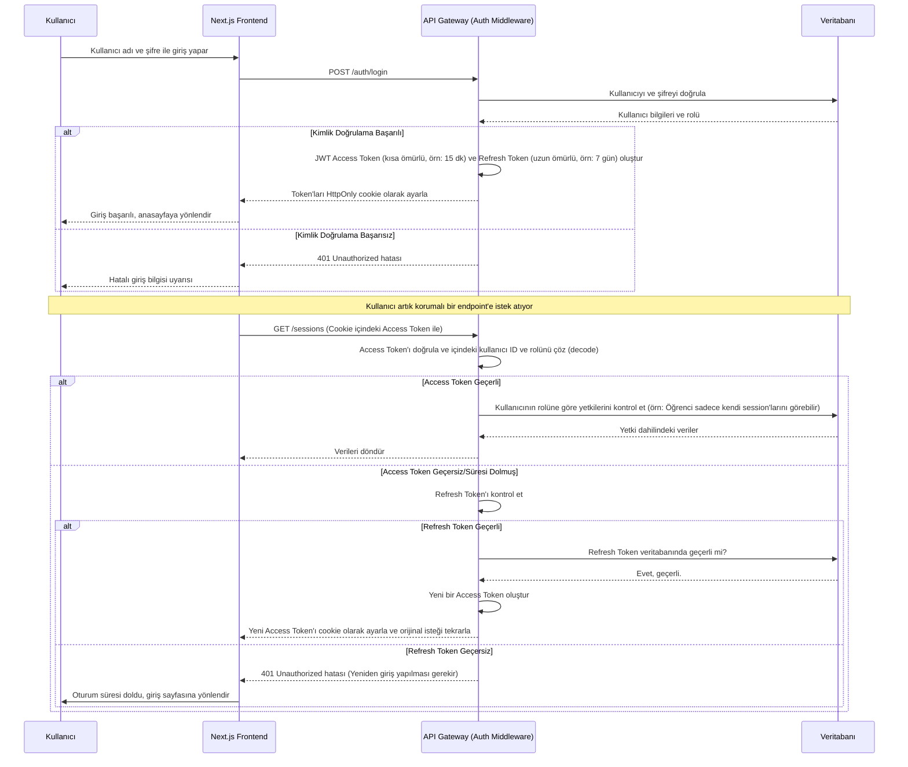

# RAG Eğitim Asistanı - Kullanıcı Yetkilendirme Sistemi Tasarımı

## Özet

Bu doküman, RAG tabanlı eğitim asistanı için tasarlanan kapsamlı kullanıcı yetkilendirme sisteminin mimarisini ve uygulama planını detaylandırmaktadır. Sistem, `Yönetici`, `Öğretmen` ve `Öğrenci` olmak üzere üç farklı kullanıcı rolünü destekleyen, Rol Tabanlı Erişim Kontrolü (RBAC) modelini temel alır.

Tasarım, mevcut Next.js frontend ve Python mikroservis mimarisiyle uyumlu olup, güvenliği ve ölçeklenebilirliği ön planda tutar. Kimlik doğrulama işlemleri, endüstri standardı olan JWT (JSON Web Token) ve HttpOnly cookie'ler kullanılarak gerçekleştirilecektir. Tüm yetkilendirme mantığı, mevcut API Gateway üzerinde merkezi olarak yönetilerek tutarlı ve güvenli bir yapı sağlanacaktır.

Doküman, roller ve yetkilerden veritabanı şemasına, API endpoint'lerinden frontend bileşenlerine ve son olarak uygulama yol haritasına kadar tüm tasarım sürecini adım adım açıklamaktadır.

---

# RAG Eğitim Asistanı - Kullanıcı Yetkilendirme Sistemi Tasarımı

Bu doküman, RAG tabanlı eğitim asistanı için tasarlanan kullanıcı rolleri, yetkileri, veritabanı şeması, API endpoint'leri ve entegrasyon planını detaylandırmaktadır.

## 1. Kullanıcı Rolleri ve Yetkileri

Sistemde üç temel kullanıcı rolü tanımlanmıştır: **Yönetici (Admin)**, **Öğretmen (Teacher)** ve **Öğrenci (Student)**. Her rolün erişebileceği kaynaklar ve gerçekleştirebileceği eylemler aşağıda bir matris halinde sunulmuştur. Bu yapı, Rol Tabanlı Erişim Kontrolü (RBAC) modelini temel alır.

| Kaynak / Eylem                          | Yönetici (Admin) |      Öğretmen (Teacher)      | Öğrenci (Student) | Açıklama                                                                                                                                                         |
| :-------------------------------------- | :--------------: | :--------------------------: | :---------------: | :--------------------------------------------------------------------------------------------------------------------------------------------------------------- |
| **KULLANICI YÖNETİMİ**                  |                  |                              |                   |                                                                                                                                                                  |
| Tüm kullanıcıları listeleme             |        ✅        |              ❌              |        ❌         | Yönetici, sistemdeki tüm kullanıcıları görebilir.                                                                                                                |
| Kullanıcı oluşturma/silme               |        ✅        |              ❌              |        ❌         | Yeni kullanıcı kayıtları sadece yönetici tarafından yapılır.                                                                                                     |
| Kullanıcı rolü değiştirme               |        ✅        |              ❌              |        ❌         | Yönetici, kullanıcıların rollerini (Öğretmen, Öğrenci) atayabilir.                                                                                               |
| Kendi profilini güncelleme              |        ✅        |              ✅              |        ✅         | Tüm kullanıcılar kendi şifre, e-posta gibi bilgilerini güncelleyebilir.                                                                                          |
| Başkasının profilini güncelleme         |        ✅        |              ❌              |        ❌         | Yönetici, diğer kullanıcıların bilgilerini (örn: şifre sıfırlama) düzenleyebilir.                                                                                |
|                                         |                  |                              |                   |                                                                                                                                                                  |
| **SESSION (DERS) YÖNETİMİ**             |                  |                              |                   |                                                                                                                                                                  |
| Tüm session'ları görme                  |        ✅        |              ✅              |        ✅         | Her rol, sadece yetkisi dahilindeki session'ları görür. Yönetici hepsini, Öğretmen kendisininkileri ve public olanları, Öğrenci ise atandığı session'ları görür. |
| Session oluşturma                       |        ✅        |              ✅              |        ❌         | Sadece Yönetici ve Öğretmenler yeni ders (session) oluşturabilir.                                                                                                |
| Kendi session'ını güncelleme/silme      |        ✅        |              ✅              |        ❌         | Oluşturan kişi kendi session'ını yönetebilir.                                                                                                                    |
| Başkasının session'ını güncelleme/silme |        ✅        |              ❌              |        ❌         | Yönetici, tüm session'ları yönetme yetkisine sahiptir.                                                                                                           |
| Öğrenciyi session'a ekleme/çıkarma      |        ✅        |              ✅              |        ❌         | Yönetici ve Öğretmenler, derslere öğrenci atayabilir.                                                                                                            |
|                                         |                  |                              |                   |                                                                                                                                                                  |
| **DOKÜMAN YÖNETİMİ**                    |                  |                              |                   |                                                                                                                                                                  |
| Session'a doküman yükleme               |        ✅        |              ✅              |        ❌         | Yönetici ve Öğretmenler, yönettikleri derslere materyal (PDF, DOCX vb.) ekleyebilir.                                                                             |
| Session'dan doküman silme               |        ✅        |              ✅              |        ❌         |                                                                                                                                                                  |
| Dokümanları listeleme/indirme           |        ✅        |              ✅              |        ✅         | Tüm roller, erişimleri olan session'lardaki dokümanları görebilir.                                                                                               |
|                                         |                  |                              |                   |                                                                                                                                                                  |
| **RAG SORGULAMA**                       |                  |                              |                   |                                                                                                                                                                  |
| Session içinde sorgu yapma              |        ✅        |              ✅              |        ✅         | Tüm roller, erişimleri olan session'larda RAG sorgusu yapabilir.                                                                                                 |
| Sorgu geçmişini görme                   |        ✅        | ✅ (Kendi session'ları için) |        ❌         | Yönetici tüm geçmişi, Öğretmen kendi derslerindeki öğrenci sorgularını görebilir.                                                                                |
|                                         |                  |                              |                   |                                                                                                                                                                  |
| **SİSTEM YÖNETİMİ**                     |                  |                              |                   |                                                                                                                                                                  |
| Sistem sağlığı ve analitikleri görme    |        ✅        |              ❌              |        ❌         | Yönetici, sistemin genel performansını ve kullanım istatistiklerini izleyebilir.                                                                                 |
| Model ve konfigürasyon ayarları         |        ✅        |              ❌              |        ❌         | RAG ayarlarını (chunking, model seçimi vb.) sadece yönetici değiştirebilir.                                                                                      |

Bu yetki matrisi, bir sonraki adımda tasarlanacak veritabanı şeması ve API endpoint'leri için temel oluşturacaktır.

## 2. Veritabanı Şeması Tasarımı

Kullanıcı, rol ve erişim bilgilerini yönetmek için aşağıdaki veritabanı şeması tasarlanmıştır. Bu şema, mevcut `sessions` tablosuyla entegre çalışacaktır.

### Veritabanı Diyagramı (ERD)

```mermaid
erDiagram
    USERS {
        string id PK "UUID"
        string username UK
        string email UK
        string hashed_password
        int role_id FK
        datetime created_at
        datetime updated_at
    }

    ROLES {
        int id PK
        string name UK "'admin', 'teacher', 'student'"
    }

    SESSIONS {
        string session_id PK
        string name
        string created_by FK "user_id"
        -- diğer mevcut session alanları
    }

    USER_SESSIONS {
        string user_id FK
        string session_id FK
    }

    USERS ||--o{ ROLES : "has"
    USERS ||--o{ SESSIONS : "creates"
    USERS ||--|{ USER_SESSIONS : "is enrolled in"
    SESSIONS ||--|{ USER_SESSIONS : "has enrolled"

```

### Tablo Detayları

#### `users`

Kullanıcıların kimlik bilgilerini ve temel bilgilerini saklar.

- `id`: Benzersiz kullanıcı kimliği (UUID).
- `username`: Sisteme giriş için kullanılacak benzersiz kullanıcı adı.
- `email`: Benzersiz kullanıcı e-posta adresi.
- `hashed_password`: Güvenlik için hash'lenmiş kullanıcı şifresi.
- `role_id`: Kullanıcının rolünü belirleyen yabancı anahtar (`roles` tablosuna referans).
- `created_at`, `updated_at`: Kayıt oluşturma ve güncelleme zaman damgaları.

#### `roles`

Sistemdeki kullanıcı rollerini tanımlar.

- `id`: Rol için birincil anahtar.
- `name`: Rolün adı (`admin`, `teacher`, `student`). Bu alan benzersiz olmalıdır.

#### `user_sessions`

Kullanıcılar ve dersler (session'lar) arasındaki çoktan-çoğa ilişkiyi kurar. Bu tablo, bir öğrencinin hangi derslere kayıtlı olduğunu veya bir öğretmenin hangi derslere erişim izni olduğunu belirler.

- `user_id`: `users` tablosuna referans.
- `session_id`: `sessions` tablosuna referans.
- Bu iki alan birlikte birincil anahtar (composite primary key) oluşturur.

### Mevcut `sessions` Tablosuna Etkisi

Mevcut `sessions` tablosundaki `created_by` alanı, artık bir `user_id`'ye referans verecek şekilde güncellenmelidir. Bu, bir session'ın sahibi olan öğretmeni veya yöneticiyi doğrudan `users` tablosuyla ilişkilendirir.

## 3. Authentication ve Authorization Akışı

Sistem, kimlik doğrulama (Authentication) ve yetkilendirme (Authorization) için **JWT (JSON Web Token)** tabanlı bir mekanizma kullanacaktır. Bu yaklaşım, stateless (durumsuz) mikroservis mimarisi için oldukça uygundur. Tüm yetkilendirme mantığı API Gateway üzerinde merkezi olarak yönetilecektir.

### Akış Diyagramı



### JWT Yapısı (Payload)

Oluşturulacak JWT Access Token'ın payload'u (içeriği), yetkilendirme için gerekli minimum bilgiyi taşımalıdır:

```json
{
  "sub": "user_id_12345", // Subject (Kullanıcı ID'si)
  "rol": "teacher", // Kullanıcının rolü
  "exp": 1678886400, // Expiration time (Token'ın son geçerlilik zamanı)
  "iat": 1678882800 // Issued at (Token'ın oluşturulma zamanı)
}
```

### Yetkilendirme Mantığı (FastAPI Dependency)

API Gateway'de, her bir korumalı endpoint için yetki kontrolü yapacak bir FastAPI "dependency" (bağımlılık) oluşturulacaktır. Bu dependency, gelen istekteki JWT'yi otomatik olarak doğrulayacak, içindeki rolü okuyacak ve istenen eylem için kullanıcının yetkisi olup olmadığını kontrol edecektir.

**Örnek Python Kodu (Pseudocode):**

```python
# FastAPI dependency
async def get_current_user(token: str = Depends(oauth2_scheme), required_roles: List[str] = []):
    # 1. Token'ı doğrula ve decode et
    payload = decode_jwt(token)
    user_id = payload.get("sub")
    user_role = payload.get("rol")

    # 2. Kullanıcı veritabanında var mı kontrol et
    user = db.get_user(user_id)
    if not user:
        raise HTTPException(status_code=401, detail="Kullanıcı bulunamadı")

    # 3. Rol yetkisini kontrol et
    if required_roles and user_role not in required_roles:
        raise HTTPException(status_code=403, detail="Bu işlem için yetkiniz yok")

    return user
```

Bu yapı, endpoint'lerin temiz kalmasını ve yetkilendirme mantığının merkezi ve yeniden kullanılabilir olmasını sağlar.

## 4. API Endpoint Spesifikasyonları

Yeni yetkilendirme sistemi için API Gateway'de aşağıdaki endpoint'ler tanımlanacak veya güncellenecektir.

### 4.1. Authentication Endpoint'leri

Bu endpoint'ler kullanıcıların sisteme giriş/çıkış yapmasını ve oturumlarını yönetmesini sağlar.

- **`POST /auth/login`**

  - **Açıklama:** Kullanıcı adı ve şifre ile kullanıcı girişi yapar.
  - **Request Body:** `{ "username": "string", "password": "string" }`
  - **Response (Başarılı):** `200 OK`. Access ve Refresh token'ları içeren HttpOnly cookie'ler set edilir.
  - **Response (Hatalı):** `401 Unauthorized`.
  - **Yetki:** Herkese açık.

- **`POST /auth/logout`**

  - **Açıklama:** Kullanıcı çıkışı yapar ve token cookie'lerini temizler.
  - **Request Body:** Yok.
  - **Response:** `200 OK`.
  - **Yetki:** Giriş yapmış kullanıcılar.

- **`POST /auth/refresh`**

  - **Açıklama:** Süresi dolmak üzere olan Access Token'ı yenilemek için kullanılır. Refresh token cookie'si ile çağrılır.
  - **Request Body:** Yok.
  - **Response:** `200 OK`. Yeni bir Access Token içeren HttpOnly cookie set edilir.
  - **Yetki:** Geçerli bir Refresh Token'a sahip kullanıcılar.

- **`GET /auth/me`**
  - **Açıklama:** Mevcut giriş yapmış kullanıcının bilgilerini döndürür.
  - **Request Body:** Yok.
  - **Response:** `200 OK`. `{ "id": "string", "username": "string", "email": "string", "role": "string" }`
  - **Yetki:** Giriş yapmış kullanıcılar.

### 4.2. User Management Endpoint'leri (Yönetici Paneli için)

Bu endpoint'ler yönetici rolüne sahip kullanıcılar tarafından kullanılacaktır.

- **`GET /users`**

  - **Açıklama:** Sistemdeki tüm kullanıcıları listeler.
  - **Yetki:** `admin`.
  - **Response:** `200 OK`. `[ { "id": "...", "username": "...", "email": "...", "role": "..." } ]`

- **`POST /users`**

  - **Açıklama:** Yeni bir kullanıcı oluşturur.
  - **Yetki:** `admin`.
  - **Request Body:** `{ "username": "string", "email": "string", "password": "string", "role": "string" }`
  - **Response:** `21 Created`. Oluşturulan kullanıcının bilgileri.

- **`PUT /users/{user_id}`**

  - **Açıklama:** Bir kullanıcının bilgilerini (rol, e-posta vb.) günceller.
  - **Yetki:** `admin`.
  - **Response:** `200 OK`. Güncellenmiş kullanıcı bilgileri.

- **`DELETE /users/{user_id}`**
  - **Açıklama:** Bir kullanıcıyı sistemden siler.
  - **Yetki:** `admin`.
  - **Response:** `204 No Content`.

### 4.3. Mevcut Endpoint'lerde Yapılacak Değişiklikler

Mevcut `/sessions`, `/documents` ve `/rag` endpoint'leri, JWT tabanlı yetkilendirme mekanizmasını kullanacak şekilde güncellenmelidir. Her endpoint, hangi rollerin erişebileceğini belirten bir yetki kontrolü (dependency) içerecektir.

**Örnek Güncelleme:**

- **`GET /sessions`**

  - **Eski Hali:** Herkese açık.
  - **Yeni Hali:**
    - **Yetki:** Giriş yapmış tüm kullanıcılar (`admin`, `teacher`, `student`).
    - **İş Mantığı:**
      - Eğer rol `admin` ise, tüm session'ları döndür.
      - Eğer rol `teacher` ise, kendi oluşturduğu ve public olan session'ları döndür.
      - Eğer rol `student` ise, sadece `user_sessions` tablosunda kendisine atanmış olan session'ları döndür.

- **`POST /sessions`**

  - **Eski Hali:** Herkese açık.
  - **Yeni Hali:**
    - **Yetki:** `admin`, `teacher`.
    - **İş Mantığı:** Session oluşturulurken `created_by` alanına, JWT'den alınan `user_id` otomatik olarak eklenir.

- **`POST /documents/process-and-store`**
  - **Eski Hali:** Herkese açık.
  - **Yeni Hali:**
    - **Yetki:** `admin`, `teacher`.
    - **İş Mantığı:** Kullanıcının, `session_id` ile belirtilen session'ın sahibi olup olmadığı kontrol edilir. Sadece kendi session'ına doküman ekleyebilir (admin hariç).

## 5. Frontend Mimarisi ve Bileşenleri

Next.js frontend uygulaması, kullanıcı kimlik doğrulama durumunu ve rollerini yönetmek için React Context API'sini kullanacaktır. Bu, uygulama genelinde tutarlı bir oturum yönetimi sağlayacaktır.

### 5.1. AuthContext ve Provider

Uygulamanın en üst seviyesinde (`layout.tsx` içinde) bir `AuthProvider` oluşturulacaktır. Bu provider, aşağıdaki bilgileri ve fonksiyonları sağlayacaktır:

- `user`: Giriş yapmış kullanıcının bilgileri (`id`, `username`, `role`) veya `null`.
- `isAuthenticated`: Kullanıcının giriş yapıp yapmadığını belirten boolean bir değer.
- `login(username, password)`: Giriş API'sini çağıran fonksiyon.
- `logout()`: Çıkış API'sini çağıran ve state'i temizleyen fonksiyon.
- `loading`: Kimlik doğrulama durumunun kontrol edilip edilmediğini belirten bir flag.

**Örnek `AuthProvider` Yapısı:**

```typescript
// contexts/AuthContext.tsx

import React, { createContext, useContext, useState, useEffect } from "react";
import { api } from "../lib/api"; // API çağrıları için merkezi bir modül

const AuthContext = createContext(null);

export const AuthProvider = ({ children }) => {
  const [user, setUser] = useState(null);
  const [loading, setLoading] = useState(true);

  useEffect(() => {
    // Sayfa yüklendiğinde kullanıcının oturum durumunu kontrol et
    const checkUser = async () => {
      try {
        const currentUser = await api.getMe(); // /auth/me endpoint'ini çağır
        setUser(currentUser);
      } catch (error) {
        setUser(null);
      } finally {
        setLoading(false);
      }
    };
    checkUser();
  }, []);

  const login = async (username, password) => {
    /* ... */
  };
  const logout = async () => {
    /* ... */
  };

  const value = { user, isAuthenticated: !!user, login, logout, loading };

  return <AuthContext.Provider value={value}>{children}</AuthContext.Provider>;
};

export const useAuth = () => useContext(AuthContext);
```

### 5.2. Korumalı Rotalar (Protected Routes)

Belirli sayfalara (örneğin, yönetici paneli, ders oluşturma sayfası) sadece yetkili kullanıcıların erişebilmesi için bir `ProtectedRoute` bileşeni oluşturulacaktır. Bu bileşen, `useAuth` hook'unu kullanarak kullanıcının kimlik doğrulama durumunu ve rolünü kontrol eder.

**Örnek `ProtectedRoute` Bileşeni:**

```typescript
// components/ProtectedRoute.tsx

import { useAuth } from "../contexts/AuthContext";
import { useRouter } from "next/router";

const ProtectedRoute = ({ children, requiredRole }) => {
  const { isAuthenticated, user, loading } = useAuth();
  const router = useRouter();

  if (loading) {
    return <div>Yükleniyor...</div>; // Veya bir spinner
  }

  if (!isAuthenticated) {
    router.push("/login");
    return null;
  }

  if (requiredRole && user.role !== requiredRole) {
    router.push("/unauthorized"); // Yetkisiz erişim sayfası
    return null;
  }

  return children;
};
```

### 5.3. Rol Bazlı UI Gösterimi

Arayüzdeki bazı bileşenler (butonlar, menü öğeleri vb.) kullanıcının rolüne göre gösterilecek veya gizlenecektir.

**Örnek Kullanım:**

```typescript
// components/SomeComponent.tsx

import { useAuth } from "../contexts/AuthContext";

const SomeComponent = () => {
  const { user } = useAuth();

  return (
    <div>
      {user && (user.role === "admin" || user.role === "teacher") && (
        <button>Ders Oluştur</button>
      )}
      {/* Diğer bileşenler */}
    </div>
  );
};
```

### 5.4. Yeni Bileşenler

- **`LoginPage.tsx`**: Kullanıcı adı ve şifre alanlarını içeren giriş formu.
- **`AdminDashboard.tsx`**: Yönetici paneli için ana bileşen. `ProtectedRoute` ile korunur.
- **`UnauthorizedPage.tsx`**: Yetkisiz erişim denemelerinde kullanıcıyı yönlendireceğimiz sayfa.
- **`UserProfile.tsx`**: Kullanıcının kendi profil bilgilerini görebileceği ve güncelleyebileceği sayfa.

## 6. Yönetici Paneli Gereksinimleri

Yönetici paneli, `admin` rolüne sahip kullanıcıların sistemi merkezi bir noktadan yönetmesini sağlar. Bu panel, `/admin` rotası altında yer alacak ve aşağıdaki modüllerden oluşacaktır.

### 6.1. Ana Gösterge Paneli (Dashboard)

- **Sistem İstatistikleri:**
  - Toplam kullanıcı sayısı.
  - Toplam session (ders) sayısı.
  - Toplam doküman ve chunk sayısı.
  - Günlük/haftalık sorgu sayısı grafiği.
- **Sistem Sağlığı:**
  - API Gateway ve mikroservislerin (PDF, Document Processor vb.) anlık durumunu gösteren bir bölüm. (`/health/services` endpoint'inden beslenir).
- **Son Aktiviteler:**
  - Son eklenen kullanıcılar, oluşturulan dersler gibi olayların bir listesi.

### 6.2. Kullanıcı Yönetimi Modülü

- **Kullanıcı Listesi:**
  - Tüm kullanıcıların `username`, `email`, `role` ve `created_at` gibi bilgilerle listelendiği bir tablo.
  - Arama ve filtreleme (role göre) özellikleri.
- **Yeni Kullanıcı Ekleme:**
  - `username`, `email`, `password` ve `role` (`teacher` veya `student`) bilgilerinin girildiği bir form.
- **Kullanıcı Düzenleme:**
  - Bir kullanıcının rolünü değiştirme.
  - Kullanıcı şifresini sıfırlama (yeni bir geçici şifre oluşturma).
- **Kullanıcı Silme:**
  - Bir kullanıcıyı sistemden tamamen kaldırma (onay mekanizması ile).

### 6.3. Session (Ders) Yönetimi Modülü

- **Session Listesi:**
  - Sistemdeki tüm session'ların `name`, `created_by` (öğretmen), `document_count`, `student_count` gibi bilgilerle listelendiği bir tablo.
- **Session Detayları:**
  - Bir session'a tıklandığında, o session'a kayıtlı öğrencileri ve yüklenmiş dokümanları görme.
- **Session Silme/Arşivleme:**
  - Artık kullanılmayan bir dersi sistemden kaldırma veya arşivleme.

### 6.4. Sistem Ayarları Modülü (İleri Seviye)

- **RAG Konfigürasyonu:**
  - Varsayılan chunking stratejisi, chunk boyutu gibi parametreleri global olarak ayarlama imkanı.
- **Model Yönetimi:**
  - `/models` endpoint'inden gelen LLM ve embedding modellerini görme, varsayılan modelleri belirleme.

## 7. Güvenlik ve Kullanıcı Oturum Yönetimi Stratejisi

Bu bölümde, sistemin genel güvenliğini artırmak için uygulanacak ek önlemler ve en iyi pratikler detaylandırılmaktadır.

### 7.1. Token Yönetimi ve Güvenliği

- **HttpOnly Cookie'ler:** Access ve Refresh token'lar, XSS (Cross-Site Scripting) saldırılarını önlemek için `HttpOnly` olarak işaretlenmiş cookie'lerde saklanacaktır. Bu, JavaScript'in bu cookie'lere doğrudan erişmesini engeller.
- **Secure ve SameSite Nitelikleri:** Production ortamında, cookie'ler `Secure` (sadece HTTPS üzerinden gönderilir) ve `SameSite=Strict` veya `SameSite=Lax` (CSRF - Cross-Site Request Forgery saldırılarını zorlaştırmak için) olarak ayarlanmalıdır.
- **Kısa Ömürlü Access Token'lar:** Access token'ların ömrü kısa (örn: 15 dakika) tutularak, çalınması durumunda potansiyel hasar süresi sınırlandırılır. Oturumun devamlılığı, daha uzun ömürlü (örn: 7 gün) Refresh Token'lar ile sağlanır.
- **Refresh Token Rotasyonu:** Güvenliği daha da artırmak için, her kullanıldığında Refresh Token'ın da yenilenmesi (rotasyon) mekanizması eklenebilir. Bu, çalınan bir Refresh Token'ın tekrar kullanılmasını engeller.

### 7.2. Şifre Güvenliği

- **Hashing Algoritması:** Şifreler, veritabanında asla düz metin olarak saklanmayacaktır. `Bcrypt` veya `Argon2` gibi güçlü ve yavaş hash algoritmaları kullanılacaktır. FastAPI/Passlib kütüphanesi bu iş için idealdir.
- **Şifre Politikası:** Kullanıcı kayıtlarında ve şifre güncellemelerinde minimum uzunluk (örn: 8 karakter), büyük/küçük harf, rakam ve özel karakter gibi gereksinimler zorunlu tutulabilir.

### 7.3. API Güvenliği

- **Rate Limiting:** Brute-force saldırılarını (özellikle `/auth/login` endpoint'ine yönelik) önlemek için IP bazlı veya kullanıcı bazlı rate limiting (istek sınırlama) uygulanacaktır.
- **CORS (Cross-Origin Resource Sharing):** API Gateway'de CORS, sadece güvenilir frontend domain'inden gelen isteklere izin verecek şekilde sıkı bir şekilde yapılandırılmalıdır. (`allow_origins=["https://your-frontend-app.com"]`)
- **Veri Doğrulama (Validation):** Tüm API istekleri, Pydantic modelleri kullanılarak sıkı bir şekilde doğrulanmalıdır. Bu, SQL injection veya benzeri enjeksiyon saldırılarına karşı ilk savunma hattını oluşturur.
- **HTTPS Zorunluluğu:** Production ortamında tüm iletişim, SSL/TLS ile şifrelenmiş HTTPS üzerinden yapılmalıdır.

### 7.4. Yetkilendirme Güvenliği

- **Merkezi Yetki Kontrolü:** Tüm yetkilendirme mantığı, daha önce tasarlandığı gibi API Gateway'deki FastAPI dependency'leri aracılığıyla merkezi olarak yönetilecektir. Bu, yetki kontrollerinin unutulmasını veya yanlış uygulanmasını önler.
- **Kaynak Bazlı Yetkilendirme:** Bir kullanıcının bir kaynağı (örn: bir session'ı silme) değiştirmeye çalıştığı durumlarda, sadece rolünün yeterli olup olmadığı değil, aynı zamanda o kaynağın sahibi olup olmadığı da kontrol edilmelidir. (Örn: Öğretmen, sadece kendi oluşturduğu session'ı silebilir).

## 8. Entegrasyon Planı ve Uygulama Yol Haritası

Bu bölümde, tasarlanan yetkilendirme sisteminin mevcut projeye entegrasyonu için adımlara bölünmüş bir yol haritası sunulmaktadır.

### Faz 1: Backend Altyapısının Kurulumu (API Gateway)

1.  **Veritabanı Şemasını Uygulama:**

    - `users`, `roles` ve `user_sessions` tablolarını oluşturacak bir veritabanı migrasyon script'i (örn: Alembic ile) hazırlayın.
    - `roles` tablosuna başlangıç verilerini ('admin', 'teacher', 'student') ekleyin.
    - İlk `admin` kullanıcısını manuel olarak veya bir script ile oluşturun.

2.  **Authentication Endpoint'lerini Geliştirme:**

    - `src/api/main.py` (API Gateway) içinde `/auth/login`, `/auth/logout`, `/auth/refresh`, `/auth/me` endpoint'lerini geliştirin.
    - JWT oluşturma, doğrulama ve şifre hash'leme mantığını ekleyin.

3.  **Merkezi Yetkilendirme Mekanizmasını Geliştirme:**
    - FastAPI'de, JWT'yi doğrulayan ve rol kontrolü yapan `get_current_user` dependency'sini oluşturun.

### Faz 2: Mevcut API'nin Güvence Altına Alınması

1.  **Session Endpoint'lerini Güncelleme:**

    - `GET /sessions`, `POST /sessions`, `DELETE /sessions/{session_id}` gibi endpoint'lere `get_current_user` dependency'sini ekleyerek yetki kontrollerini uygulayın.
    - İş mantığını, kullanıcının rolüne ve kaynak sahipliğine göre veri döndürecek şekilde güncelleyin.

2.  **Doküman ve RAG Endpoint'lerini Güncelleme:**
    - `/documents/*` ve `/rag/query` endpoint'lerine de yetki kontrollerini ekleyin.
    - Özellikle kaynak oluşturma/değiştirme (POST, PUT, DELETE) işlemlerinde, kullanıcının ilgili `session` üzerinde yetkisi olup olmadığını kontrol edin.

### Faz 3: Frontend Entegrasyonu

1.  **Auth Context ve Sayfaları Oluşturma:**

    - `AuthProvider` ve `useAuth` hook'unu oluşturun.
    - `LoginPage.tsx` ve `UnauthorizedPage.tsx` sayfalarını geliştirin.
    - `AuthProvider`'ı ana `layout.tsx` dosyasına ekleyerek tüm uygulamayı sarmalayın.

2.  **API Çağrılarını Güncelleme:**

    - `frontend/lib/api.ts` dosyasındaki tüm API çağrılarını, cookie tabanlı kimlik doğrulamasını destekleyecek şekilde (`credentials: 'include'`) güncelleyin.
    - `login`, `logout`, `getMe` gibi yeni API fonksiyonlarını ekleyin.

3.  **Rol Bazlı Arayüzü Uygulama:**
    - `ProtectedRoute` bileşenini oluşturun ve yönetici paneli gibi özel sayfaları bu bileşenle koruma altına alın.
    - Arayüzde, kullanıcının rolüne göre buton/menü gizleme/gösterme mantığını uygulayın.

### Faz 4: Yönetici Panelinin Geliştirilmesi

1.  **Backend Endpoint'lerini Geliştirme:**

    - `/users` endpoint'lerini (GET, POST, PUT, DELETE) geliştirin.
    - Sistemin genel analitik verilerini sunacak `/admin/stats` gibi endpoint'ler oluşturun.

2.  **Frontend Yönetici Panelini Geliştirme:**
    - `/admin` rotası altında `AdminDashboard.tsx` bileşenini ve alt bileşenlerini (kullanıcı listesi, session yönetimi vb.) geliştirin.
    - Backend'deki yönetici endpoint'lerini kullanarak verileri listeleyin ve yönetim işlevlerini (kullanıcı ekle/sil vb.) bağlayın.
