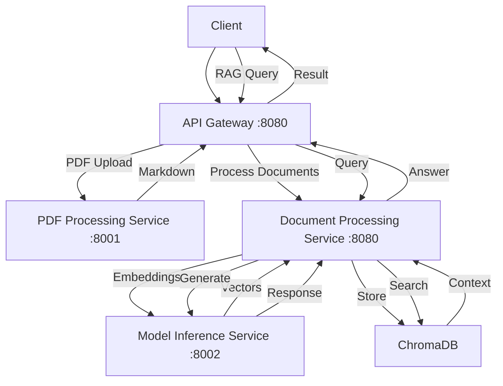
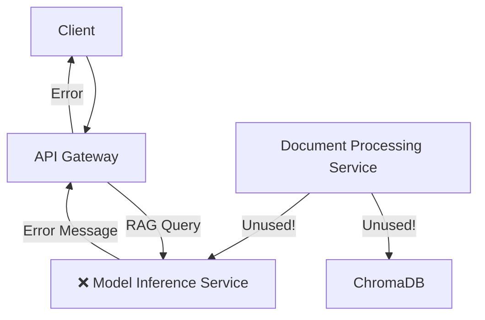

# Mikroservis Mimari Analizi ve Problem Tespiti

## Mevcut Servis Mimarisi

### 1. PDF Processing Service (Port: 8001)

**Lokasyon:** `services/pdf_processing_service/main.py`
**Gerçek Rol:** PDF'leri Markdown'a dönüştürme
**Endpoints:**

- `/process` - PDF dosyasını Markdown'a çevirir
- `/health` - Sağlık kontrolü

**Yetenekler:**

- Marker kütüphanesi kullanarak PDF→MD dönüşümü
- PyPDF2 fallback desteği
- Model cache manager ile optimize edilmiş model yükleme
- **RAG yetenekleri: YOK**

### 2. Document Processing Service (Port: 8080)

**Lokasyon:** `services/document_processing_service/main.py`
**Gerçek Rol:** TAM RAG PİPELİNE SERVİSİ
**Endpoints:**

- `/process-and-store` - Metni chunk'lara ayırır ve embedding'ler oluşturur
- `/query` - RAG sorgusu işler (ChromaDB + Model Inference entegrasyonu)
- `/health` - Sağlık kontrolü

**Yetenekler:**

- Regex tabanlı text chunking
- Model Inference Service'ten embedding'ler alır
- ChromaDB ile vektör arama
- Türkçe RAG prompt'ları
- Groq/Ollama modelleri ile text generation
- **BU SERVİS RAG QUERY'LERİ İŞLEMELİ!**

### 3. Model Inference Service (Port: 8002)

**Lokasyon:** `services/model_inference_service/main.py`
**Gerçek Rol:** LLM ve Embedding Model Sağlayıcı
**Endpoints:**

- `/models/generate` - Text generation
- `/embed` - Embedding oluşturma
- `/query` - **PROBLEM KAYNAĞI!**
- `/models/available` - Mevcut modeller

**Yetenekler:**

- Ollama ve Groq model desteği
- Nomic-embed-text ile embedding
- **HATA MESAJI BURADAN GELİYOR:**

```python
# Line 327-328'de:
return RAGQueryResponse(
    answer="I'm a lightweight model inference service and don't have access to the full RAG pipeline. "
           "Please ensure you're connecting to the correct RAG service.",
    sources=[]
)
```

### 4. API Gateway (Port: 8080)

**Lokasyon:** `src/api/main_gateway.py`
**Gerçek Rol:** Request Routing
**Routing Logic:**

- `/rag/query` → `DOCUMENT_PROCESSOR_URL/query` ✅ DOĞRU
- `/documents/convert-document-to-markdown` → `PDF_PROCESSOR_URL/process` ✅ DOĞRU
- `/documents/process-and-store` → `DOCUMENT_PROCESSOR_URL/process-and-store` ✅ DOĞRU

## Problem Analizi

### Hata Mesajının Kaynağı

❌ **"I'm a lightweight model inference service" hatası Model Inference Service'ten geliyor**

### Neden Bu Hata Alınıyor?

#### İhtimal 1: Yanlış URL Konfigürasyonu

API Gateway'de `DOCUMENT_PROCESSOR_URL` ortam değişkeni yanlış ayarlanmış olabilir:

**Deployment Config'de (`cloudbuild-api-gateway.yaml` line 53):**

```yaml
DOCUMENT_PROCESSOR_URL=https://doc-proc-service-awe3elsvra-ew.a.run.app
```

**Test'te görülen URL'ler:**

```python
API_GATEWAY_URL = "https://api-gateway-1051060211087.europe-west1.run.app"
```

URL format'ları farklı! Bu eski deployment URL'lerinin kullanılmakta olduğunu gösteriyor.

#### İhtimal 2: Service Discovery Problemi

Document Processing Service deploy edilmemiş veya erişilemez durumda olabilir.

#### İhtimal 3: Cache Problemi

API Gateway eski URL'leri cache'lemiş olabilir.

## RAG Workflow Haritası

### Doğru Workflow



### Mevcut Hatalı Durum



## Environment URL Analizi

### Deployment Config URL'leri

```yaml
PDF_PROCESSOR_URL=https://pdf-processor-awe3elsvra-ew.a.run.app
DOCUMENT_PROCESSOR_URL=https://doc-proc-service-awe3elsvra-ew.a.run.app
MODEL_INFERENCE_URL=https://model-inferencer-awe3elsvra-ew.a.run.app
```

### Test'te Kullanılan URL'ler

```python
API_GATEWAY_URL = "https://api-gateway-1051060211087.europe-west1.run.app"
RAG_SERVICE_URL = "https://rag-service-1051060211087.europe-west1.run.app"
```

**Problem:** URL format'ları tutarsız!

## Çözüm Önerileri

### 1. URL Konfigürasyonunu Kontrol Et

```bash
# API Gateway'de mevcut environment variable'ları kontrol et
gcloud run services describe api-gateway --region=europe-west1 --format="export"
```

### 2. Document Processing Service Deployment'ını Doğrula

```bash
# Service'in çalışır durumda olduğunu kontrol et
curl https://doc-proc-service-awe3elsvra-ew.a.run.app/health
```

### 3. API Gateway Environment Variable'larını Güncelle

```bash
gcloud run services update api-gateway \
  --region=europe-west1 \
  --update-env-vars DOCUMENT_PROCESSOR_URL=https://doc-proc-service-1051060211087.europe-west1.run.app
```

### 4. RAG Service URL'sini Kaldır

API Gateway'de `RAG_SERVICE_URL` kullanılmıyor, bunun yerine `DOCUMENT_PROCESSOR_URL` kullanılıyor.

## Servis Sorumlulukları Matrisi

| Servis              | PDF→MD | Chunking | Embeddings       | Vector Store | RAG Query   | LLM Generate     |
| ------------------- | ------ | -------- | ---------------- | ------------ | ----------- | ---------------- |
| PDF Processing      | ✅     | ❌       | ❌               | ❌           | ❌          | ❌               |
| Document Processing | ❌     | ✅       | 🔄 (calls Model) | ✅           | ✅          | 🔄 (calls Model) |
| Model Inference     | ❌     | ❌       | ✅               | ❌           | ❌          | ✅               |
| API Gateway         | ❌     | ❌       | ❌               | ❌           | 🔄 (routes) | ❌               |

## Kritik Bulgular

1. **Document Processing Service gerçek RAG engine'i**
2. **Model Inference Service sadece model sağlayıcı**
3. **API Gateway routing'i doğru ama URL'ler yanlış**
4. **Deployment'taki URL'ler test URL'leri ile tutarsız**
5. **Cache veya environment configuration problemi var**

Bu analiz, mikroservis mimarisinin doğru tasarlandığını ama deployment configuration'da problem olduğunu gösteriyor.
