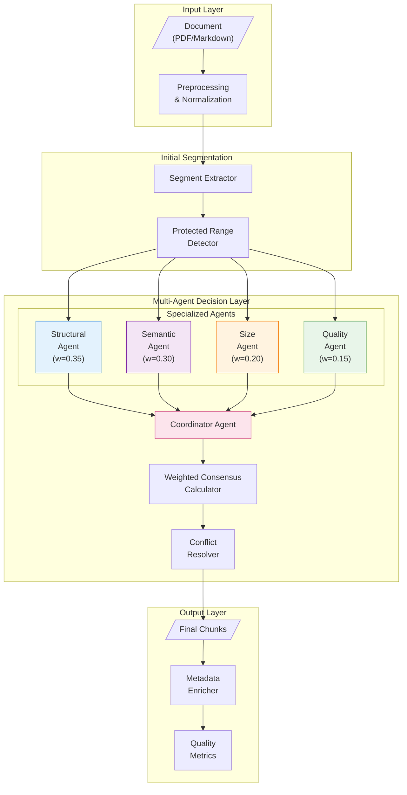

# Multi-Agent Chunking System Architecture
# Bilimsel Makale için Sistem Mimarisi Diyagramı

## Figure 1: Multi-Agent System Architecture

## Figure 1 Caption (TR)
**Şekil 1: Çok-Ajanlı Metin Parçalama Sistemi Mimarisi.** Sistem dört uzmanlaşmış ajandan oluşmaktadır: Yapısal Ajan (w=0.35) atomik birimleri korur, Semantik Ajan (w=0.30) konu tutarlılığını analiz eder, Boyut Ajanı (w=0.20) chunk boyutlarını yönetir ve Kalite Ajanı (w=0.15) çıktı kalitesini değerlendirir. Koordinatör Ajan, ağırlıklı konsensüs hesaplayarak nihai kararı verir.

## Figure 1 Caption (EN)
**Figure 1: Multi-Agent Text Chunking System Architecture.** The system comprises four specialized agents: Structural Agent (w=0.35) preserves atomic units, Semantic Agent (w=0.30) analyzes topic coherence, Size Agent (w=0.20) manages chunk sizes, and Quality Agent (w=0.15) evaluates output quality. The Coordinator Agent computes weighted consensus to determine final decisions.
