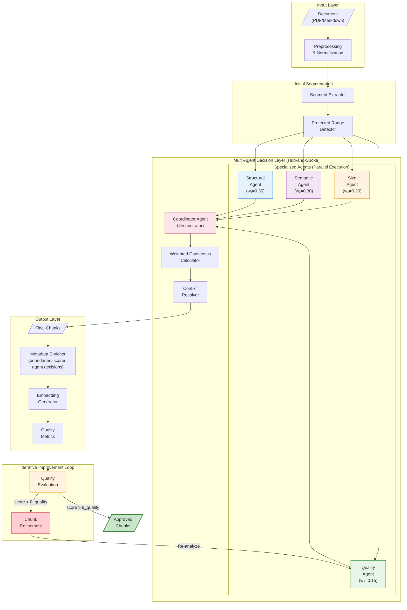

# Multi-Agent Chunking System Architecture
# Bilimsel Makale için Sistem Mimarisi Diyagramı

## Figure 1: Multi-Agent System Architecture



## Notation Table (Notasyon Tablosu)

| Symbol | Description (EN) | Açıklama (TR) | Range/Values |
|--------|------------------|---------------|--------------|
| $w_i$ | Weight of agent $i$ | Ajan $i$'nin ağırlığı | $[0, 1]$, $\sum w_i = 1$ |
| $c_i$ | Confidence score of agent $i$ | Ajan $i$'nin güven skoru | $[0, 1]$ |
| $d_i$ | Decision of agent $i$ | Ajan $i$'nin kararı | $\{SPLIT, MERGE, PRESERVE, ...\}$ |
| $\theta_{quality}$ | Quality threshold | Kalite eşik değeri | Default: $0.6$ |
| $I[\cdot]$ | Indicator function | İndikatör fonksiyonu | $\{0, 1\}$ |

## Data Flow Specification

```
Input Document → [Text + Structure Metadata]
     ↓
Preprocessing → [Normalized Text + Protected Ranges]
     ↓
Agent Analysis → [Decision + Confidence + Reasoning] per agent
     ↓
Coordinator → [Aggregated Score + Final Decision]
     ↓
Output Chunk → {
    content: string,
    metadata: {
        chunk_id: string,
        boundary_type: "natural" | "semantic" | "forced",
        agent_decisions: AgentDecision[],
        quality_score: float,
        embedding: float[768]
    }
}
```

## Figure 1 Caption (TR)
**Şekil 1: Çok-Ajanlı Metin Parçalama Sistemi Mimarisi.** Sistem dört uzmanlaşmış ajandan oluşmaktadır: Yapısal Ajan ($w_1$=0.35) atomik birimleri korur, Semantik Ajan ($w_2$=0.30) konu tutarlılığını analiz eder, Boyut Ajanı ($w_3$=0.20) chunk boyutlarını yönetir ve Kalite Ajanı ($w_4$=0.15) çıktı kalitesini değerlendirir. Koordinatör Ajan, Hub-and-Spoke mimarisinde orkestrasyon yaparak ağırlıklı konsensüs hesaplar. **İteratif İyileştirme Döngüsü** kalite eşiğini ($\theta_{quality}$) karşılamayan chunk'ları yeniden değerlendirir. Çıktı, metadata ve embedding ile zenginleştirilmiş chunk'lardır.

## Figure 1 Caption (EN)
**Figure 1: Multi-Agent Text Chunking System Architecture.** The system comprises four specialized agents: Structural Agent ($w_1$=0.35) preserves atomic units, Semantic Agent ($w_2$=0.30) analyzes topic coherence, Size Agent ($w_3$=0.20) manages chunk sizes, and Quality Agent ($w_4$=0.15) evaluates output quality. The Coordinator Agent orchestrates via Hub-and-Spoke architecture, computing weighted consensus. The **Iterative Improvement Loop** re-evaluates chunks failing the quality threshold ($\theta_{quality}$). Output chunks are enriched with metadata and embeddings.
