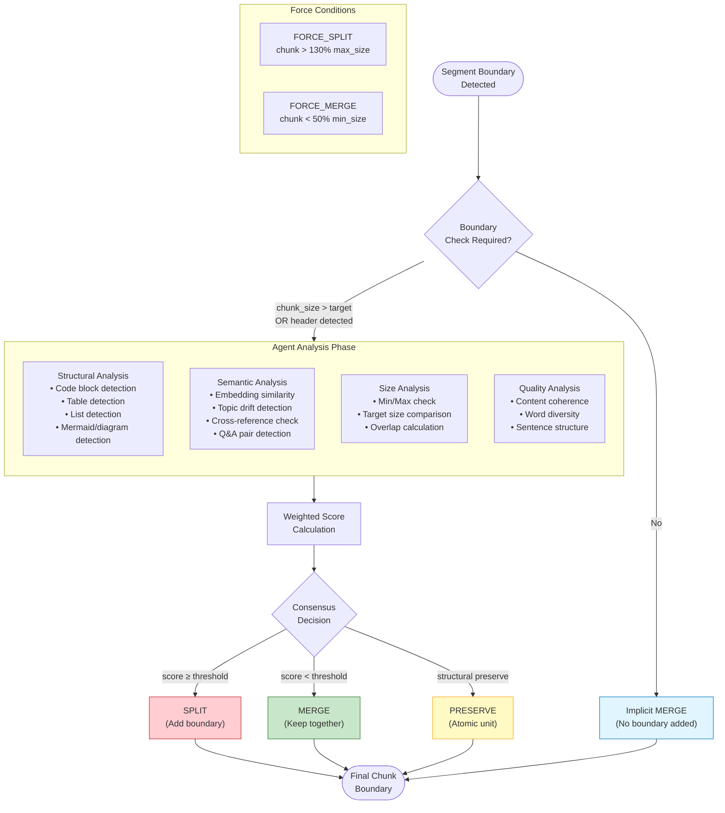

# Decision Pipeline Flow
# Bilimsel Makale için Karar Akış Diyagramı

## Figure 2: Boundary Decision Pipeline

## Figure 2 Caption (TR)
**Şekil 2: Sınır Karar Akış Diyagramı.** Her segment sınırında, sistem dört ajanın analizini değerlendirir. Yapısal Ajan atomik birimleri (kod blokları, tablolar, diyagramlar) tespit eder. Semantik Ajan embedding benzerliği ve konu sürekliliğini analiz eder. Boyut Ajanı chunk boyut kısıtlamalarını kontrol eder. Ağırlıklı konsensüs sonucuna göre SPLIT, MERGE veya PRESERVE kararı verilir.

## Figure 2 Caption (EN)
**Figure 2: Boundary Decision Flow Diagram.** At each segment boundary, the system evaluates analyses from four agents. Structural Agent detects atomic units (code blocks, tables, diagrams). Semantic Agent analyzes embedding similarity and topic continuity. Size Agent checks chunk size constraints. Based on weighted consensus, a SPLIT, MERGE, or PRESERVE decision is made.
