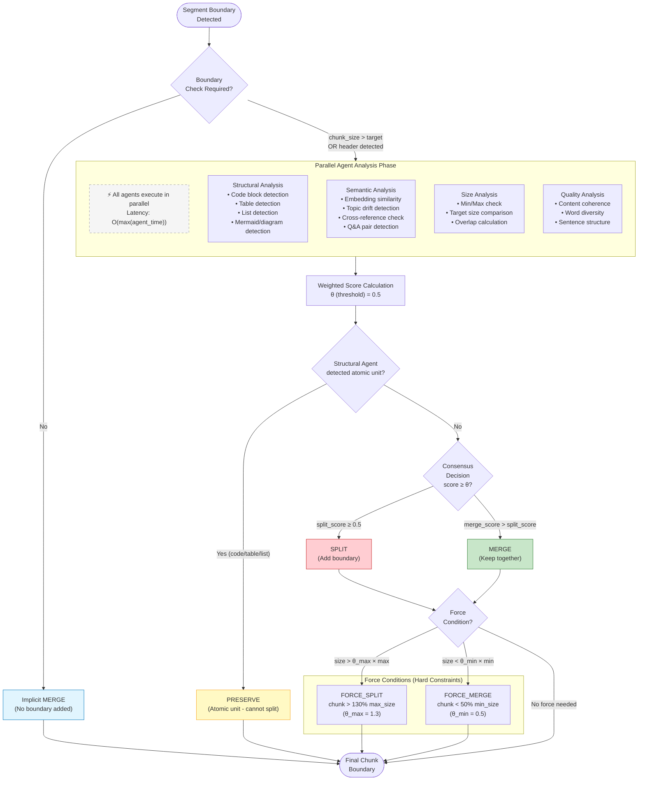

# Decision Pipeline Flow
# Bilimsel Makale için Karar Akış Diyagramı

## Figure 2: Boundary Decision Pipeline



## Threshold Parameters (Eşik Değerleri)

| Parameter | Symbol | Default Value | Description |
|-----------|--------|---------------|-------------|
| Consensus Threshold | $\theta$ | 0.5 | Minimum score for SPLIT decision |
| Force Split Ratio | $\theta_{max}$ | 1.3 | Chunk size / max_size ratio triggering force split |
| Force Merge Ratio | $\theta_{min}$ | 0.5 | Chunk size / min_size ratio triggering force merge |
| Quality Threshold | $\theta_{quality}$ | 0.6 | Minimum quality score for approval |

## Computational Complexity

```
Time Complexity:
- Sequential Agent Execution: O(n × k) where n = segments, k = agents
- Parallel Agent Execution: O(n × max(agent_time)) ← Our approach

Space Complexity: O(n × d) where d = embedding dimension (768)

Latency Optimization:
- Agents run in parallel (asyncio/threading)
- Early exit on PRESERVE detection (structural agent)
- Cached embeddings for repeated segments
```

## Figure 2 Caption (TR)
**Şekil 2: Sınır Karar Akış Diyagramı.** Her segment sınırında, sistem dört ajanın analizini **paralel olarak** değerlendirir (gecikme optimizasyonu). Yapısal Ajan atomik birimleri (kod blokları, tablolar, diyagramlar) tespit ettiğinde, diğer ajanların kararlarından bağımsız olarak **PRESERVE** kararı önceliklidir. Konsensüs eşiği $\theta=0.5$ olup, bu değerin üzerindeki split skorları SPLIT kararına yol açar. Zorlama koşulları (FORCE_SPLIT: chunk > %130 max, FORCE_MERGE: chunk < %50 min) hard constraint olarak uygulanır.

## Figure 2 Caption (EN)
**Figure 2: Boundary Decision Flow Diagram.** At each segment boundary, the system evaluates analyses from four agents **in parallel** (latency optimization). When Structural Agent detects atomic units (code blocks, tables, diagrams), **PRESERVE** decision takes priority regardless of other agents' decisions. Consensus threshold is $\theta=0.5$; split scores above this trigger SPLIT decision. Force conditions (FORCE_SPLIT: chunk > 130% max, FORCE_MERGE: chunk < 50% min) are applied as hard constraints.
