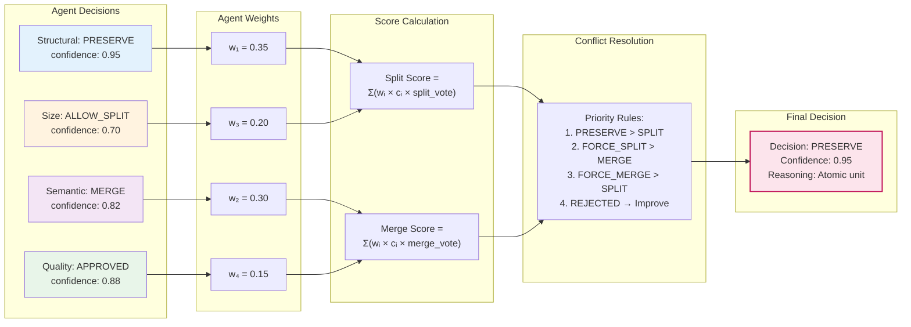
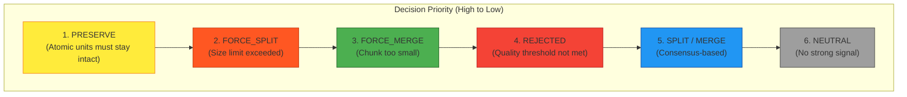

# Consensus Mechanism
# Bilimsel Makale için Konsensüs Mekanizması Diyagramı

## Figure 3: Weighted Consensus Calculation



## Figure 3b: Decision Type Hierarchy



## Figure 3 Caption (TR)
**Şekil 3: Ağırlıklı Konsensüs Hesaplama Mekanizması.** Her ajan kendi kararını (SPLIT, MERGE, PRESERVE, vb.) ve güven skorunu üretir. Koordinatör Ajan, ajan ağırlıklarını (Yapısal: 0.35, Semantik: 0.30, Boyut: 0.20, Kalite: 0.15) kullanarak ağırlıklı skor hesaplar. Çakışma durumunda öncelik kuralları uygulanır: PRESERVE en yüksek önceliğe sahiptir çünkü atomik birimler (kod blokları, tablolar) bölünemez.

## Figure 3 Caption (EN)
**Figure 3: Weighted Consensus Calculation Mechanism.** Each agent produces its decision (SPLIT, MERGE, PRESERVE, etc.) and confidence score. The Coordinator Agent calculates weighted scores using agent weights (Structural: 0.35, Semantic: 0.30, Size: 0.20, Quality: 0.15). In case of conflicts, priority rules apply: PRESERVE has highest priority as atomic units (code blocks, tables) cannot be split.

## Mathematical Formulation

### Consensus Score Calculation
```
Split_Score = Σᵢ (wᵢ × cᵢ × I[dᵢ ∈ {SPLIT, FORCE_SPLIT, ALLOW_SPLIT}])
Merge_Score = Σᵢ (wᵢ × cᵢ × I[dᵢ ∈ {MERGE, FORCE_MERGE}])

where:
  wᵢ = weight of agent i
  cᵢ = confidence of agent i
  dᵢ = decision of agent i
  I[·] = indicator function
```

### Final Decision
```
Decision = 
  PRESERVE,     if any agent returns PRESERVE with high confidence
  FORCE_SPLIT,  if Size Agent detects chunk > 1.3 × max_size
  FORCE_MERGE,  if Size Agent detects chunk < 0.5 × min_size
  SPLIT,        if Split_Score > Merge_Score AND Split_Score ≥ threshold
  MERGE,        if Merge_Score > Split_Score AND Merge_Score ≥ threshold
  NEUTRAL,      otherwise
```
