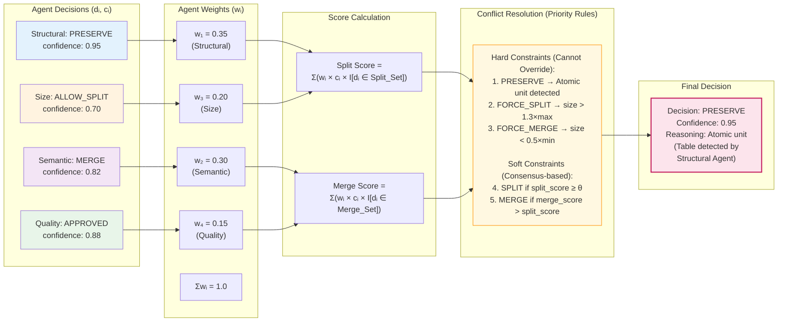
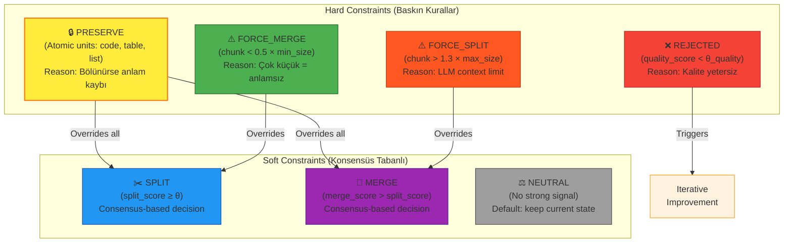

# Consensus Mechanism
# Bilimsel Makale için Konsensüs Mekanizması Diyagramı

## Figure 3: Weighted Consensus Calculation



## Figure 3b: Decision Type Hierarchy (Hard vs Soft Constraints)



## Case Study: Conflict Resolution Example

```
Scenario: A code block is detected within a large chunk

Agent Decisions:
  - Structural Agent: PRESERVE (confidence: 0.95) ← Code block detected
  - Semantic Agent: SPLIT (confidence: 0.78) ← Topic change detected
  - Size Agent: FORCE_SPLIT (confidence: 0.85) ← Chunk exceeds max_size
  - Quality Agent: APPROVED (confidence: 0.72)

Conflict Analysis:
  1. Structural Agent says PRESERVE (atomic unit)
  2. Size Agent says FORCE_SPLIT (hard constraint)
  
Resolution:
  → PRESERVE wins because atomic units cannot be split
  → The chunk will exceed size limit but maintain semantic integrity
  → Quality Agent will flag for potential improvement in next iteration

Final Decision: PRESERVE
Reasoning: "Code block integrity takes precedence over size constraints"
```

## Figure 3 Caption (TR)
**Şekil 3: Ağırlıklı Konsensüs Hesaplama Mekanizması.** Her ajan kendi kararını ($d_i$) ve güven skorunu ($c_i$) üretir. Koordinatör Ajan, ajan ağırlıklarını ($w_1$=0.35, $w_2$=0.30, $w_3$=0.20, $w_4$=0.15, $\sum w_i = 1$) kullanarak ağırlıklı skor hesaplar. **Hard Constraints** (PRESERVE, FORCE_SPLIT, FORCE_MERGE) soft constraint'leri geçersiz kılar. PRESERVE en yüksek önceliğe sahiptir çünkü atomik birimler (kod blokları, tablolar) bölündüğünde anlam kaybı yaşanır. Case study örneğinde görüldüğü gibi, boyut limiti aşılsa bile kod bloğu bütünlüğü korunur.

## Figure 3 Caption (EN)
**Figure 3: Weighted Consensus Calculation Mechanism.** Each agent produces its decision ($d_i$) and confidence score ($c_i$). The Coordinator Agent calculates weighted scores using agent weights ($w_1$=0.35, $w_2$=0.30, $w_3$=0.20, $w_4$=0.15, $\sum w_i = 1$). **Hard Constraints** (PRESERVE, FORCE_SPLIT, FORCE_MERGE) override soft constraints. PRESERVE has highest priority as splitting atomic units (code blocks, tables) causes semantic loss. As shown in the case study, code block integrity is preserved even when size limits are exceeded.

## Mathematical Formulation

### Notation Table

| Symbol | Definition | Domain |
|--------|------------|--------|
| $w_i$ | Weight of agent $i$ | $[0, 1]$, $\sum_{i=1}^{4} w_i = 1$ |
| $c_i$ | Confidence score of agent $i$ | $[0, 1]$ |
| $d_i$ | Decision of agent $i$ | $\{SPLIT, MERGE, PRESERVE, FORCE\_SPLIT, FORCE\_MERGE, NEUTRAL\}$ |
| $\theta$ | Consensus threshold | Default: $0.5$ |
| $I[\cdot]$ | Indicator function | $\{0, 1\}$ |

### Consensus Score Calculation
```
Split_Score = Σᵢ (wᵢ × cᵢ × I[dᵢ ∈ {SPLIT, FORCE_SPLIT, ALLOW_SPLIT}])
Merge_Score = Σᵢ (wᵢ × cᵢ × I[dᵢ ∈ {MERGE, FORCE_MERGE}])

where:
  Split_Set = {SPLIT, FORCE_SPLIT, ALLOW_SPLIT}
  Merge_Set = {MERGE, FORCE_MERGE}
```

### Final Decision Algorithm
```
function decide(agent_decisions, agent_confidences, agent_weights):
    # Step 1: Check Hard Constraints (Priority Order)
    if any(d == PRESERVE for d in agent_decisions):
        return PRESERVE  # Atomic unit - cannot split
    
    if SIZE_AGENT.decision == FORCE_SPLIT:
        return FORCE_SPLIT  # Size limit exceeded
    
    if SIZE_AGENT.decision == FORCE_MERGE:
        return FORCE_MERGE  # Chunk too small
    
    if QUALITY_AGENT.decision == REJECTED:
        return REJECTED  # Quality threshold not met
    
    # Step 2: Calculate Consensus Scores
    split_score = Σ(wᵢ × cᵢ × I[dᵢ ∈ Split_Set])
    merge_score = Σ(wᵢ × cᵢ × I[dᵢ ∈ Merge_Set])
    
    # Step 3: Apply Soft Constraints
    if split_score ≥ θ and split_score > merge_score:
        return SPLIT
    elif merge_score > split_score:
        return MERGE
    else:
        return NEUTRAL
```
