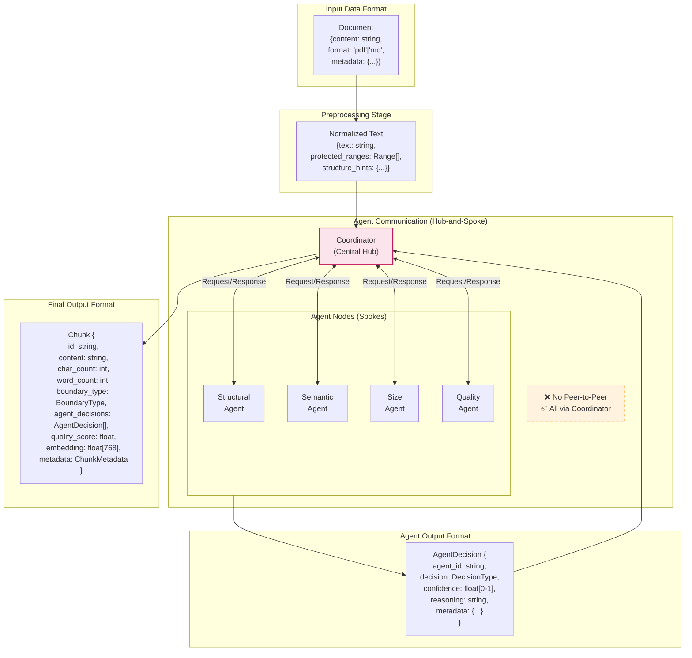
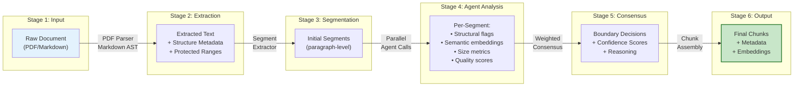

# Data Flow Diagram
# Bilimsel Makale için Veri Akış Diyagramı

## Figure 4: Agent Communication & Data Flow



## Figure 4b: Detailed Data Transformation Pipeline



## Communication Protocol

### Request Format (Coordinator → Agent)
```json
{
  "request_id": "uuid",
  "segment_id": "seg_001",
  "segment_text": "...",
  "context": {
    "previous_segment": "...",
    "next_segment": "...",
    "document_metadata": {...}
  },
  "config": {
    "target_chunk_size": 1500,
    "min_chunk_size": 500,
    "max_chunk_size": 3000
  }
}
```

### Response Format (Agent → Coordinator)
```json
{
  "request_id": "uuid",
  "agent_id": "structural_agent",
  "decision": "PRESERVE",
  "confidence": 0.95,
  "reasoning": "Code block detected (lines 5-25)",
  "metadata": {
    "detected_structures": ["code_block"],
    "protected_range": [120, 580],
    "analysis_time_ms": 45
  }
}
```

## Why Hub-and-Spoke Architecture?

| Aspect | Hub-and-Spoke (Our Choice) | Peer-to-Peer |
|--------|---------------------------|--------------|
| **Complexity** | O(n) connections | O(n²) connections |
| **Coordination** | Centralized, predictable | Distributed, complex |
| **Conflict Resolution** | Single point of decision | Consensus required |
| **Debugging** | Easy to trace | Difficult |
| **Scalability** | Add agents easily | Requires protocol changes |

**Rationale:** Hub-and-Spoke prevents chaos by ensuring all decisions flow through the Coordinator. This makes the system deterministic and easier to debug/audit.

## Figure 4 Caption (TR)
**Şekil 4: Ajan İletişimi ve Veri Akış Diyagramı.** Sistem, Hub-and-Spoke mimarisini kullanır: tüm ajanlar yalnızca Koordinatör üzerinden iletişim kurar (Peer-to-Peer yok). Bu tasarım, karar sürecini deterministik ve izlenebilir kılar. Her ajan, standart bir istek/yanıt protokolü kullanarak kararını ($d_i$), güven skorunu ($c_i$) ve gerekçesini iletir. Çıktı chunk'ları, ajan kararları, kalite skoru ve embedding ile zenginleştirilmiş metadata içerir.

## Figure 4 Caption (EN)
**Figure 4: Agent Communication and Data Flow Diagram.** The system uses Hub-and-Spoke architecture: all agents communicate only through the Coordinator (no Peer-to-Peer). This design makes the decision process deterministic and traceable. Each agent communicates its decision ($d_i$), confidence score ($c_i$), and reasoning using a standard request/response protocol. Output chunks contain enriched metadata including agent decisions, quality scores, and embeddings.
