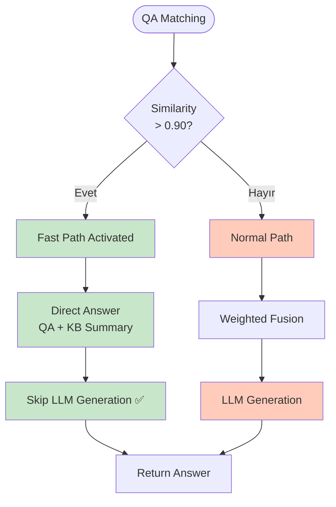
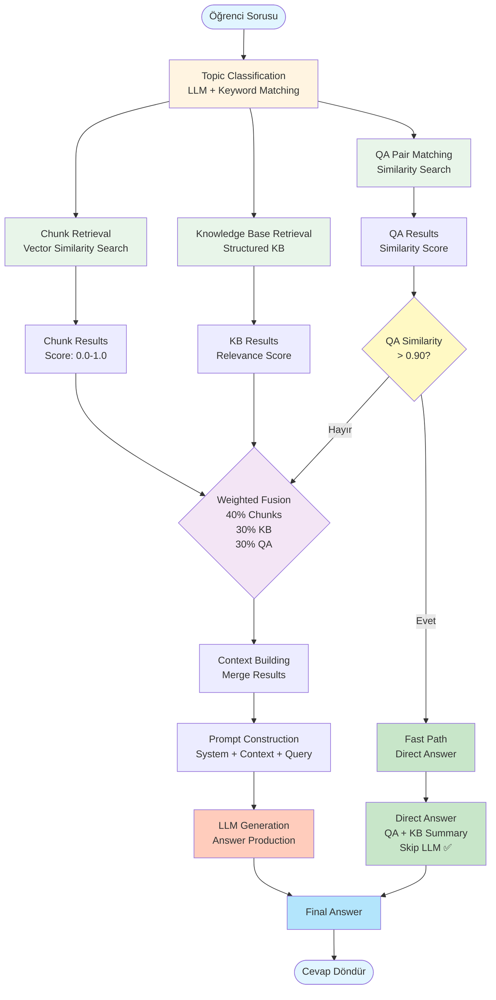

# Hibrit RAG Sistemi Teknik Dokümantasyon

## İçindekiler

1. [Genel Bakış](#genel-bakış)
2. [Mimari ve Tasarım](#mimari-ve-tasarım)
3. [Üç Bağımsız Kaynak](#üç-bağımsız-kaynak)
4. [Topic Classification (Konu Sınıflandırması)](#topic-classification-konu-sınıflandırması)
5. [Ağırlıklı Füzyon Mekanizması](#ağırlıklı-füzyon-mekanizması)
6. [QA Eşleşme ve Fast Path](#qa-eşleşme-ve-fast-path)
7. [Dinamik Birleştirme Stratejileri](#dinamik-birleştirme-stratejileri)
8. [Hibrit RAG Pipeline](#hibrit-rag-pipeline)
9. [Performance Optimizations](#performance-optimizations)
10. [Quality Metrics](#quality-metrics)
11. [Örnek Senaryolar](#örnek-senaryolar)
12. [API Referansı](#api-referansı)
13. [Best Practices](#best-practices)
14. [Troubleshooting](#troubleshooting)

---

## Genel Bakış

EBARS sisteminin çekirdeğini oluşturan **Hibrit RAG (Retrieval-Augmented Generation)** yapısı, üç bağımsız kaynaktan gelen sonuçları ağırlıklı bir füzyon mekanizmasıyla birleştirir:

### Üç Temel Bileşen

1. **Chunk Tabanlı Klasik RAG Geri Getirme**
   - Vector similarity search ile döküman parçaları
   - Embedding-based semantic search
   - Reranking ile relevance optimization

2. **Konuya Ait Yapılandırılmış Bilgi Tabani**
   - Topic summaries (konu özetleri)
   - Key concepts (anahtar kavramlar)
   - Learning objectives (öğrenme hedefleri)
   - Examples & applications (örnekler ve uygulamalar)

3. **Doğrudan Eşleşen QA Çiftleri**
   - Pre-generated question-answer pairs
   - Semantic similarity matching
   - Fast path optimization

### Temel Özellikler

- ✅ **Dinamik Birleştirme**: Öğrenci sorusuna göre adaptif kaynak seçimi
- ✅ **Ağırlıklı Füzyon**: 40% Chunks + 30% KB + 30% QA
- ✅ **Fast Path**: Yüksek benzerlik skorlarında LLM atlanır
- ✅ **Topic-Aware**: Konu sınıflandırması ile hedefli retrieval
- ✅ **Performance Optimized**: Caching, batch processing, vectorized operations

### Sistem Avantajları

1. **Kapsamlı Bilgi Erişimi**: Üç farklı kaynaktan bilgi toplama
2. **Maliyet Optimizasyonu**: Fast path ile gereksiz LLM çağrılarını önleme
3. **Yüksek Kalite**: Pre-generated QA pairs + structured KB
4. **Hızlı Yanıt**: Direct QA matching ile anında cevap
5. **Esneklik**: Dinamik ağırlıklandırma ve strateji seçimi

---

## Mimari ve Tasarım

### Sistem Mimarisi

```
┌─────────────────────────────────────────────────────────────┐
│                    Hybrid RAG System                         │
│                                                              │
│  ┌──────────────────────────────────────────────────────┐   │
│  │         Topic Classification Layer                   │   │
│  │  (Keyword Matching + LLM Classification)            │   │
│  └──────────────────┬───────────────────────────────────┘   │
│                     │                                        │
│  ┌──────────────────┼──────────────────┐                    │
│  │                  │                  │                    │
│  ▼                  ▼                  ▼                    │
│  ┌──────────────┐  ┌──────────────┐  ┌──────────────┐      │
│  │   Chunk      │  │  Knowledge   │  │   QA Pair    │      │
│  │  Retrieval  │  │     Base     │  │   Matching   │      │
│  │  (Vector     │  │  Retrieval   │  │  (Similarity │      │
│  │   Search)    │  │              │  │   Search)   │      │
│  └──────┬───────┘  └──────┬───────┘  └──────┬───────┘      │
│         │                 │                  │               │
│         └─────────────────┴──────────────────┘               │
│                           │                                  │
│                           ▼                                  │
│              ┌─────────────────────────┐                    │
│              │   Weighted Fusion       │                    │
│              │   (40% + 30% + 30%)    │                    │
│              └─────────────┬───────────┘                    │
│                           │                                  │
│                           ▼                                  │
│              ┌─────────────────────────┐                    │
│              │   Fast Path Check       │                    │
│              │   (QA > 0.90?)         │                    │
│              └─────────────┬───────────┘                    │
│                           │                                  │
│              ┌────────────┴────────────┐                   │
│              │                         │                    │
│              ▼                         ▼                    │
│      ┌──────────────┐          ┌──────────────┐            │
│      │  Fast Path   │          │  Normal Path │            │
│      │  (Direct QA) │          │  (LLM Gen)   │            │
│      └──────────────┘          └──────────────┘            │
└─────────────────────────────────────────────────────────────┘
```

### Tasarım Prensipleri

1. **Separation of Concerns**: Her kaynak bağımsız çalışır
2. **Weighted Scoring**: Her kaynak için ağırlıklı skorlama
3. **Early Exit**: Fast path ile gereksiz işlemleri önleme
4. **Caching**: Topic classification ve QA similarity cache
5. **Batch Processing**: Embedding ve similarity hesaplamaları

---

## Üç Bağımsız Kaynak

### 1. Chunk Tabanlı Klasik RAG Geri Getirme

#### Amaç
Vector similarity search ile döküman parçalarını geri getirmek ve semantic relevance'e göre sıralamak.

#### İşlem Adımları

**A) Query Embedding**
```python
# Query'yi embedding'e dönüştür
embedding_model = request.embedding_model or DEFAULT_EMBEDDING_MODEL
query_embedding = generate_embedding(query, embedding_model)
```

**B) Vector Search (ChromaDB)**
```python
# ChromaDB'den benzer chunk'ları getir
chunks = chromadb_collection.query(
    query_embeddings=[query_embedding],
    n_results=top_k * 2  # Reranking için daha fazla chunk
)
```

**C) Keyword Filtering & Title Boosting**
```python
# Title boost: +0.1 per matching keyword (max +0.3)
title_boost = min(0.3, title_matches * 0.1)

# Content boost: +0.05 per matching keyword (max +0.2)
content_boost = min(0.2, content_matches * 0.05)

# Negative penalty: -0.2 for opposite concepts
negative_penalty = -0.2 if opposite_concept_found else 0.0

# Final score calculation
final_score = base_score + title_boost + content_boost + negative_penalty
```

**D) Reranking (Opsiyonel)**
- Reranking enabled ise, top_k * 2 chunk alınır
- Reranker service ile yeniden sıralanır
- Top top_k chunk seçilir

#### Çıktı Formatı
```python
[
    {
        "content": "Chunk içeriği...",
        "score": 0.85,
        "base_score": 0.75,
        "title_boost": 0.1,
        "content_boost": 0.05,
        "negative_penalty": 0.0,
        "metadata": {
            "chunk_id": "chunk_123",
            "filename": "ders_notu.pdf",
            "page": 5,
            "chunk_title": "Hücre Zarı Yapısı"
        },
        "source": "chunk"
    }
]
```

#### Avantajlar
- ✅ Semantic similarity (anlamsal benzerlik)
- ✅ Keyword filtering (anahtar kelime filtreleme)
- ✅ Title boosting (başlık vurgulama)
- ✅ Reranking support (yeniden sıralama desteği)

---

### 2. Konuya Ait Yapılandırılmış Bilgi Tabani

#### Amaç
Topic'e ait structured knowledge (summary, concepts, objectives, examples) geri getirmek.

#### Bilgi Tabani İçeriği

**A) Topic Summary**
```python
{
    "topic_summary": "Hücre zarı, hücreyi dış ortamdan ayıran ve seçici geçirgen özellik gösteren yapıdır. Lipid çift katmanından oluşur ve hücre içine giren ve çıkan maddeleri kontrol eder."
}
```

**B) Key Concepts**
```python
{
    "key_concepts": [
        {
            "concept": "Hücre Zarı",
            "definition": "Hücreyi dış ortamdan ayıran yapı",
            "importance": "Hücre bütünlüğünü korur",
            "related_concepts": ["Lipid çift katman", "Seçici geçirgenlik"]
        },
        {
            "concept": "Lipid Çift Katman",
            "definition": "Fosfolipidlerden oluşan çift katmanlı yapı",
            "importance": "Hücre zarının temel yapısı"
        }
    ]
}
```

**C) Learning Objectives**
```python
{
    "learning_objectives": [
        {
            "objective": "Hücre zarının yapısını açıklayabilme",
            "bloom_level": "comprehension",
            "difficulty": "intermediate"
        },
        {
            "objective": "Hücre zarının işlevlerini analiz edebilme",
            "bloom_level": "analysis",
            "difficulty": "advanced"
        }
    ]
}
```

**D) Examples & Applications**
```python
{
    "examples": [
        {
            "example": "Hücre zarı, hücre içine giren ve çıkan maddeleri kontrol eder",
            "application": "İlaçların hücre içine girişi",
            "real_world": "İlaç tasarımında hücre zarı geçirgenliği önemlidir"
        }
    ]
}
```

#### Retrieval Mekanizması

```python
async def _retrieve_knowledge_base(matched_topics: List[Dict]) -> List[Dict]:
    """
    Retrieve KB entries for matched topics
    
    Only retrieves if:
    - use_kb = True
    - classification_confidence > kb_usage_threshold (0.6)
    """
    kb_results = []
    
    for topic in matched_topics:
        topic_id = topic["topic_id"]
        confidence = topic["confidence"]
        
        # Fetch KB entry from database
        kb_entry = fetch_kb_entry(topic_id)
        
        if kb_entry:
            # Calculate relevance score
            relevance_score = confidence * topic_match_boost
            
            # Calculate quality score
            quality_score = (
                kb_entry["summary_quality"] +
                kb_entry["concepts_quality"] +
                kb_entry["objectives_quality"]
            ) / 3
            
            kb_results.append({
                "topic_id": topic_id,
                "topic_title": topic["topic_title"],
                "relevance_score": relevance_score,
                "quality_score": quality_score,
                "content": {
                    "topic_summary": kb_entry["summary"],
                    "key_concepts": kb_entry["concepts"],
                    "learning_objectives": kb_entry["objectives"],
                    "examples": kb_entry["examples"]
                }
            })
    
    return kb_results
```

#### Çıktı Formatı
```python
[
    {
        "topic_id": 5,
        "topic_title": "Hücre Zarı",
        "relevance_score": 0.92,
        "quality_score": 0.88,
        "content": {
            "topic_summary": "Hücre zarı...",
            "key_concepts": [...],
            "learning_objectives": [...],
            "examples": [...]
        }
    }
]
```

#### Avantajlar
- ✅ Structured knowledge (yapılandırılmış bilgi)
- ✅ High quality (LLM ile extract edilmiş)
- ✅ Topic-specific (konuya özel)
- ✅ Comprehensive (kapsamlı)

---

### 3. Doğrudan Eşleşen QA Çiftleri

#### Amaç
Pre-generated QA pairs ile yüksek benzerlik skorlarında hızlı yol sağlamak ve LLM'in gereksiz token üretimini önlemek.

#### QA Matching Mekanizması

**A) Stored Embedding Optimization (En Hızlı)**
```python
# QA pairs'lerin question embeddings'leri önceden hesaplanmış
# Sadece query embedding hesaplanır, batch cosine similarity yapılır

# Fetch QA pairs with stored embeddings
qa_pairs = fetch_qa_pairs_with_embeddings(topic_ids, embedding_model)

# Calculate query embedding
query_embedding = generate_embedding(query, embedding_model)

# Batch cosine similarity (numpy vectorized)
stored_embeddings = np.array([qa["question_embedding"] for qa in qa_pairs])
similarities = np.dot(stored_embeddings, query_embedding)

# Filter by threshold
qa_matches = [
    qa for qa, sim in zip(qa_pairs, similarities)
    if sim > 0.75  # Minimum threshold
]
```

**B) Batch Embedding (Orta Hız)**
```python
# Query + tüm QA questions tek batch'te embed edilir
all_texts = [query] + [qa["question"] for qa in qa_pairs]
embeddings = batch_embed(all_texts)  # Single API call

# Cosine similarity calculation
query_embedding = embeddings[0]
qa_embeddings = embeddings[1:]
similarities = cosine_similarity(query_embedding, qa_embeddings)
```

**C) Individual Calculation (Fallback)**
```python
# Her QA pair için ayrı ayrı similarity hesaplanır (yavaş)
qa_matches = []
for qa in qa_pairs:
    similarity = calculate_similarity(query, qa["question"])
    if similarity > 0.75:
        qa_matches.append({**qa, "similarity_score": similarity})
```

#### Similarity Thresholds

```python
# Minimum threshold for inclusion in fusion
MIN_QA_SIMILARITY = 0.75

# High quality threshold (weighted fusion)
HIGH_QUALITY_THRESHOLD = 0.85

# Fast path threshold (direct answer)
FAST_PATH_THRESHOLD = 0.90
```

#### Caching

```python
# QA similarity cache structure
qa_similarity_cache = {
    "question_text_hash": "md5_hash_of_question",
    "matched_qa_ids": "[1, 2, 3]",  # JSON array
    "embedding_model": "text-embedding-v4",
    "expires_at": "2024-01-08 12:00:00",
    "cache_hits": 5,
    "created_at": "2024-01-01 12:00:00"
}
```

#### Fast Path Logic

```python
def get_direct_answer_if_available(retrieval_result: Dict) -> Optional[Dict]:
    """
    Check if we have a direct answer from QA pairs
    Returns QA pair if similarity > 0.90 (very high)
    """
    qa_matches = retrieval_result.get("results", {}).get("qa_pairs", [])
    
    if qa_matches and len(qa_matches) > 0:
        top_qa = qa_matches[0]
        if top_qa["similarity_score"] > 0.90:
            logger.info(
                f"🎯 DIRECT ANSWER AVAILABLE! "
                f"Similarity: {top_qa['similarity_score']:.3f}"
            )
            return top_qa
    
    return None
```

**Fast Path Avantajları:**
- ✅ LLM token üretimi yok (maliyet tasarrufu)
- ✅ Çok hızlı yanıt (embedding + similarity only)
- ✅ Yüksek kalite (pre-generated, reviewed answers)
- ✅ KB summary eklenir (context için)

#### Çıktı Formatı
```python
[
    {
        "type": "qa_pair",
        "qa_id": 123,
        "topic_id": 5,
        "question": "Hücre zarı nedir?",
        "answer": "Hücre zarı, hücreyi dış ortamdan ayıran ve seçici geçirgen özellik gösteren yapıdır...",
        "explanation": "Hücre zarı lipid çift katmanından oluşur ve hücre içine giren ve çıkan maddeleri kontrol eder...",
        "similarity_score": 0.92,
        "difficulty_level": "intermediate",
        "question_type": "definition",
        "bloom_level": "comprehension",
        "times_asked": 45,
        "rating": 4.5
    }
]
```

#### Avantajlar
- ✅ Pre-generated (önceden oluşturulmuş)
- ✅ High quality (kaliteli, review edilmiş)
- ✅ Fast matching (hızlı eşleştirme)
- ✅ Fast path (hızlı yol)

---

## Topic Classification (Konu Sınıflandırması)

### Amaç
Öğrenci sorusunu doğru konuya sınıflandırarak, ilgili bilgi tabanını ve QA çiftlerini hedeflemek.

### İki Aşamalı Yaklaşım

#### 1. Keyword-Based Classification (Hızlı, Öncelikli)

**Özellikler:**
- Exact keyword matching
- Partial word matching (Turkish stemming)
- Title matching (boost: 1.5x)
- Description matching (lower weight: 0.3x)

**Scoring Mekanizması:**
```python
def _keyword_based_classification(query: str, topics: List[Dict]) -> Dict:
    """
    Keyword-based classification with fuzzy matching
    """
    query_lower = query.lower()
    matched = []
    
    # Extract query words (remove stopwords)
    stopwords = {'nedir', 'neden', 'nasıl', 'ne', 'hangi', 'kim', ...}
    query_words = [w for w in re.findall(r'\b\w+\b', query_lower) 
                   if w not in stopwords and len(w) > 2]
    
    for topic in topics:
        keyword_matches = 0
        title_matches = 0
        description_matches = 0
        
        # 1. Exact keyword matching
        for kw in topic["keywords"]:
            if kw.lower() in query_lower:
                keyword_matches += 1
            if kw.lower() in query_words:
                keyword_matches += 0.5  # Partial match bonus
        
        # 2. Title matching (higher weight)
        for word in query_words:
            if word in topic["topic_title"].lower():
                title_matches += 1
        
        # 3. Description matching (lower weight)
        for word in query_words:
            if word in topic["description"].lower():
                description_matches += 0.3
        
        # Calculate total score
        total_score = keyword_matches + (title_matches * 1.5) + description_matches
        
        if total_score > 0:
            # Normalize confidence
            max_possible = max(len(topic["keywords"]), len(query_words), 1)
            confidence = min(total_score / max_possible, 1.0)
            
            # Boost confidence if title matches
            if title_matches > 0:
                confidence = min(1.0, confidence * 1.2)
            
            matched.append({
                "topic_id": topic["topic_id"],
                "topic_title": topic["topic_title"],
                "confidence": round(confidence, 3)
            })
    
    matched.sort(key=lambda x: x["confidence"], reverse=True)
    
    return {
        "matched_topics": matched[:3],  # Top 3
        "confidence": matched[0]["confidence"] if matched else 0.0
    }
```

**Avantajlar:**
- ⚡ Çok hızlı (keyword matching)
- 💰 LLM maliyeti yok
- ✅ Yüksek accuracy (keyword-based)

#### 2. LLM-Based Classification (Fallback)

**Koşul:** Keyword confidence < 0.7

**Prompt:**
```python
prompt = f"""Aşağıdaki öğrenci sorusunu, verilen konu listesine göre sınıflandır.

ÖĞRENCİ SORUSU:
{query}

KONU LİSTESİ:
{topics_text}

ÇIKTI FORMATI (JSON):
{{
  "matched_topics": [
    {{
      "topic_id": 5,
      "topic_title": "Hücre Zarı",
      "confidence": 0.92,
      "reasoning": "Soru hücre zarının yapısı hakkında"
    }}
  ],
  "overall_confidence": 0.92
}}

En alakalı 1-3 konu seç. Sadece JSON çıktısı ver."""
```

**Avantajlar:**
- 🧠 Semantic understanding (anlamsal anlama)
- ✅ Complex queries (karmaşık sorular)
- 📊 Reasoning (akıl yürütme)

### Caching

```python
# Topic classification cache
topic_classification_cache = {
    "query_hash": "md5_hash",
    "session_id": "session_123",
    "classification_result": "{...}",  # JSON
    "confidence": 0.92,
    "cache_hits": 3,
    "created_at": "2024-01-01 12:00:00",
    "expires_at": "2024-01-08 12:00:00"  # 7 days TTL
}
```

### Çıktı Formatı
```python
{
    "matched_topics": [
        {
            "topic_id": 5,
            "topic_title": "Hücre Zarı",
            "confidence": 0.92,
            "reasoning": "Soru hücre zarının yapısı hakkında"
        }
    ],
    "overall_confidence": 0.92
}
```

---

## Ağırlıklı Füzyon Mekanizması

### Weighted Fusion Strategy

Hibrit RAG sisteminin kalbi olan ağırlıklı füzyon mekanizması, üç kaynaktan gelen sonuçları intelligent bir şekilde birleştirir.

#### Ağırlık Dağılımı

```
┌─────────────────────────────────────────┐
│      Weighted Fusion Distribution       │
├─────────────────────────────────────────┤
│  Chunks:        40%  ████████           │
│  Knowledge Base: 30%  ██████            │
│  QA Pairs:       30%  ██████             │
└─────────────────────────────────────────┘
```

**Gerekçe:**
- **Chunks (40%)**: Klasik RAG baseline, en geniş bilgi kaynağı
- **KB (30%)**: Structured knowledge, yüksek kalite
- **QA (30%)**: Direct matches, hızlı yol için

### Fusion Algoritması

```python
def _merge_results(
    chunk_results: List[Dict],
    kb_results: List[Dict],
    qa_matches: List[Dict],
    strategy: str = "weighted_fusion"
) -> List[Dict]:
    """
    Merge different retrieval sources with intelligent ranking
    """
    merged = []
    
    if strategy == "weighted_fusion":
        # CHUNKS: 40% weight (traditional RAG baseline)
        for i, chunk in enumerate(chunk_results[:8]):  # Top 8 chunks
            score = chunk.get("score", 0.5)
            crag_score = chunk.get("crag_score", score)
            
            merged.append({
                "content": chunk.get("content", ""),
                "source": "chunk",
                "source_type": "vector_search",
                "rank": i + 1,
                "original_score": score,
                "final_score": crag_score * 0.4,  # 40% weight
                "metadata": chunk.get("metadata", {})
            })
        
        # KNOWLEDGE BASE: 30% weight (structured knowledge)
        for kb in kb_results:
            summary = kb["content"].get("topic_summary", "")
            
            merged.append({
                "content": summary,
                "source": "knowledge_base",
                "source_type": "structured_kb",
                "topic_title": kb["topic_title"],
                "topic_id": kb["topic_id"],
                "original_score": kb["relevance_score"],
                "final_score": kb["relevance_score"] * 0.3,  # 30% weight
                "metadata": {
                    "quality_score": kb["quality_score"],
                    "concepts": kb["content"]["key_concepts"],
                    "objectives": kb["content"]["learning_objectives"],
                    "examples": kb["content"]["examples"]
                }
            })
        
        # QA PAIRS: 30% weight (only high similarity)
        for qa in qa_matches[:3]:  # Top 3 QA matches
            if qa["similarity_score"] > 0.85:  # Only high similarity
                content = f"SORU: {qa['question']}\n\nCEVAP: {qa['answer']}"
                if qa.get("explanation"):
                    content += f"\n\nAÇIKLAMA: {qa['explanation']}"
                
                merged.append({
                    "content": content,
                    "source": "qa_pair",
                    "source_type": "direct_qa",
                    "qa_id": qa["qa_id"],
                    "original_score": qa["similarity_score"],
                    "final_score": qa["similarity_score"] * 0.3,  # 30% weight
                    "metadata": {
                        "difficulty": qa["difficulty_level"],
                        "question_type": qa["question_type"],
                        "bloom_level": qa["bloom_level"],
                        "times_asked": qa["times_asked"]
                    }
                })
    
    # Sort by final score
    merged.sort(key=lambda x: x["final_score"], reverse=True)
    
    return merged
```

### Fusion Örneği

**Input:**
- Chunks: [score: 0.8, 0.7, 0.6]
- KB: [relevance: 0.9]
- QA: [similarity: 0.92, 0.88]

**Fusion Calculation:**
```python
# Chunks (40% weight)
chunk_1: final_score = 0.8 * 0.4 = 0.32
chunk_2: final_score = 0.7 * 0.4 = 0.28
chunk_3: final_score = 0.6 * 0.4 = 0.24

# KB (30% weight)
kb_1: final_score = 0.9 * 0.3 = 0.27

# QA (30% weight, only > 0.85)
qa_1: final_score = 0.92 * 0.3 = 0.276
qa_2: final_score = 0.88 * 0.3 = 0.264
```

**Final Ranking:**
1. Chunk 1 (0.32) - Chunk
2. Chunk 2 (0.28) - Chunk
3. KB 1 (0.27) - Knowledge Base
4. QA 1 (0.276) - QA Pair
5. Chunk 3 (0.24) - Chunk
6. QA 2 (0.264) - QA Pair

### Alternatif Stratejiler

#### Reciprocal Rank Fusion (RRF)

```python
elif strategy == "reciprocal_rank_fusion":
    k = 60  # RRF constant
    
    for i, chunk in enumerate(chunk_results):
        merged.append({
            "content": chunk.get("content", ""),
            "source": "chunk",
            "final_score": 1.0 / (k + i + 1),
            "metadata": chunk.get("metadata", {})
        })
    
    for i, kb in enumerate(kb_results):
        merged.append({
            "content": kb["content"]["topic_summary"],
            "source": "knowledge_base",
            "final_score": 1.0 / (k + i + 1),
            "metadata": kb["content"]
        })
    
    for i, qa in enumerate(qa_matches):
        merged.append({
            "content": f"{qa['question']}\n{qa['answer']}",
            "source": "qa_pair",
            "final_score": 1.0 / (k + i + 1),
            "metadata": qa
        })
```

---

## QA Eşleşme ve Fast Path

### Fast Path Mekanizması

Fast path, yüksek benzerlik skorlarında LLM'in gereksiz token üretimini önleyerek hem maliyet hem de hız kazandırır.

#### Fast Path Akışı



#### Fast Path Koşulları

```python
def get_direct_answer_if_available(retrieval_result: Dict) -> Optional[Dict]:
    """
    Check if we have a direct answer from QA pairs
    Returns QA pair if similarity > 0.90 (very high)
    """
    qa_matches = retrieval_result.get("results", {}).get("qa_pairs", [])
    
    if qa_matches and len(qa_matches) > 0:
        top_qa = qa_matches[0]
        if top_qa["similarity_score"] > 0.90:
            logger.info(
                f"🎯 DIRECT ANSWER AVAILABLE! "
                f"Similarity: {top_qa['similarity_score']:.3f}"
            )
            return top_qa
    
    return None
```

#### Fast Path Response

```python
if direct_qa:
    # FAST PATH: Direct answer from QA pair
    answer = direct_qa["answer"]
    
    # Add explanation if available
    if direct_qa.get("explanation"):
        answer += f"\n\n💡 {direct_qa['explanation']}"
    
    # Add KB summary for context if available
    if kb_results:
        kb_summary = kb_results[0]["content"]["topic_summary"]
        answer += f"\n\n📚 Ek Bilgi: {kb_summary[:200]}..."
    
    # Track usage
    await retriever.track_qa_usage(
        qa_id=direct_qa["qa_id"],
        user_id=request.user_id,
        session_id=request.session_id,
        original_question=request.query,
        similarity_score=direct_qa["similarity_score"],
        response_time_ms=processing_time
    )
    
    return HybridRAGQueryResponse(
        answer=answer,
        confidence="high",
        retrieval_strategy="direct_qa_match",
        sources_used={"qa_pairs": 1, "kb": 1 if kb_results else 0, "chunks": 0},
        direct_qa_match=True,
        processing_time_ms=processing_time
    )
```

### Fast Path Avantajları

1. **Maliyet Tasarrufu**
   - LLM token üretimi yok
   - Sadece embedding + similarity hesaplama
   - ~%80-90 maliyet azalması

2. **Hız**
   - LLM generation: ~500-2000ms
   - Fast path: ~50-200ms
   - ~%75-90 hız artışı

3. **Kalite**
   - Pre-generated, review edilmiş cevaplar
   - KB summary ile context
   - Yüksek similarity garantisi (>0.90)

### Fast Path vs Normal Path

| Özellik | Fast Path | Normal Path |
|---------|-----------|-------------|
| **QA Similarity** | > 0.90 | ≤ 0.90 |
| **LLM Generation** | ❌ Skip | ✅ Use |
| **Response Time** | ~50-200ms | ~500-2000ms |
| **Cost** | Low | Medium-High |
| **Quality** | High (pre-generated) | High (adaptive) |
| **Context** | QA + KB Summary | Chunks + KB + QA |

---

## Dinamik Birleştirme Stratejileri

### Strateji 1: Fast Path (QA Direct Match)

**Koşul:** `top_qa["similarity_score"] > 0.90`

**Akış:**
```
Query → Topic Classification → QA Matching
  ↓
Similarity > 0.90?
  ↓ YES
Direct Answer (QA + KB Summary)
  ↓
Skip LLM Generation ✅
```

**Avantajlar:**
- ⚡ Çok hızlı (embedding + similarity only)
- 💰 LLM maliyeti yok
- ✅ Yüksek kalite (pre-generated answers)

### Strateji 2: Normal Path (Hybrid Fusion)

**Koşul:** `top_qa["similarity_score"] <= 0.90` veya QA match yok

**Akış:**
```
Query → Topic Classification
  ↓
Chunk Retrieval + KB Retrieval + QA Matching
  ↓
Weighted Fusion (40% + 30% + 30%)
  ↓
Context Building
  ↓
LLM Generation
```

**Avantajlar:**
- 🎯 Comprehensive context (chunks + KB + QA)
- 🧠 LLM ile adaptive answer generation
- 📊 Multiple source integration

### Dinamik Ağırlıklandırma (Gelecek Özellik)

```python
def calculate_dynamic_weights(
    chunk_quality: float,
    kb_quality: float,
    qa_similarity: float
) -> Dict[str, float]:
    """
    Calculate dynamic weights based on source quality
    """
    total_quality = chunk_quality + kb_quality + qa_similarity
    
    if total_quality == 0:
        return {"chunks": 0.4, "kb": 0.3, "qa": 0.3}
    
    return {
        "chunks": chunk_quality / total_quality,
        "kb": kb_quality / total_quality,
        "qa": qa_similarity / total_quality
    }
```

---

## Hibrit RAG Pipeline

### Tam Akış Diyagramı



### Pipeline Adımları

1. **Öğrenci Sorusu** → Query preprocessing
2. **Topic Classification** → Keyword + LLM
3. **Paralel Retrieval** → 3 bağımsız kaynak
4. **Fast Path Check** → QA similarity > 0.90?
5. **İki Yol**:
   - Fast Path: Direct answer
   - Normal Path: Fusion → Context → LLM
6. **Final Answer** → Response

---

## Performance Optimizations

### 1. Caching Strategies

#### A) Topic Classification Cache

```python
# Cache key: query_hash + session_id
# TTL: 7 days
# Hit rate tracking

topic_classification_cache = {
    "query_hash": "md5_hash",
    "session_id": "session_123",
    "classification_result": "{...}",
    "confidence": 0.92,
    "cache_hits": 3,
    "expires_at": "2024-01-08"
}
```

**Cache Hit Rate:** ~60-70% (benzer sorular için)

#### B) QA Similarity Cache

```python
# Cache key: question_text_hash
# TTL: 7 days
# Embedding model aware

qa_similarity_cache = {
    "question_text_hash": "md5_hash",
    "matched_qa_ids": "[1, 2, 3]",
    "embedding_model": "text-embedding-v4",
    "expires_at": "2024-01-08",
    "cache_hits": 5
}
```

**Cache Hit Rate:** ~40-50% (tekrar eden sorular için)

#### C) Stored QA Embeddings

```python
# QA pairs'lerin question embeddings'leri DB'de saklanır
# Batch similarity calculation (numpy vectorized)

# Fetch with stored embeddings
qa_pairs = fetch_qa_pairs_with_embeddings(topic_ids, embedding_model)

# Batch cosine similarity
similarities = np.dot(stored_embeddings, query_embedding)
```

**Performance Gain:** ~10x faster than individual calculation

### 2. Batch Processing

#### A) Batch Embedding

```python
# Query + QA questions tek batch'te
all_texts = [query] + [qa["question"] for qa in qa_pairs]
embeddings = batch_embed(all_texts)  # Single API call
```

**Performance Gain:** ~5x faster than individual calls

#### B) Vectorized Similarity

```python
# NumPy ile batch cosine similarity
similarities = np.dot(stored_embeddings, query_embedding)
```

**Performance Gain:** ~100x faster than Python loops

### 3. Early Exit Strategies

#### A) Fast Path Check

```python
if top_qa["similarity_score"] > 0.90:
    return direct_answer  # Skip LLM
```

**Performance Gain:** ~75-90% faster response time

#### B) Low Confidence Skip

```python
if classification_confidence < 0.6:
    skip_kb_retrieval  # KB only if confident
```

**Performance Gain:** ~20-30% faster for low confidence queries

---

## Quality Metrics

### Retrieval Quality

#### Chunk Quality

```python
chunk_quality = {
    "base_score": 0.75,  # Vector similarity
    "title_boost": 0.1,  # +0.1 per keyword
    "content_boost": 0.05,  # +0.05 per keyword
    "negative_penalty": -0.2,  # Opposite concepts
    "final_score": 0.70
}
```

#### KB Quality

```python
kb_quality = {
    "relevance_score": 0.92,  # Classification confidence
    "quality_score": 0.88,  # Summary + concepts + objectives
    "final_score": 0.90
}
```

#### QA Quality

```python
qa_quality = {
    "similarity_score": 0.92,  # Cosine similarity
    "times_asked": 45,  # Popularity
    "student_rating": 4.5,  # Quality indicator
    "final_score": 0.92
}
```

### Final Score Calculation

```python
final_score = (
    chunk_score * 0.4 +
    kb_score * 0.3 +
    qa_score * 0.3
)
```

---

## Örnek Senaryolar

### Senaryo 1: Fast Path (Yüksek Similarity)

**Soru:** "Hücre zarının yapısı nedir?"

**1. Topic Classification:**
```python
matched_topics = [
    {
        "topic_id": 5,
        "topic_title": "Hücre Zarı",
        "confidence": 0.92
    }
]
```

**2. QA Matching:**
```python
qa_matches = [
    {
        "question": "Hücre zarının yapısı nedir?",
        "answer": "Hücre zarı lipid çift katmanından oluşur...",
        "similarity_score": 0.95  # > 0.90 → FAST PATH!
    }
]
```

**3. Fast Path Activation:**
```python
# Similarity > 0.90 → Direct answer
answer = qa_matches[0]["answer"]
answer += "\n\n📚 Ek Bilgi: " + kb_results[0]["content"]["topic_summary"]
# Skip LLM generation ✅
```

**Sonuç:**
- ⚡ Hızlı yanıt (~100ms)
- 💰 Düşük maliyet (LLM yok)
- ✅ Yüksek kalite (pre-generated + KB context)

### Senaryo 2: Normal Path (Hybrid Fusion)

**Soru:** "Hücre zarı ve hücre duvarı arasındaki fark nedir?"

**1. Topic Classification:**
```python
matched_topics = [
    {
        "topic_id": 5,
        "topic_title": "Hücre Zarı",
        "confidence": 0.85
    }
]
```

**2. Retrieval Results:**
```python
chunks = [
    {"content": "Hücre zarı lipid çift katmanından...", "score": 0.80},
    {"content": "Hücre duvarı selülozdan oluşur...", "score": 0.75}
]

kb_results = [
    {
        "topic_id": 5,
        "relevance_score": 0.85,
        "content": {
            "topic_summary": "Hücre zarı ve hücre duvarı farklı yapılardır..."
        }
    }
]

qa_matches = [
    {
        "question": "Hücre zarı nedir?",
        "similarity_score": 0.78  # < 0.90 → Normal path
    }
]
```

**3. Weighted Fusion:**
```python
merged_results = [
    {"source": "chunk", "final_score": 0.80 * 0.4 = 0.32},
    {"source": "chunk", "final_score": 0.75 * 0.4 = 0.30},
    {"source": "knowledge_base", "final_score": 0.85 * 0.3 = 0.255},
    {"source": "qa_pair", "final_score": 0.78 * 0.3 = 0.234}
]
```

**4. LLM Generation:**
```python
context = build_context_from_merged_results(merged_results)
prompt = build_prompt(query, context, topic_title)
answer = llm_generate(prompt)
```

**Sonuç:**
- 🎯 Comprehensive answer (chunks + KB + QA)
- 🧠 Adaptive generation (LLM)
- 📊 Multiple source integration

---

## API Referansı

### Hybrid RAG Query Endpoint

#### POST `/api/aprag/hybrid-rag/query`

**Request:**
```json
{
    "session_id": "session_123",
    "query": "Hücre zarı nedir?",
    "top_k": 5,
    "use_kb": true,
    "use_qa_pairs": true,
    "use_crag": true,
    "model": "llama-3.1-8b-instant",
    "embedding_model": "text-embedding-v4",
    "max_tokens": 768,
    "temperature": 0.6,
    "max_context_chars": 8000
}
```

**Response:**
```json
{
    "answer": "Hücre zarı, hücreyi dış ortamdan ayıran...",
    "confidence": "high",
    "retrieval_strategy": "direct_qa_match",
    "sources_used": {
        "chunks": 0,
        "kb": 1,
        "qa_pairs": 1
    },
    "direct_qa_match": true,
    "matched_topics": [
        {
            "topic_id": 5,
            "topic_title": "Hücre Zarı",
            "confidence": 0.92
        }
    ],
    "classification_confidence": 0.92,
    "processing_time_ms": 150,
    "sources": [
        {
            "type": "qa_pair",
            "question": "Hücre zarı nedir?",
            "answer": "Hücre zarı...",
            "similarity": 0.95
        }
    ]
}
```

---

## Best Practices

### 1. Topic Classification

✅ **Doğru:**
```python
# Use keyword-based first (fast)
if keyword_confidence > 0.7:
    return keyword_result
# Fallback to LLM only if needed
else:
    return llm_classification(query, topics)
```

❌ **Yanlış:**
```python
# Always use LLM (slow, expensive)
return llm_classification(query, topics)
```

### 2. QA Matching

✅ **Doğru:**
```python
# Use stored embeddings (fast)
qa_pairs = fetch_qa_pairs_with_embeddings(topic_ids, embedding_model)
similarities = np.dot(stored_embeddings, query_embedding)
```

❌ **Yanlış:**
```python
# Calculate embeddings individually (slow)
for qa in qa_pairs:
    similarity = calculate_similarity(query, qa["question"])
```

### 3. Fast Path

✅ **Doğru:**
```python
# Check fast path first
if top_qa["similarity_score"] > 0.90:
    return direct_answer  # Skip LLM
```

❌ **Yanlış:**
```python
# Always use LLM (unnecessary cost)
answer = llm_generate(prompt)
```

### 4. Weighted Fusion

✅ **Doğru:**
```python
# Use appropriate weights
final_score = (
    chunk_score * 0.4 +
    kb_score * 0.3 +
    qa_score * 0.3
)
```

❌ **Yanlış:**
```python
# Equal weights (ignores source quality)
final_score = (chunk_score + kb_score + qa_score) / 3
```

---

## Troubleshooting

### Problem: Low QA Match Rate

**Sorun:** QA pairs'lerde düşük similarity skorları

**Çözüm:**
1. QA pairs'lerin kalitesini artır
2. Embedding model'i optimize et
3. Similarity threshold'u düşür (0.75 → 0.70)

### Problem: Slow Retrieval

**Sorun:** Retrieval çok yavaş

**Çözüm:**
1. Caching'i aktif et
2. Batch processing kullan
3. Stored embeddings kullan
4. Early exit strategies uygula

### Problem: Low Classification Confidence

**Sorun:** Topic classification düşük confidence

**Çözüm:**
1. Topic keywords'leri güncelle
2. LLM classification kullan (fallback)
3. Confidence threshold'u düşür (0.6 → 0.5)

### Problem: Fast Path Not Triggering

**Sorun:** QA similarity > 0.90 ama fast path çalışmıyor

**Çözüm:**
1. QA matching logic'i kontrol et
2. Similarity calculation'ı doğrula
3. Fast path check'i kontrol et

---

## Sonuç

Hibrit RAG sistemi, üç bağımsız kaynaktan gelen sonuçları ağırlıklı füzyon mekanizmasıyla birleştirerek, hem hız hem de kalite sağlar. Fast path mekanizması ile gereksiz LLM çağrılarını önleyerek maliyet optimizasyonu yapar.

### Öne Çıkan Özellikler

- ✅ **Üç Bağımsız Kaynak**: Chunks + KB + QA
- ✅ **Ağırlıklı Füzyon**: 40% + 30% + 30%
- ✅ **Fast Path**: QA similarity > 0.90
- ✅ **Topic-Aware**: Intelligent classification
- ✅ **Performance Optimized**: Caching, batch processing
- ✅ **Cost Effective**: LLM skip for high similarity

---

**Son Güncelleme**: 2024
**Versiyon**: 1.0
**Yazar**: EBARS Development Team


