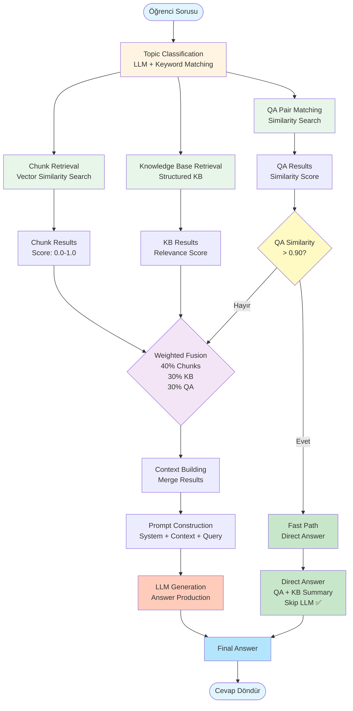

# LLM Katmanı Teknik Dokümantasyon

## İçindekiler

1. [Genel Bakış](#genel-bakış)
2. [Mimari](#mimari)
3. [Hibrit RAG Yapısı](#hibrit-rag-yapısı)
4. [Context Birleştirme](#context-birleştirme)
5. [Prompt Construction](#prompt-construction)
6. [LLM Answer Generation](#llm-answer-generation)
7. [Model Selection ve Provider Management](#model-selection-ve-provider-management)
8. [Cost Optimization](#cost-optimization)
9. [Konuya Uygun Model Seçimi](#konuya-uygun-model-seçimi)
10. [API Referansı](#api-referansı)
11. [Best Practices](#best-practices)
12. [Troubleshooting](#troubleshooting)

---

## Genel Bakış

EBARS sisteminde LLM katmanı, chunking, embedding ve reranking aşamalarından gelen verileri birleştirerek, sistem promptuna ekleyip LLM tarafından cevap üretilmesini sağlar. Sistem, çoklu LLM provider desteği ile esnek model seçimi ve cost optimization özellikleri sunar.

### Temel Özellikler

- **Multi-Provider Support**: Ollama, Groq, OpenRouter, Alibaba, DeepSeek, HuggingFace
- **Context Fusion**: Chunks + Knowledge Base + QA Pairs birleştirme
- **Smart Prompt Engineering**: Sistem promptu + context + query
- **Cost Optimization**: Düşük maliyetli model seçimi
- **Topic-Aware Selection**: Konuya uygun model seçimi
- **Fallback Mechanism**: Provider/model başarısız olursa alternatif

### LLM Katmanı Akışı

```
Chunking → Embedding → Reranking → Context Fusion → Prompt Building → LLM Generation → Answer
```

---

## Mimari

### Sistem Bileşenleri

```
┌─────────────────────────────────────────────────────────────┐
│              Hybrid RAG Query (APRAG Service)              │
│                                                             │
│  1. Chunk Retrieval (Vector Search)                        │
│  2. Knowledge Base Retrieval                                │
│  3. QA Pair Matching                                        │
│  4. Reranking                                               │
│  5. Context Fusion                                          │
│  6. Prompt Construction                                     │
│  7. LLM Generation                                          │
└──────────────────────┬──────────────────────────────────────┘
                       │
                       ▼
        ┌──────────────────────────────┐
        │   Model Inference Service     │
        │   (Provider Router)           │
        └──────────────┬─────────────────┘
                       │
        ┌──────────────┼──────────────┐
        │              │              │
        ▼              ▼              ▼
┌──────────────┐ ┌──────────────┐ ┌──────────────┐
│    Ollama    │ │     Groq     │ │  OpenRouter   │
│   (Local)    │ │   (Cloud)    │ │   (Cloud)    │
└──────────────┘ └──────────────┘ └──────────────┘
        │              │              │
        ▼              ▼              ▼
┌──────────────┐ ┌──────────────┐ ┌──────────────┐
│   Alibaba    │ │   DeepSeek   │ │ HuggingFace  │
│   (Cloud)    │ │   (Cloud)    │ │   (Cloud)    │
└──────────────┘ └──────────────┘ └──────────────┘
```

### LLM Generation Pipeline

```
1. Retrieval Results (Chunks + KB + QA)
   ↓
2. Context Fusion (build_context_from_merged_results)
   ↓
3. Prompt Construction (System Prompt + Context + Query)
   ↓
4. Model Selection (Provider + Model)
   ↓
5. LLM API Call (Model Inference Service)
   ↓
6. Answer Extraction & Cleaning
   ↓
7. Response Return
```

---

## Hibrit RAG Yapısı

### Genel Bakış

EBARS sisteminin çekirdeğini oluşturan hibrit RAG yapısı, üç bağımsız kaynaktan gelen sonuçları ağırlıklı bir füzyon mekanizmasıyla birleştirir:

1. **Chunk Tabanlı Klasik RAG Geri Getirme** - Vector similarity search ile döküman parçaları
2. **Konuya Ait Yapılandırılmış Bilgi Tabani** - Topic summaries, key concepts, learning objectives
3. **Doğrudan Eşleşen QA Çiftleri** - Pre-generated question-answer pairs

Bu üç bileşen, öğrenci sorusuna göre dinamik olarak birleştirilir ve ağırlıklı skorlama ile sıralanır.

### Hibrit RAG Pipeline



### Detaylı Akış Açıklaması

#### 1. Başlangıç: Öğrenci Sorusu
- Kullanıcıdan gelen soru sisteme girer
- Query preprocessing (normalization, stopword removal)

#### 2. Topic Classification
- **Keyword-Based** (hızlı, öncelikli): Keyword matching ile topic bulma
- **LLM-Based** (fallback): Keyword confidence < 0.7 ise LLM kullanılır
- **Output**: Matched topics + confidence score

#### 3. Paralel Retrieval (Üç Bağımsız Kaynak)

**A) Chunk Retrieval:**
- Vector similarity search (ChromaDB)
- Keyword filtering & title boosting
- Reranking (opsiyonel)
- **Output**: Top K chunks with scores

**B) Knowledge Base Retrieval:**
- Topic-based structured knowledge
- Topic summary, key concepts, objectives, examples
- **Output**: KB entries with relevance scores

**C) QA Pair Matching:**
- Semantic similarity search (embedding-based)
- Stored embeddings optimization (hızlı)
- Batch processing (optimized)
- **Output**: QA pairs with similarity scores

#### 4. Fast Path Check
- **Koşul**: `top_qa["similarity_score"] > 0.90`
- **Eğer Evet**: Direct answer path (LLM atlanır)
- **Eğer Hayır**: Normal path (fusion + LLM)

#### 5. Weighted Fusion (Normal Path)
- **Chunks**: 40% weight (baseline RAG)
- **KB**: 30% weight (structured knowledge)
- **QA**: 30% weight (direct matches)
- **Output**: Merged & ranked results

#### 6. Context Building
- Fusion sonuçlarından context string oluşturma
- Source labeling (chunk, KB, QA)
- Length management (max 8000 chars)

#### 7. Prompt Construction
- System prompt (eğitim asistanı rolü)
- Course scope validation
- Context section
- Query section
- Answer rules

#### 8. LLM Generation
- Model selection (provider + model)
- API call to Model Inference Service
- Answer extraction & cleaning

#### 9. Final Answer
- Fast Path: Direct QA answer + KB summary
- Normal Path: LLM-generated answer
- Source attribution
- Confidence scoring

### 1. Topic Classification (Konu Sınıflandırması)

#### Amaç
Öğrenci sorusunu doğru konuya sınıflandırarak, ilgili bilgi tabanını ve QA çiftlerini hedeflemek.

#### Yöntemler

**A) Keyword-Based Classification (Hızlı, Öncelikli)**
```python
def _keyword_based_classification(query: str, topics: List[Dict]) -> Dict:
    """
    Keyword-based classification with fuzzy matching
    
    Features:
    - Exact keyword matching
    - Partial word matching (Turkish stemming)
    - Title matching (boost: 1.5x)
    - Description matching (lower weight: 0.3x)
    """
```

**Scoring Mekanizması:**
- **Keyword Matches**: Her eşleşen keyword için +1.0
- **Title Matches**: Her eşleşen kelime için +1.5 (boost)
- **Description Matches**: Her eşleşen kelime için +0.3 (lower weight)

**Confidence Calculation:**
```python
total_score = keyword_matches + (title_matches * 1.5) + description_matches
confidence = min(total_score / max_possible, 1.0)

# Title match boost
if title_matches > 0:
    confidence = min(1.0, confidence * 1.2)
```

**B) LLM-Based Classification (Fallback)**
- Keyword confidence < 0.7 ise LLM kullanılır
- JSON formatında topic_id, confidence, reasoning döner
- Timeout: 10 saniye (hızlı fallback)

**Caching:**
- Sonuçlar 7 gün cache'lenir
- Query hash + session_id ile unique key
- Cache hit rate tracking

#### Çıktı Formatı
```python
{
    "matched_topics": [
        {
            "topic_id": 5,
            "topic_title": "Hücre Zarı",
            "confidence": 0.92,
            "reasoning": "Soru hücre zarının yapısı hakkında"
        }
    ],
    "overall_confidence": 0.92
}
```

### 2. Chunk Tabanlı Klasik RAG Geri Getirme

#### Amaç
Vector similarity search ile döküman parçalarını geri getirmek.

#### İşlem Adımları

1. **Query Embedding**
   ```python
   embedding_model = request.embedding_model or DEFAULT_EMBEDDING_MODEL
   query_embedding = generate_embedding(query, embedding_model)
   ```

2. **Vector Search**
   ```python
   chunks = chromadb_collection.query(
       query_embeddings=[query_embedding],
       n_results=top_k * 2  # Reranking için daha fazla chunk
   )
   ```

3. **Keyword Filtering & Title Boosting**
   ```python
   # Title boost: +0.1 per matching keyword (max +0.3)
   title_boost = min(0.3, title_matches * 0.1)
   
   # Content boost: +0.05 per matching keyword (max +0.2)
   content_boost = min(0.2, content_matches * 0.05)
   
   # Negative penalty: -0.2 for opposite concepts
   negative_penalty = -0.2 if opposite_concept_found else 0.0
   
   final_score = base_score + title_boost + content_boost + negative_penalty
   ```

4. **Reranking (Opsiyonel)**
   - Reranking enabled ise, top_k * 2 chunk alınır
   - Reranker service ile yeniden sıralanır
   - Top top_k chunk seçilir

#### Çıktı Formatı
```python
[
    {
        "content": "Chunk içeriği...",
        "score": 0.85,
        "base_score": 0.75,
        "title_boost": 0.1,
        "content_boost": 0.05,
        "negative_penalty": 0.0,
        "metadata": {...},
        "source": "chunk"
    }
]
```

### 3. Konuya Ait Yapılandırılmış Bilgi Tabani

#### Amaç
Topic'e ait structured knowledge (summary, concepts, objectives, examples) geri getirmek.

#### Bilgi Tabani İçeriği

**A) Topic Summary**
- Konuya ait özet bilgi
- LLM ile extract edilmiş, yapılandırılmış

**B) Key Concepts**
```python
{
    "concept": "Hücre Zarı",
    "definition": "Hücreyi dış ortamdan ayıran yapı",
    "importance": "Hücre bütünlüğünü korur"
}
```

**C) Learning Objectives**
```python
{
    "objective": "Hücre zarının yapısını açıklayabilme",
    "bloom_level": "comprehension"
}
```

**D) Examples & Applications**
```python
{
    "example": "Hücre zarı, hücre içine giren ve çıkan maddeleri kontrol eder",
    "application": "İlaçların hücre içine girişi"
}
```

#### Retrieval Mekanizması

```python
async def _retrieve_knowledge_base(matched_topics: List[Dict]) -> List[Dict]:
    """
    Retrieve KB entries for matched topics
    
    Only retrieves if:
    - use_kb = True
    - classification_confidence > kb_usage_threshold (0.6)
    """
```

**Relevance Scoring:**
```python
relevance_score = classification_confidence * topic_match_boost
quality_score = (summary_quality + concepts_quality + objectives_quality) / 3
```

#### Çıktı Formatı
```python
[
    {
        "topic_id": 5,
        "topic_title": "Hücre Zarı",
        "relevance_score": 0.92,
        "quality_score": 0.88,
        "content": {
            "topic_summary": "Hücre zarı...",
            "key_concepts": [...],
            "learning_objectives": [...],
            "examples": [...]
        }
    }
]
```

### 4. Doğrudan Eşleşen QA Çiftleri

#### Amaç
Pre-generated QA pairs ile yüksek benzerlik skorlarında hızlı yol sağlamak.

#### QA Matching Mekanizması

**A) Stored Embedding Optimization (En Hızlı)**
```python
# QA pairs'lerin question embeddings'leri önceden hesaplanmış
# Sadece query embedding hesaplanır, batch cosine similarity yapılır
similarities = np.dot(stored_embeddings, query_embedding)
```

**B) Batch Embedding (Orta Hız)**
```python
# Query + tüm QA questions tek batch'te embed edilir
all_texts = [query] + [qa["question"] for qa in qa_pairs]
embeddings = batch_embed(all_texts)
similarities = cosine_similarity(embeddings[0], embeddings[1:])
```

**C) Individual Calculation (Fallback)**
```python
# Her QA pair için ayrı ayrı similarity hesaplanır (yavaş)
for qa in qa_pairs:
    similarity = calculate_similarity(query, qa["question"])
```

#### Similarity Thresholds

```python
# Minimum threshold for inclusion
MIN_QA_SIMILARITY = 0.75

# Fast path threshold (direct answer)
FAST_PATH_THRESHOLD = 0.90

# High quality threshold (weighted fusion)
HIGH_QUALITY_THRESHOLD = 0.85
```

#### Caching

```python
# QA similarity cache
qa_similarity_cache = {
    "question_text_hash": "md5_hash",
    "matched_qa_ids": "[1, 2, 3]",
    "embedding_model": "text-embedding-v4",
    "expires_at": "2024-01-08",
    "cache_hits": 5
}
```

#### Fast Path Logic

```python
def get_direct_answer_if_available(retrieval_result: Dict) -> Optional[Dict]:
    """
    Check if we have a direct answer from QA pairs
    Returns QA pair if similarity > 0.90 (very high)
    """
    top_qa = qa_matches[0]
    if top_qa["similarity_score"] > 0.90:
        # FAST PATH: Skip LLM generation
        return top_qa
    return None
```

**Fast Path Avantajları:**
- ✅ LLM token üretimi yok (maliyet tasarrufu)
- ✅ Çok hızlı yanıt (embedding + similarity only)
- ✅ Yüksek kalite (pre-generated, reviewed answers)
- ✅ KB summary eklenir (context için)

#### Çıktı Formatı
```python
[
    {
        "type": "qa_pair",
        "qa_id": 123,
        "topic_id": 5,
        "question": "Hücre zarı nedir?",
        "answer": "Hücre zarı, hücreyi dış ortamdan ayıran...",
        "explanation": "Hücre zarı lipid çift katmanından oluşur...",
        "similarity_score": 0.92,
        "difficulty_level": "intermediate",
        "question_type": "definition",
        "bloom_level": "comprehension",
        "times_asked": 45,
        "rating": 4.5
    }
]
```

### 5. Ağırlıklı Füzyon Mekanizması

#### Weighted Fusion Strategy

**Ağırlık Dağılımı:**
- **Chunks**: 40% (klasik RAG baseline)
- **Knowledge Base**: 30% (structured knowledge)
- **QA Pairs**: 30% (direct matches)

#### Fusion Algoritması

```python
def _merge_results(
    chunk_results: List[Dict],
    kb_results: List[Dict],
    qa_matches: List[Dict],
    strategy: str = "weighted_fusion"
) -> List[Dict]:
    """
    Merge different retrieval sources with intelligent ranking
    """
    
    merged = []
    
    # CHUNKS: 40% weight
    for i, chunk in enumerate(chunk_results[:8]):  # Top 8 chunks
        score = chunk.get("score", 0.5)
        crag_score = chunk.get("crag_score", score)
        
        merged.append({
            "content": chunk.get("content", ""),
            "source": "chunk",
            "source_type": "vector_search",
            "rank": i + 1,
            "original_score": score,
            "final_score": crag_score * 0.4,  # 40% weight
            "metadata": chunk.get("metadata", {})
        })
    
    # KNOWLEDGE BASE: 30% weight
    for kb in kb_results:
        summary = kb["content"].get("topic_summary", "")
        
        merged.append({
            "content": summary,
            "source": "knowledge_base",
            "source_type": "structured_kb",
            "topic_title": kb["topic_title"],
            "topic_id": kb["topic_id"],
            "original_score": kb["relevance_score"],
            "final_score": kb["relevance_score"] * 0.3,  # 30% weight
            "metadata": {
                "quality_score": kb["quality_score"],
                "concepts": kb["content"]["key_concepts"],
                "objectives": kb["content"]["learning_objectives"],
                "examples": kb["content"]["examples"]
            }
        })
    
    # QA PAIRS: 30% weight (only high similarity)
    for qa in qa_matches[:3]:  # Top 3 QA matches
        if qa["similarity_score"] > 0.85:  # Only high similarity
            content = f"SORU: {qa['question']}\n\nCEVAP: {qa['answer']}"
            if qa.get("explanation"):
                content += f"\n\nAÇIKLAMA: {qa['explanation']}"
            
            merged.append({
                "content": content,
                "source": "qa_pair",
                "source_type": "direct_qa",
                "qa_id": qa["qa_id"],
                "original_score": qa["similarity_score"],
                "final_score": qa["similarity_score"] * 0.3,  # 30% weight
                "metadata": {
                    "difficulty": qa["difficulty_level"],
                    "question_type": qa["question_type"],
                    "bloom_level": qa["bloom_level"],
                    "times_asked": qa["times_asked"]
                }
            })
    
    # Sort by final score
    merged.sort(key=lambda x: x["final_score"], reverse=True)
    
    return merged
```

#### Fusion Örneği

**Input:**
- Chunks: [score: 0.8, 0.7, 0.6]
- KB: [relevance: 0.9]
- QA: [similarity: 0.92, 0.88]

**Fusion:**
```python
# Chunks (40% weight)
chunk_1: final_score = 0.8 * 0.4 = 0.32
chunk_2: final_score = 0.7 * 0.4 = 0.28
chunk_3: final_score = 0.6 * 0.4 = 0.24

# KB (30% weight)
kb_1: final_score = 0.9 * 0.3 = 0.27

# QA (30% weight, only > 0.85)
qa_1: final_score = 0.92 * 0.3 = 0.276
qa_2: final_score = 0.88 * 0.3 = 0.264
```

**Final Ranking:**
1. Chunk 1 (0.32)
2. Chunk 2 (0.28)
3. KB 1 (0.27)
4. QA 1 (0.276)
5. Chunk 3 (0.24)
6. QA 2 (0.264)

### 6. Dinamik Birleştirme Stratejileri

#### Strateji 1: Fast Path (QA Direct Match)

**Koşul:** `top_qa["similarity_score"] > 0.90`

**Akış:**
```
Query → Topic Classification → QA Matching
  ↓
Similarity > 0.90?
  ↓ YES
Direct Answer (QA + KB Summary)
  ↓
Skip LLM Generation ✅
```

**Avantajlar:**
- ⚡ Çok hızlı (embedding + similarity only)
- 💰 LLM maliyeti yok
- ✅ Yüksek kalite (pre-generated answers)

#### Strateji 2: Normal Path (Hybrid Fusion)

**Koşul:** `top_qa["similarity_score"] <= 0.90` veya QA match yok

**Akış:**
```
Query → Topic Classification
  ↓
Chunk Retrieval + KB Retrieval + QA Matching
  ↓
Weighted Fusion (40% + 30% + 30%)
  ↓
Context Building
  ↓
LLM Generation
```

**Avantajlar:**
- 🎯 Comprehensive context (chunks + KB + QA)
- 🧠 LLM ile adaptive answer generation
- 📊 Multiple source integration

### 7. Performance Optimizations

#### A) Caching Strategies

**1. Topic Classification Cache**
```python
# Cache key: query_hash + session_id
# TTL: 7 days
# Hit rate tracking
```

**2. QA Similarity Cache**
```python
# Cache key: question_text_hash
# TTL: 7 days
# Embedding model aware
```

**3. Stored QA Embeddings**
```python
# QA pairs'lerin question embeddings'leri DB'de saklanır
# Batch similarity calculation (numpy vectorized)
```

#### B) Batch Processing

**1. Batch Embedding**
```python
# Query + QA questions tek batch'te
all_texts = [query] + [qa["question"] for qa in qa_pairs]
embeddings = batch_embed(all_texts)  # Single API call
```

**2. Vectorized Similarity**
```python
# NumPy ile batch cosine similarity
similarities = np.dot(stored_embeddings, query_embedding)
```

#### C) Early Exit Strategies

**1. Fast Path Check**
```python
if top_qa["similarity_score"] > 0.90:
    return direct_answer  # Skip LLM
```

**2. Low Confidence Skip**
```python
if classification_confidence < 0.6:
    skip_kb_retrieval  # KB only if confident
```

### 8. Quality Metrics

#### Retrieval Quality

**Chunk Quality:**
- Base score (vector similarity)
- Title boost (+0.1 per keyword)
- Content boost (+0.05 per keyword)
- Negative penalty (-0.2 for opposite concepts)

**KB Quality:**
- Relevance score (classification confidence)
- Quality score (summary + concepts + objectives quality)

**QA Quality:**
- Similarity score (cosine similarity)
- Times asked (popularity)
- Student rating (quality indicator)

#### Final Score Calculation

```python
final_score = (
    chunk_score * 0.4 +
    kb_score * 0.3 +
    qa_score * 0.3
)
```

### 9. Örnek Senaryo

**Soru:** "Hücre zarının yapısı nedir?"

**1. Topic Classification:**
```python
matched_topics = [
    {
        "topic_id": 5,
        "topic_title": "Hücre Zarı",
        "confidence": 0.92
    }
]
```

**2. Chunk Retrieval:**
```python
chunks = [
    {"content": "Hücre zarı lipid çift katmanından...", "score": 0.85},
    {"content": "Hücre zarı seçici geçirgendir...", "score": 0.78}
]
```

**3. KB Retrieval:**
```python
kb_results = [
    {
        "topic_id": 5,
        "topic_title": "Hücre Zarı",
        "relevance_score": 0.92,
        "content": {
            "topic_summary": "Hücre zarı, hücreyi dış ortamdan ayıran...",
            "key_concepts": ["Lipid çift katman", "Seçici geçirgenlik"],
            "learning_objectives": ["Hücre zarının yapısını açıklayabilme"]
        }
    }
]
```

**4. QA Matching:**
```python
qa_matches = [
    {
        "question": "Hücre zarının yapısı nedir?",
        "answer": "Hücre zarı lipid çift katmanından oluşur...",
        "similarity_score": 0.95  # > 0.90 → FAST PATH!
    }
]
```

**5. Fast Path Activation:**
```python
# Similarity > 0.90 → Direct answer
answer = qa_matches[0]["answer"]
answer += "\n\n📚 Ek Bilgi: " + kb_results[0]["content"]["topic_summary"]
# Skip LLM generation ✅
```

**Sonuç:**
- ⚡ Hızlı yanıt (LLM yok)
- 💰 Düşük maliyet
- ✅ Yüksek kalite (pre-generated + KB context)

---

## Context Birleştirme

### Context Fusion Fonksiyonu

**Lokasyon**: `services/aprag_service/services/hybrid_knowledge_retriever.py`

#### Fonksiyon: `build_context_from_merged_results()`

```python
def build_context_from_merged_results(
    self,
    merged_results: List[Dict],
    max_chars: int = 8000,
    include_sources: bool = True
) -> str:
    """
    Build context string from merged results for LLM
    
    Args:
        merged_results: Merged retrieval results (chunks + KB + QA)
        max_chars: Maximum context length
        include_sources: Whether to label sources
        
    Returns:
        Formatted context string
    """
```

### Context Yapısı

#### 1. Chunk Results (Ders Materyali)

```python
[DERS MATERYALİ #1]
Chunk içeriği buraya gelir...
---

[DERS MATERYALİ #2]
Başka bir chunk içeriği...
---
```

#### 2. Knowledge Base Results (Bilgi Tabani)

```python
[BİLGİ TABANI #1]
Topic summary, key concepts, learning objectives...
---

[BİLGİ TABANI #2]
Başka bir topic bilgisi...
---
```

#### 3. QA Pair Results (Soru-Cevap)

```python
[SORU-CEVAP #1]
Question: Soru metni
Answer: Cevap metni
---
```

### Context Birleştirme Algoritması

```python
context_parts = []
current_length = 0

for i, result in enumerate(merged_results):
    content = result["content"]
    source = result["source"]
    
    # Source label mapping
    source_label = {
        "chunk": "DERS MATERYALİ",
        "knowledge_base": "BİLGİ TABANI",
        "qa_pair": "SORU-CEVAP"
    }.get(source, "KAYNAK")
    
    # Format with source label
    formatted = f"[{source_label} #{i+1}]\n{content}\n"
    
    # Check length limit
    if current_length + len(formatted) > max_chars:
        break
    
    context_parts.append(formatted)
    current_length += len(formatted)

# Join with separator
context = "\n---\n\n".join(context_parts)
```

### Context Priority

1. **QA Pairs** (en yüksek priority - direct answers)
2. **Knowledge Base** (structured knowledge)
3. **Chunks** (retrieved documents)

### Context Length Management

```python
# Default max context
max_context_chars = 8000

# Adjustable per request
max_context_chars = request.max_context_chars or 8000

# Truncation strategy
if current_length + len(formatted) > max_chars:
    # Truncate at sentence boundary if possible
    break
```

---

## Prompt Construction

### Prompt Yapısı

#### 1. Course Scope Validation (Opsiyonel)

```python
course_scope_section = f"""
⚠️ ÇOK ÖNEMLİ - İLK KONTROL (DERS KAPSAMI):
ŞU ANDA '{session_name}' DERSİ İÇİN CEVAP VERİYORSUN.

🔴 KRİTİK KURAL:
- Öğrencinin sorusu '{session_name}' dersi kapsamında olmalıdır.
- Eğer soru ders kapsamı dışındaysa, şu cevabı ver:
  'Bu soru '{session_name}' dersi kapsamı dışındadır.'
"""
```

#### 2. Topic Context (Opsiyonel)

```python
topic_section = f"📚 KONU: {topic_title}" if topic_title else ""
```

#### 3. Context Section

```python
context_section = f"""
📖 DERS MATERYALLERİ VE BİLGİ TABANI:
{context}
"""
```

#### 4. Query Section

```python
query_section = f"""
👨‍🎓 ÖĞRENCİ SORUSU:
{query}
"""
```

#### 5. Answer Rules

```python
rules_section = """
YANIT KURALLARI (ÇOK ÖNEMLİ):
1. Yanıt TAMAMEN TÜRKÇE olmalı.
2. Sadece sorulan soruya odaklan; konu dışına çıkma.
3. Yanıtın toplam uzunluğunu en fazla 3 paragraf ile sınırla.
4. Bilgiyi mutlaka yukarıdaki ders materyali ve bilgi tabanından al.
5. Eğer sorunun cevabı ders materyallerinde yoksa:
   - SADECE şu cümleyi yaz: 'Bu bilgi ders dökümanlarında bulunamamıştır.'
   - BAŞKA HİÇBİR ŞEY EKLEME
"""
```

### Tam Prompt Örneği

```python
prompt = f"""{course_scope_section}Sen bir eğitim asistanısın. Aşağıdaki ders materyallerini kullanarak ÖĞRENCİ SORUSUNU kısa, net ve konu dışına çıkmadan yanıtla.

{f"📚 KONU: {topic_title}" if topic_title else ""}

📖 DERS MATERYALLERİ VE BİLGİ TABANI:
{context}

👨‍🎓 ÖĞRENCİ SORUSU:
{query}

YANIT KURALLARI (ÇOK ÖNEMLİ):
1. Yanıt TAMAMEN TÜRKÇE olmalı.
2. Sadece sorulan soruya odaklan; konu dışına çıkma, gereksiz alt başlıklar açma.
3. Yanıtın toplam uzunluğunu en fazla 3 paragraf ve yaklaşık 5–8 cümle ile sınırla.
4. Gerekirse en fazla 1 tane kısa gerçek hayat örneği ver; uzun anlatımlardan kaçın.
5. Bilgiyi mutlaka yukarıdaki ders materyali ve bilgi tabanından al; emin olmadığın şeyleri yazma, uydurma.
6. 🔴 ÇOK ÖNEMLİ - Eğer sorunun cevabı ders materyallerinde yoksa veya materyaller soruyla ilgili değilse:
   - SADECE şu cümleyi yaz: 'Bu bilgi ders dökümanlarında bulunamamıştır.'
   - BAŞKA HİÇBİR ŞEY EKLEME, açıklama yapma, örnek verme, başka bilgi verme
   - SADECE bu cümleyi yaz ve bitir
7. Önemli kavramları gerektiğinde **kalın** yazarak vurgulayabilirsin ama liste/rapor formatına dönüştürme.

✍️ YANIT (sadece cevabı yaz, başlık veya madde listesi ekleme):"""
```

### Prompt Optimization

#### Temperature Ayarları

```python
# Daha doğru, context'e sadık cevaplar için
temperature = 0.3  # Düşük temperature (default: 0.7)

# Daha yaratıcı cevaplar için
temperature = 0.7  # Orta temperature

# Çok yaratıcı cevaplar için (önerilmez)
temperature = 1.0  # Yüksek temperature
```

#### Max Tokens

```python
# Kısa cevaplar için
max_tokens = 512

# Orta uzunlukta cevaplar için
max_tokens = 768  # Default

# Uzun cevaplar için
max_tokens = 1024
```

---

## LLM Answer Generation

### Ana Fonksiyon: `generate_answer_with_llm()`

**Lokasyon**: `services/aprag_service/api/hybrid_rag_query.py`

```python
async def generate_answer_with_llm(
    query: str,
    context: str,
    topic_title: Optional[str] = None,
    session_name: Optional[str] = None,
    model: str = "llama-3.1-8b-instant",
    max_tokens: int = 768,
    temperature: float = 0.6,
    return_debug: bool = False
) -> tuple[str, Optional[Dict[str, Any]]]:
    """
    Generate answer using LLM with KB-enhanced context
    
    Returns:
        tuple: (answer, debug_info) if return_debug=True, else (answer, None)
    """
```

### Generation Akışı

1. **Prompt Construction**
   ```python
   prompt = build_prompt(query, context, topic_title, session_name)
   ```

2. **Model Inference Service Call**
   ```python
   response = requests.post(
       f"{MODEL_INFERENCER_URL}/models/generate",
       json={
           "prompt": prompt,
           "model": model,
           "max_tokens": max_tokens,
           "temperature": temperature
       },
       timeout=60
   )
   ```

3. **Answer Extraction**
   ```python
   result = response.json()
   answer = result.get("response", "").strip()
   ```

4. **Debug Info (Opsiyonel)**
   ```python
   debug_info = {
       "prompt": prompt,
       "prompt_length": len(prompt),
       "context_length": len(context),
       "model": model,
       "llm_duration_ms": llm_duration,
       "response_length": len(answer)
   }
   ```

### Error Handling

```python
try:
    # LLM generation
    answer = await generate_answer_with_llm(...)
except Exception as e:
    logger.error(f"LLM generation failed: {e}")
    # Fallback answer
    answer = "Üzgünüm, cevap oluştururken bir hata oluştu."
```

---

## Model Selection ve Provider Management

### Desteklenen Providers

| Provider | Type | Cost | Speed | Use Case |
|----------|------|------|-------|----------|
| **Ollama** | Local | Free | Medium | Development, offline |
| **Groq** | Cloud | Low | Very Fast | Production, high traffic |
| **OpenRouter** | Cloud | Low-Medium | Fast | Multiple models, cost-effective |
| **Alibaba** | Cloud | Low | Fast | Türkçe support, cost-effective |
| **DeepSeek** | Cloud | Low | Fast | Chinese/Turkish support |
| **HuggingFace** | Cloud | Free-Low | Medium | Open source models |

### Model Selection Logic

**Lokasyon**: `services/model_inference_service/main.py`

#### Provider Detection

```python
def is_groq_model(model_name: str) -> bool:
    """Check if model is for Groq"""
    groq_models = [
        "llama-3.1-8b-instant",
        "llama-3.3-70b-versatile",
        "qwen/qwen3-32b"
    ]
    return model_name in groq_models

def is_openrouter_model(model_name: str) -> bool:
    """Check if model is for OpenRouter"""
    openrouter_models = [
        "meta-llama/llama-3.1-8b-instruct:free",
        "mistralai/mistral-7b-instruct:free"
    ]
    return model_name in openrouter_models

def is_alibaba_model(model_name: str) -> bool:
    """Check if model is for Alibaba"""
    alibaba_models = [
        "qwen-plus",
        "qwen-turbo",
        "qwen-max",
        "qwen-flash"
    ]
    return model_name in alibaba_models
```

#### Provider Routing

```python
async def generate_response(request: GenerationRequest):
    """Route to appropriate provider based on model name"""
    
    model_name = request.model
    
    if is_groq_model(model_name):
        return await generate_with_groq(request)
    elif is_openrouter_model(model_name):
        return await generate_with_openrouter(request)
    elif is_alibaba_model(model_name):
        return await generate_with_alibaba(request)
    elif is_ollama_model(model_name):
        return await generate_with_ollama(request)
    # ... other providers
```

### Model Selection Strategy

#### 1. Session-Based Selection

```python
# Session settings'den model al
session_rag_settings = get_session_rag_settings(session_id)
effective_model = request.model or session_rag_settings.get("model") or "llama-3.1-8b-instant"
```

#### 2. Request-Based Override

```python
# Request'te model belirtilmişse kullan
if request.model:
    effective_model = request.model
```

#### 3. Default Fallback

```python
# Varsayılan model
DEFAULT_MODEL = "llama-3.1-8b-instant"  # Groq - hızlı ve düşük maliyetli
```

---

## Cost Optimization

### Model Cost Comparison

| Model | Provider | Cost/1K Tokens | Speed | Quality |
|-------|----------|----------------|-------|---------|
| `llama-3.1-8b-instant` | Groq | Free | Very Fast | Good |
| `qwen-turbo` | Alibaba | $0.001 | Fast | Good |
| `mistral-7b-instruct:free` | OpenRouter | Free | Fast | Good |
| `llama-3.3-70b-versatile` | Groq | Free | Fast | Excellent |
| `qwen-plus` | Alibaba | $0.002 | Medium | Excellent |

### Cost Optimization Strategies

#### 1. Free Model Priority

```python
# Free models first
FREE_MODELS = [
    "llama-3.1-8b-instant",  # Groq - free
    "mistral-7b-instruct:free",  # OpenRouter - free
    "meta-llama/llama-3.1-8b-instruct:free"  # OpenRouter - free
]

# Select free model if available
if free_model_available:
    selected_model = free_model
```

#### 2. Low-Cost Model Selection

```python
# Low-cost models
LOW_COST_MODELS = [
    "qwen-turbo",  # Alibaba - $0.001/1K tokens
    "qwen-flash",  # Alibaba - $0.0005/1K tokens
    "deepseek-chat"  # DeepSeek - $0.001/1K tokens
]
```

#### 3. Context Length Optimization

```python
# Shorter context = lower cost
max_context_chars = 4000  # Instead of 8000
max_tokens = 512  # Instead of 1024
```

#### 4. Batch Processing

```python
# Batch multiple queries to reduce API calls
# (Not always applicable for real-time queries)
```

### Cost Tracking

```python
# Track token usage
token_usage = {
    "input_tokens": prompt_tokens,
    "output_tokens": response_tokens,
    "total_tokens": prompt_tokens + response_tokens,
    "estimated_cost": calculate_cost(model, total_tokens)
}
```

---

## Konuya Uygun Model Seçimi

### Topic-Aware Model Selection

#### 1. Complexity-Based Selection

```python
def select_model_by_complexity(topic_complexity: str) -> str:
    """Select model based on topic complexity"""
    
    if topic_complexity == "advanced":
        # Use more capable model
        return "llama-3.3-70b-versatile"  # Groq
    elif topic_complexity == "intermediate":
        # Use balanced model
        return "qwen-plus"  # Alibaba
    else:
        # Use fast, cost-effective model
        return "llama-3.1-8b-instant"  # Groq
```

#### 2. Language-Based Selection

```python
def select_model_by_language(language: str) -> str:
    """Select model based on language"""
    
    if language == "turkish":
        # Turkish-optimized models
        return "qwen-turbo"  # Alibaba - good Turkish support
    elif language == "english":
        # English-optimized models
        return "llama-3.1-8b-instant"  # Groq
    else:
        # Multilingual models
        return "qwen-plus"  # Alibaba - multilingual
```

#### 3. Subject-Based Selection

```python
def select_model_by_subject(subject: str) -> str:
    """Select model based on subject"""
    
    subject_models = {
        "mathematics": "qwen-plus",  # Good at math
        "programming": "llama-3.1-8b-instant",  # Good at code
        "science": "qwen-turbo",  # Good at science
        "language": "qwen-plus"  # Good at language
    }
    
    return subject_models.get(subject, "llama-3.1-8b-instant")
```

### Adaptive Model Selection

```python
def select_adaptive_model(
    query: str,
    topic: str,
    complexity: str,
    language: str
) -> str:
    """Adaptive model selection based on multiple factors"""
    
    # Priority 1: Free models
    if free_model_available:
        return free_model
    
    # Priority 2: Language match
    if language == "turkish":
        return "qwen-turbo"  # Turkish-optimized
    
    # Priority 3: Complexity match
    if complexity == "advanced":
        return "llama-3.3-70b-versatile"
    
    # Priority 4: Cost-effective default
    return "llama-3.1-8b-instant"
```

---

## API Referansı

### Model Inference Service

#### POST `/models/generate`

**Request:**
```json
{
    "prompt": "Full prompt with context...",
    "model": "llama-3.1-8b-instant",
    "temperature": 0.6,
    "max_tokens": 768
}
```

**Response:**
```json
{
    "response": "Generated answer text...",
    "model_used": "llama-3.1-8b-instant"
}
```

### Hybrid RAG Query

#### POST `/api/aprag/hybrid-rag/query`

**Request:**
```json
{
    "session_id": "session_123",
    "query": "Python'da liste nedir?",
    "model": "llama-3.1-8b-instant",
    "embedding_model": "text-embedding-v4",
    "top_k": 5,
    "use_kb": true,
    "use_qa_pairs": true,
    "use_crag": true,
    "max_tokens": 768,
    "temperature": 0.6,
    "max_context_chars": 8000
}
```

**Response:**
```json
{
    "answer": "Python'da liste, birden fazla öğeyi...",
    "confidence": "high",
    "retrieval_strategy": "hybrid_kb_rag",
    "sources_used": {
        "chunks": 3,
        "kb": 1,
        "qa_pairs": 0
    },
    "matched_topics": [
        {
            "topic_id": 1,
            "topic_title": "Python Temelleri",
            "confidence": 0.95
        }
    ],
    "processing_time_ms": 1250,
    "sources": [...],
    "debug_info": {
        "prompt_length": 2500,
        "context_length": 1800,
        "llm_duration_ms": 450
    }
}
```

---

## Best Practices

### 1. Context Length Management

✅ **Doğru:**
```python
# Optimal context length
max_context_chars = 8000  # Good balance
max_tokens = 768  # Sufficient for answer
```

❌ **Yanlış:**
```python
# Too long context (costly, slow)
max_context_chars = 20000  # Unnecessary
max_tokens = 2048  # Too long for simple answers
```

### 2. Model Selection

✅ **Doğru:**
```python
# Free, fast model for simple queries
model = "llama-3.1-8b-instant"  # Groq - free

# More capable model for complex queries
if query_complexity == "advanced":
    model = "llama-3.3-70b-versatile"  # Groq - free, powerful
```

❌ **Yanlış:**
```python
# Always using expensive model
model = "qwen-max"  # Expensive, unnecessary for simple queries
```

### 3. Temperature Settings

✅ **Doğru:**
```python
# Low temperature for factual answers
temperature = 0.3  # More deterministic, context-faithful

# Medium temperature for balanced answers
temperature = 0.6  # Good balance
```

❌ **Yanlış:**
```python
# High temperature for factual queries
temperature = 1.0  # Too creative, may hallucinate
```

### 4. Prompt Engineering

✅ **Doğru:**
```python
# Clear, structured prompt
prompt = f"""
System: Sen bir eğitim asistanısın.
Context: {context}
Query: {query}
Rules: {rules}
Answer:
"""
```

❌ **Yanlış:**
```python
# Unclear, unstructured prompt
prompt = f"{context} {query} cevap ver"
```

### 5. Error Handling

✅ **Doğru:**
```python
try:
    answer = await generate_answer_with_llm(...)
except Exception as e:
    logger.error(f"LLM generation failed: {e}")
    # Fallback answer
    answer = "Üzgünüm, cevap oluştururken bir hata oluştu."
    # Try fallback model
    try:
        answer = await generate_answer_with_llm(..., model="fallback_model")
    except:
        pass
```

❌ **Yanlış:**
```python
# No error handling
answer = await generate_answer_with_llm(...)  # May crash
```

---

## Troubleshooting

### Problem: LLM Generation Timeout

**Hata:**
```
TimeoutError: Request timeout after 60 seconds
```

**Çözüm:**
1. Daha hızlı model kullan (Groq)
2. Context length'i azalt
3. Max tokens'ı azalt
4. Timeout süresini artır

### Problem: Low Quality Answers

**Sorun:**
- Cevap context'e uymuyor
- Hallucination

**Çözüm:**
1. Temperature'ı düşür (0.3)
2. Prompt'a daha strict kurallar ekle
3. Daha capable model kullan
4. Context quality'yi kontrol et

### Problem: High Cost

**Sorun:**
- API maliyetleri yüksek

**Çözüm:**
1. Free modeller kullan (Groq, OpenRouter free)
2. Context length'i optimize et
3. Max tokens'ı azalt
4. Batch processing kullan (mümkünse)

### Problem: Provider Unavailable

**Hata:**
```
503 Service Unavailable: Groq API unavailable
```

**Çözüm:**
1. Fallback provider kullan
2. Provider health check yap
3. Retry mechanism ekle
4. Multiple provider support

---

## Provider-Specific Details

### Groq

**Avantajlar:**
- ✅ Free (rate limits apply)
- ✅ Very fast inference
- ✅ Good quality models
- ✅ No API key required (for some models)

**Modeller:**
- `llama-3.1-8b-instant` - Fast, free
- `llama-3.3-70b-versatile` - Powerful, free

**Kullanım:**
```python
model = "llama-3.1-8b-instant"  # Groq
```

### OpenRouter

**Avantajlar:**
- ✅ Multiple providers
- ✅ Free tier available
- ✅ Cost-effective
- ✅ Wide model selection

**Free Modeller:**
- `meta-llama/llama-3.1-8b-instruct:free`
- `mistralai/mistral-7b-instruct:free`

**Kullanım:**
```python
model = "meta-llama/llama-3.1-8b-instruct:free"  # OpenRouter
```

### Alibaba DashScope

**Avantajlar:**
- ✅ Good Turkish support
- ✅ Low cost
- ✅ Fast inference
- ✅ Multilingual

**Modeller:**
- `qwen-turbo` - Fast, low cost
- `qwen-plus` - Better quality
- `qwen-max` - Best quality

**Kullanım:**
```python
model = "qwen-turbo"  # Alibaba
```

### Ollama (Local)

**Avantajlar:**
- ✅ Completely free
- ✅ No internet required
- ✅ Privacy (local processing)
- ✅ No rate limits

**Dezavantajlar:**
- ❌ Requires local setup
- ❌ Slower than cloud
- ❌ Limited model selection

**Kullanım:**
```python
model = "llama3.1:8b"  # Ollama local
```

---

## Sonuç

EBARS LLM katmanı, chunking, embedding ve reranking'den gelen verileri birleştirerek, esnek model seçimi ve cost optimization ile etkili cevaplar üretir. Multi-provider desteği, context fusion ve smart prompt engineering ile production-ready bir sistemdir.

### Öne Çıkan Özellikler

- ✅ Multi-provider support (6+ providers)
- ✅ Context fusion (Chunks + KB + QA)
- ✅ Smart prompt engineering
- ✅ Cost optimization (free/low-cost models)
- ✅ Topic-aware model selection
- ✅ Comprehensive error handling
- ✅ Debug information

---

**Son Güncelleme**: 2024
**Versiyon**: 1.0
**Yazar**: EBARS Development Team

