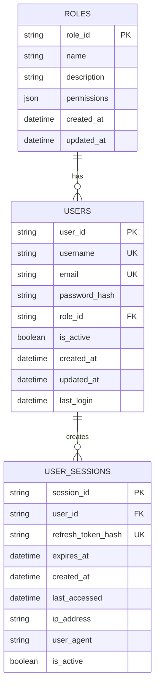

# RAG Education Assistant - Database Schema Documentation

## Overview

The RAG Education Assistant uses SQLite as its primary database with SQLAlchemy ORM for data access. The database stores user authentication information, role-based permissions, and session metadata.

## Database Configuration

- **Database Engine**: SQLite 3.x
- **ORM**: SQLAlchemy 2.x
- **Location**: `data/rag_assistant.db`
- **Encoding**: UTF-8
- **Journal Mode**: WAL (Write-Ahead Logging)

## Schema Overview

The database consists of three main tables with foreign key relationships:



## Table Definitions

### 1. roles

Stores role definitions and permissions for the RBAC system.

```sql
CREATE TABLE roles (
    role_id TEXT PRIMARY KEY,
    name TEXT NOT NULL UNIQUE,
    description TEXT,
    permissions TEXT, -- JSON array of permissions
    created_at TIMESTAMP DEFAULT CURRENT_TIMESTAMP,
    updated_at TIMESTAMP DEFAULT CURRENT_TIMESTAMP
);
```

#### Columns

| Column        | Type      | Constraints               | Description                         |
| ------------- | --------- | ------------------------- | ----------------------------------- |
| `role_id`     | TEXT      | PRIMARY KEY               | Unique identifier (UUID)            |
| `name`        | TEXT      | NOT NULL, UNIQUE          | Role name (admin, teacher, student) |
| `description` | TEXT      |                           | Human-readable role description     |
| `permissions` | TEXT      |                           | JSON array of permission strings    |
| `created_at`  | TIMESTAMP | DEFAULT CURRENT_TIMESTAMP | Record creation time                |
| `updated_at`  | TIMESTAMP | DEFAULT CURRENT_TIMESTAMP | Last modification time              |

#### Default Roles

The system includes three predefined roles:

**Admin Role:**

```json
{
  "role_id": "admin-role-id",
  "name": "admin",
  "description": "Administrator with full system access",
  "permissions": ["*"]
}
```

**Teacher Role:**

```json
{
  "role_id": "teacher-role-id",
  "name": "teacher",
  "description": "Teacher with session and document management",
  "permissions": [
    "create_session",
    "read_session",
    "update_session",
    "delete_session",
    "upload_document",
    "process_document",
    "query_session",
    "manage_students",
    "view_analytics"
  ]
}
```

**Student Role:**

```json
{
  "role_id": "student-role-id",
  "name": "student",
  "description": "Student with read-only access",
  "permissions": ["read_session", "query_session", "view_documents"]
}
```

#### Indexes

```sql
CREATE INDEX idx_roles_name ON roles(name);
CREATE INDEX idx_roles_created_at ON roles(created_at);
```

### 2. users

Stores user account information and authentication data.

```sql
CREATE TABLE users (
    user_id TEXT PRIMARY KEY,
    username TEXT NOT NULL UNIQUE,
    email TEXT NOT NULL UNIQUE,
    password_hash TEXT NOT NULL,
    role_id TEXT NOT NULL,
    is_active BOOLEAN DEFAULT 1,
    created_at TIMESTAMP DEFAULT CURRENT_TIMESTAMP,
    updated_at TIMESTAMP DEFAULT CURRENT_TIMESTAMP,
    last_login TIMESTAMP,
    FOREIGN KEY (role_id) REFERENCES roles (role_id) ON DELETE RESTRICT
);
```

#### Columns

| Column          | Type      | Constraints               | Description              |
| --------------- | --------- | ------------------------- | ------------------------ |
| `user_id`       | TEXT      | PRIMARY KEY               | Unique identifier (UUID) |
| `username`      | TEXT      | NOT NULL, UNIQUE          | User login name          |
| `email`         | TEXT      | NOT NULL, UNIQUE          | User email address       |
| `password_hash` | TEXT      | NOT NULL                  | bcrypt hashed password   |
| `role_id`       | TEXT      | NOT NULL, FK              | Reference to roles table |
| `is_active`     | BOOLEAN   | DEFAULT 1                 | Account active status    |
| `created_at`    | TIMESTAMP | DEFAULT CURRENT_TIMESTAMP | Account creation time    |
| `updated_at`    | TIMESTAMP | DEFAULT CURRENT_TIMESTAMP | Last profile update      |
| `last_login`    | TIMESTAMP |                           | Last successful login    |

#### Password Security

- **Hashing Algorithm**: bcrypt with salt
- **Rounds**: 12 (configurable)
- **Format**: `$2b$12$...` (bcrypt identifier + rounds + salt + hash)

#### Default Users (Development Only)

```json
[
  {
    "user_id": "admin-user-id",
    "username": "admin",
    "email": "admin@rag-assistant.local",
    "role": "admin"
  },
  {
    "user_id": "teacher-user-id",
    "username": "teacher",
    "email": "teacher@rag-assistant.local",
    "role": "teacher"
  },
  {
    "user_id": "student-user-id",
    "username": "student",
    "email": "student@rag-assistant.local",
    "role": "student"
  }
]
```

#### Indexes

```sql
CREATE INDEX idx_users_username ON users(username);
CREATE INDEX idx_users_email ON users(email);
CREATE INDEX idx_users_role_id ON users(role_id);
CREATE INDEX idx_users_is_active ON users(is_active);
CREATE INDEX idx_users_created_at ON users(created_at);
CREATE INDEX idx_users_last_login ON users(last_login);
```

### 3. user_sessions

Stores active user sessions and refresh tokens.

```sql
CREATE TABLE user_sessions (
    session_id TEXT PRIMARY KEY,
    user_id TEXT NOT NULL,
    refresh_token_hash TEXT NOT NULL UNIQUE,
    expires_at TIMESTAMP NOT NULL,
    created_at TIMESTAMP DEFAULT CURRENT_TIMESTAMP,
    last_accessed TIMESTAMP DEFAULT CURRENT_TIMESTAMP,
    ip_address TEXT,
    user_agent TEXT,
    is_active BOOLEAN DEFAULT 1,
    FOREIGN KEY (user_id) REFERENCES users (user_id) ON DELETE CASCADE
);
```

#### Columns

| Column               | Type      | Constraints               | Description                      |
| -------------------- | --------- | ------------------------- | -------------------------------- |
| `session_id`         | TEXT      | PRIMARY KEY               | Unique session identifier (UUID) |
| `user_id`            | TEXT      | NOT NULL, FK              | Reference to users table         |
| `refresh_token_hash` | TEXT      | NOT NULL, UNIQUE          | Hashed refresh token             |
| `expires_at`         | TIMESTAMP | NOT NULL                  | Session expiration time          |
| `created_at`         | TIMESTAMP | DEFAULT CURRENT_TIMESTAMP | Session creation time            |
| `last_accessed`      | TIMESTAMP | DEFAULT CURRENT_TIMESTAMP | Last activity time               |
| `ip_address`         | TEXT      |                           | Client IP address                |
| `user_agent`         | TEXT      |                           | Client user agent string         |
| `is_active`          | BOOLEAN   | DEFAULT 1                 | Session active status            |

#### Session Management

- **Session Duration**: 7 days (configurable)
- **Cleanup**: Automatic cleanup of expired sessions
- **Security**: Refresh tokens are hashed (SHA-256) before storage
- **Tracking**: IP address and user agent for security monitoring

#### Indexes

```sql
CREATE INDEX idx_user_sessions_user_id ON user_sessions(user_id);
CREATE INDEX idx_user_sessions_refresh_token_hash ON user_sessions(refresh_token_hash);
CREATE INDEX idx_user_sessions_expires_at ON user_sessions(expires_at);
CREATE INDEX idx_user_sessions_is_active ON user_sessions(is_active);
CREATE INDEX idx_user_sessions_created_at ON user_sessions(created_at);
CREATE INDEX idx_user_sessions_last_accessed ON user_sessions(last_accessed);
```

## Database Initialization

### Migration Scripts

#### 001_create_tables.sql

```sql
-- Create roles table
CREATE TABLE IF NOT EXISTS roles (
    role_id TEXT PRIMARY KEY,
    name TEXT NOT NULL UNIQUE,
    description TEXT,
    permissions TEXT,
    created_at TIMESTAMP DEFAULT CURRENT_TIMESTAMP,
    updated_at TIMESTAMP DEFAULT CURRENT_TIMESTAMP
);

-- Create users table
CREATE TABLE IF NOT EXISTS users (
    user_id TEXT PRIMARY KEY,
    username TEXT NOT NULL UNIQUE,
    email TEXT NOT NULL UNIQUE,
    password_hash TEXT NOT NULL,
    role_id TEXT NOT NULL,
    is_active BOOLEAN DEFAULT 1,
    created_at TIMESTAMP DEFAULT CURRENT_TIMESTAMP,
    updated_at TIMESTAMP DEFAULT CURRENT_TIMESTAMP,
    last_login TIMESTAMP,
    FOREIGN KEY (role_id) REFERENCES roles (role_id) ON DELETE RESTRICT
);

-- Create user_sessions table
CREATE TABLE IF NOT EXISTS user_sessions (
    session_id TEXT PRIMARY KEY,
    user_id TEXT NOT NULL,
    refresh_token_hash TEXT NOT NULL UNIQUE,
    expires_at TIMESTAMP NOT NULL,
    created_at TIMESTAMP DEFAULT CURRENT_TIMESTAMP,
    last_accessed TIMESTAMP DEFAULT CURRENT_TIMESTAMP,
    ip_address TEXT,
    user_agent TEXT,
    is_active BOOLEAN DEFAULT 1,
    FOREIGN KEY (user_id) REFERENCES users (user_id) ON DELETE CASCADE
);

-- Create indexes
CREATE INDEX IF NOT EXISTS idx_roles_name ON roles(name);
CREATE INDEX IF NOT EXISTS idx_users_username ON users(username);
CREATE INDEX IF NOT EXISTS idx_users_email ON users(email);
CREATE INDEX IF NOT EXISTS idx_users_role_id ON users(role_id);
CREATE INDEX IF NOT EXISTS idx_user_sessions_user_id ON user_sessions(user_id);
CREATE INDEX IF NOT EXISTS idx_user_sessions_expires_at ON user_sessions(expires_at);
```

#### 002_insert_default_data.sql

```sql
-- Insert default roles
INSERT OR IGNORE INTO roles (role_id, name, description, permissions) VALUES
('550e8400-e29b-41d4-a716-446655440001', 'admin', 'Administrator with full system access', '["*"]'),
('550e8400-e29b-41d4-a716-446655440002', 'teacher', 'Teacher with session and document management', '["create_session","read_session","update_session","delete_session","upload_document","process_document","query_session","manage_students","view_analytics"]'),
('550e8400-e29b-41d4-a716-446655440003', 'student', 'Student with read-only access', '["read_session","query_session","view_documents"]');

-- Insert default users (development only)
INSERT OR IGNORE INTO users (user_id, username, email, password_hash, role_id) VALUES
('550e8400-e29b-41d4-a716-446655440011', 'admin', 'admin@rag-assistant.local', '$2b$12$LQv3c1yqBWVHxkd0LHAkCOYz6TtxMQJqhN8/LewWM2OVQlA8E8Spe', '550e8400-e29b-41d4-a716-446655440001'),
('550e8400-e29b-41d4-a716-446655440012', 'teacher', 'teacher@rag-assistant.local', '$2b$12$LQv3c1yqBWVHxkd0LHAkCOYz6TtxMQJqhN8/LewWM2OVQlA8E8Spe', '550e8400-e29b-41d4-a716-446655440002'),
('550e8400-e29b-41d4-a716-446655440013', 'student', 'student@rag-assistant.local', '$2b$12$LQv3c1yqBWVHxkd0LHAkCOYz6TtxMQJqhN8/LewWM2OVQlA8E8Spe', '550e8400-e29b-41d4-a716-446655440003');
```

## SQLAlchemy Models

### Role Model

```python
from sqlalchemy import Column, String, DateTime, Text
from sqlalchemy.orm import relationship
import json

class Role(Base):
    __tablename__ = "roles"

    role_id = Column(String, primary_key=True)
    name = Column(String, unique=True, nullable=False)
    description = Column(Text)
    permissions = Column(Text)  # JSON string
    created_at = Column(DateTime, default=datetime.utcnow)
    updated_at = Column(DateTime, default=datetime.utcnow, onupdate=datetime.utcnow)

    # Relationship
    users = relationship("User", back_populates="role")

    @property
    def permissions_list(self):
        """Parse permissions JSON string to list"""
        if self.permissions:
            return json.loads(self.permissions)
        return []
```

### User Model

```python
from sqlalchemy import Column, String, Boolean, DateTime, ForeignKey
from sqlalchemy.orm import relationship
from passlib.context import CryptContext

pwd_context = CryptContext(schemes=["bcrypt"], deprecated="auto")

class User(Base):
    __tablename__ = "users"

    user_id = Column(String, primary_key=True)
    username = Column(String, unique=True, nullable=False)
    email = Column(String, unique=True, nullable=False)
    password_hash = Column(String, nullable=False)
    role_id = Column(String, ForeignKey("roles.role_id", ondelete="RESTRICT"), nullable=False)
    is_active = Column(Boolean, default=True)
    created_at = Column(DateTime, default=datetime.utcnow)
    updated_at = Column(DateTime, default=datetime.utcnow, onupdate=datetime.utcnow)
    last_login = Column(DateTime)

    # Relationships
    role = relationship("Role", back_populates="users")
    sessions = relationship("UserSession", back_populates="user", cascade="all, delete-orphan")

    def verify_password(self, password: str) -> bool:
        """Verify password against hash"""
        return pwd_context.verify(password, self.password_hash)

    def set_password(self, password: str):
        """Hash and set password"""
        self.password_hash = pwd_context.hash(password)
```

### UserSession Model

```python
from sqlalchemy import Column, String, DateTime, Boolean, ForeignKey
from sqlalchemy.orm import relationship

class UserSession(Base):
    __tablename__ = "user_sessions"

    session_id = Column(String, primary_key=True)
    user_id = Column(String, ForeignKey("users.user_id", ondelete="CASCADE"), nullable=False)
    refresh_token_hash = Column(String, unique=True, nullable=False)
    expires_at = Column(DateTime, nullable=False)
    created_at = Column(DateTime, default=datetime.utcnow)
    last_accessed = Column(DateTime, default=datetime.utcnow)
    ip_address = Column(String)
    user_agent = Column(String)
    is_active = Column(Boolean, default=True)

    # Relationship
    user = relationship("User", back_populates="sessions")

    @property
    def is_expired(self) -> bool:
        """Check if session is expired"""
        return datetime.utcnow() > self.expires_at
```

## Database Operations

### Common Queries

#### User Authentication

```python
# Get user by username
user = session.query(User).filter(User.username == username).first()

# Verify user credentials
if user and user.verify_password(password):
    # Update last login
    user.last_login = datetime.utcnow()
    session.commit()
```

#### Session Management

```python
# Create new session
new_session = UserSession(
    session_id=str(uuid.uuid4()),
    user_id=user.user_id,
    refresh_token_hash=hash_token(refresh_token),
    expires_at=datetime.utcnow() + timedelta(days=7)
)
session.add(new_session)
session.commit()

# Clean expired sessions
expired_sessions = session.query(UserSession).filter(
    UserSession.expires_at < datetime.utcnow()
).delete()
session.commit()
```

#### Role-based Queries

```python
# Get users by role
admins = session.query(User).join(Role).filter(Role.name == 'admin').all()

# Check user permissions
user_permissions = user.role.permissions_list
has_permission = 'create_session' in user_permissions or '*' in user_permissions
```

### Performance Considerations

#### Query Optimization

- Use proper indexes on frequently queried columns
- Avoid N+1 queries with eager loading: `query(User).options(joinedload(User.role))`
- Use batch operations for bulk updates

#### Connection Management

```python
# Connection pooling configuration
engine = create_engine(
    database_url,
    pool_size=10,
    max_overflow=20,
    pool_pre_ping=True,
    echo=False  # Set to True for SQL debugging
)
```

## Database Administration

### Backup and Restore

#### Backup Database

```bash
# SQLite backup
sqlite3 data/rag_assistant.db ".backup data/rag_assistant_backup.db"

# Or using Python
python -c "
import sqlite3
con = sqlite3.connect('data/rag_assistant.db')
backup = sqlite3.connect('data/backup.db')
con.backup(backup)
backup.close()
con.close()
"
```

#### Restore Database

```bash
# Replace current database with backup
cp data/rag_assistant_backup.db data/rag_assistant.db
```

### Maintenance Tasks

#### Clean Expired Sessions

```python
# Automated cleanup (runs on service startup/shutdown)
def cleanup_expired_sessions():
    expired_count = session.query(UserSession).filter(
        UserSession.expires_at < datetime.utcnow()
    ).delete()
    session.commit()
    return expired_count
```

#### Database Statistics

```sql
-- Table sizes
SELECT name, COUNT(*) as count FROM sqlite_master
WHERE type='table' GROUP BY name;

-- User statistics
SELECT
    r.name as role,
    COUNT(u.user_id) as user_count,
    COUNT(CASE WHEN u.is_active = 1 THEN 1 END) as active_users
FROM roles r
LEFT JOIN users u ON r.role_id = u.role_id
GROUP BY r.role_id, r.name;

-- Session statistics
SELECT
    COUNT(*) as total_sessions,
    COUNT(CASE WHEN expires_at > datetime('now') THEN 1 END) as active_sessions,
    COUNT(CASE WHEN expires_at <= datetime('now') THEN 1 END) as expired_sessions
FROM user_sessions;
```

## Security Considerations

### Data Protection

- **Password Hashing**: bcrypt with configurable rounds
- **Token Security**: Refresh tokens hashed before storage
- **SQL Injection**: Use parameterized queries (SQLAlchemy ORM)
- **Foreign Key Constraints**: Maintain referential integrity

### Access Control

- **Database Permissions**: Restrict file system access to database file
- **Connection Security**: Use TLS for database connections in production
- **Audit Trail**: Log authentication and authorization events

### Compliance

- **Data Retention**: Implement session cleanup policies
- **Privacy**: Hash sensitive tokens, don't log passwords
- **Backup Security**: Encrypt database backups

## Troubleshooting

### Common Issues

#### Database Locked Error

```bash
# Check for processes using the database
lsof data/rag_assistant.db

# Enable WAL mode for better concurrency
sqlite3 data/rag_assistant.db "PRAGMA journal_mode=WAL;"
```

#### Migration Failures

```python
# Check migration status
python src/database/create_admin.py --check-schema

# Force re-run migrations
rm data/rag_assistant.db
python src/database/create_admin.py
```

#### Performance Issues

```sql
-- Analyze query performance
EXPLAIN QUERY PLAN SELECT * FROM users WHERE username = 'admin';

-- Rebuild indexes
REINDEX;

-- Update table statistics
ANALYZE;
```

This database schema provides a solid foundation for the RAG Education Assistant's authentication and user management system, with proper security measures and scalability considerations.
