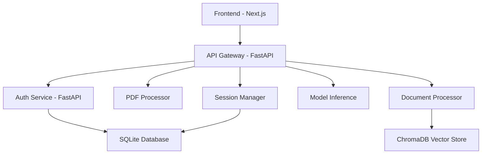

# RAG Education Assistant - System Architecture

## Overview

The RAG Education Assistant is a comprehensive full-stack application that provides secure, role-based access to an educational document processing and question-answering system. The system combines modern authentication, document processing, vector storage, and AI-powered query capabilities.

## Architecture Components

### 1. Frontend Layer

- **Technology**: Next.js 13+ with TypeScript
- **Port**: 3000
- **Features**:
  - React-based UI with server-side rendering
  - JWT-based authentication with AuthContext
  - Role-based component rendering
  - File upload and document management
  - Session management interface
  - Admin dashboard for user and role management

### 2. API Gateway

- **Technology**: FastAPI (Python)
- **Port**: 8000
- **Features**:
  - Central routing hub for all client requests
  - Session management and metadata storage
  - Document upload and processing coordination
  - Health checks for all microservices
  - CORS handling and request validation

### 3. Authentication Service

- **Technology**: FastAPI (Python)
- **Port**: 8006
- **Features**:
  - JWT token generation and validation
  - User registration and management
  - Role-based access control (RBAC)
  - Session lifecycle management
  - Password hashing and security
  - Rate limiting and security headers

### 4. Database Layer

- **Technology**: SQLite with SQLAlchemy ORM
- **Location**: `data/rag_assistant.db`
- **Features**:
  - User accounts and authentication
  - Role and permission management
  - Session metadata and tracking
  - Document processing history

### 5. External Microservices

- **PDF Processing Service**: Document to markdown conversion
- **Document Processing Service**: Text chunking and vector storage
- **Model Inference Service**: AI model integration (Groq, Ollama)

## System Flow



## Authentication Flow

1. **User Registration/Login**

   - User submits credentials to frontend
   - Frontend sends request to API Gateway
   - API Gateway forwards to Auth Service
   - Auth Service validates credentials against database
   - Returns JWT access token and refresh token

2. **Token Validation**

   - Each protected request includes JWT token
   - Auth Service validates token signature and expiration
   - Returns user information and permissions
   - API Gateway enforces role-based access

3. **Session Management**
   - Active sessions tracked in database
   - Automatic cleanup of expired sessions
   - Session metadata includes user activity

## Data Flow

### Document Processing Pipeline

1. **Upload**: User uploads document through frontend
2. **Conversion**: PDF/DOCX converted to markdown via PDF Processor
3. **Storage**: Markdown saved to local/cloud storage
4. **Processing**: Document chunked and vectorized via Document Processor
5. **Indexing**: Vectors stored in ChromaDB with session association

### Query Processing Pipeline

1. **Query**: User submits question through frontend
2. **Retrieval**: Document Processor searches vectors for relevant chunks
3. **Generation**: Model Inference Service generates answer using context
4. **Response**: Answer and sources returned to user

## Security Architecture

### Authentication Security

- **JWT Tokens**: Signed with HMAC-SHA256
- **Token Expiration**: Access tokens (30 min), Refresh tokens (7 days)
- **Password Security**: bcrypt hashing with salt
- **Rate Limiting**: Configurable per-minute request limits

### Authorization Security

- **Role-Based Access Control**: Admin, Teacher, Student roles
- **Granular Permissions**: Create, read, update, delete operations
- **Session Security**: Automatic cleanup and validation
- **CORS Protection**: Configurable origin restrictions

### Data Security

- **Database**: Local SQLite with proper foreign key constraints
- **File Storage**: Secure file handling with path traversal protection
- **API Security**: Input validation and sanitization
- **Error Handling**: Secure error messages without information leakage

## Deployment Architecture

### Development Mode

- All services run locally on different ports
- Hot reloading enabled for development
- Debug logging and comprehensive error messages
- Demo accounts pre-configured

### Docker Deployment

- Multi-container setup with docker-compose
- Service isolation with dedicated containers
- Shared database volume between services
- Health checks and dependency management

### Production Considerations

- SSL/TLS termination at reverse proxy
- Environment-specific configuration
- Enhanced security headers
- Performance monitoring and logging
- Backup and recovery procedures

## Configuration Management

### Environment Variables

- **Development**: `.env.development` with relaxed security
- **Production**: `.env.production` with strict security
- **Example**: `.env.example` with documentation
- **Secrets**: External secret management for production

### Service Configuration

- **Auth Service**: JWT secrets, database path, CORS origins
- **API Gateway**: Service URLs, timeout configurations
- **Frontend**: API endpoints, authentication settings
- **Database**: Connection strings, migration scripts

## Monitoring and Health Checks

### Health Check Endpoints

- **Auth Service**: `/health` - Database connectivity and session status
- **API Gateway**: `/health/comprehensive` - Full system validation
- **Individual Services**: Service-specific health indicators

### System Validation

- **Automated Validation**: `scripts/system_validation.py`
- **Integration Testing**: Comprehensive test suite
- **Performance Monitoring**: Response time and resource tracking

## Scalability Considerations

### Horizontal Scaling

- Auth Service: Stateless, can run multiple instances
- API Gateway: Session affinity for file uploads
- Database: Connection pooling and read replicas

### Performance Optimization

- **Caching**: JWT token validation caching
- **Database**: Proper indexing on user_id, session_id
- **File Storage**: CDN integration for document serving
- **Vector Storage**: ChromaDB clustering for large datasets

## Technology Stack Summary

| Component          | Technology     | Version | Purpose                                   |
| ------------------ | -------------- | ------- | ----------------------------------------- |
| Frontend           | Next.js        | 13+     | User interface and client-side logic      |
| API Gateway        | FastAPI        | 0.104+  | Request routing and session management    |
| Auth Service       | FastAPI        | 0.104+  | Authentication and authorization          |
| Database           | SQLite         | 3.x     | Relational data storage                   |
| Vector Store       | ChromaDB       | Latest  | Document embeddings and similarity search |
| Containerization   | Docker         | 20+     | Service isolation and deployment          |
| Process Management | Docker Compose | 2.x     | Multi-service orchestration               |

## Directory Structure

```
rag3_for_colab/
├── frontend/                 # Next.js frontend application
│   ├── app/                 # Next.js 13+ app directory
│   ├── components/          # React components
│   ├── contexts/            # React contexts (AuthContext)
│   └── public/              # Static assets
├── services/
│   └── auth_service/        # Authentication microservice
│       ├── api/             # FastAPI route handlers
│       ├── auth/            # Auth logic and middleware
│       └── main.py          # Service entry point
├── src/
│   ├── api/                 # API Gateway
│   ├── database/            # Database models and migrations
│   └── services/            # Business logic services
├── tests/
│   ├── integration/         # Integration test suite
│   └── unit/                # Unit tests
├── scripts/                 # Deployment and utility scripts
├── docs/                    # Documentation
└── docker-compose.yml       # Multi-service deployment
```

This architecture provides a robust, secure, and scalable foundation for the RAG Education Assistant, with clear separation of concerns and comprehensive authentication integration.
