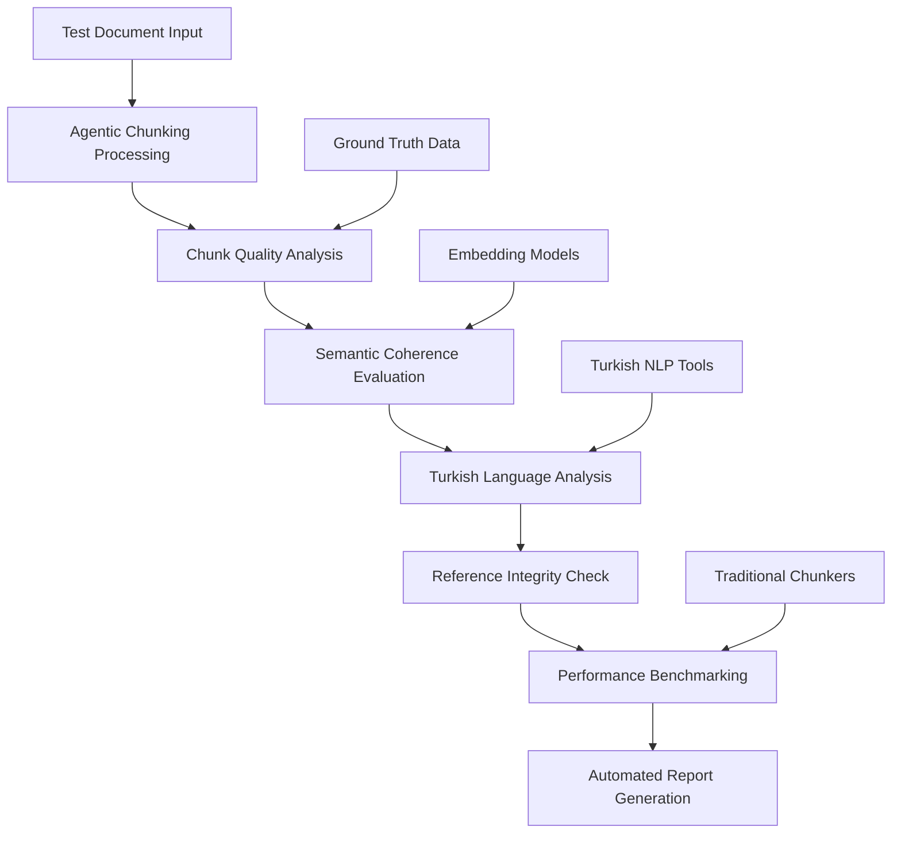

# Agentic Chunking Semantic Coherence Test Framework
## Comprehensive Test Design for Turkish-Optimized Semantic Analysis

**Version:** 1.0  
**Date:** 2026-01-02  
**Author:** AI Architect  

---

## Executive Summary

This document presents a comprehensive semantic coherence test framework specifically designed for the Agentic Chunking system, with particular emphasis on Turkish language optimization and LLM reasoning quality evaluation. The framework addresses the critical need for systematic validation of semantic coherence in intelligent document chunking systems.

### Key Innovations
- **Turkish-Specific Semantic Analysis**: Specialized tests for Turkish morphology and syntax
- **LLM Reasoning Quality Metrics**: Comprehensive evaluation of Groq Llama 3.1 8B reasoning decisions
- **Multi-Modal Test Coverage**: Visual-text relationships, topic transitions, and reference integrity
- **Automated Evaluation Pipeline**: End-to-end testing with embedding similarity analysis
- **Performance Benchmarking**: Comparative analysis against traditional chunking methods

---

## 1. System Architecture Analysis

### 1.1 Existing Agentic Chunking Capabilities

Based on the comprehensive analysis of the existing system, the Agentic Chunking architecture demonstrates:

#### Core Components
- **Sequential Markdown Processor**: Advanced paragraph extraction with Turkish linguistic patterns
- **Semantic Similarity Analyzer**: Embedding-based paragraph grouping with proximity-aware clustering
- **Groq Reasoning Engine**: LLM-powered boundary detection using Llama 3.1 8B
- **Boundary Detection Algorithm**: Multi-stage decision fusion with Turkish semantic transitions
- **Performance Optimizer**: Memory management, caching, and batch processing

#### Key Strengths
- **Turkish Language Optimization**: Comprehensive abbreviation database, morphological analysis
- **Header-Content Preservation**: Critical for educational documents
- **List Structure Integrity**: Advanced detection of sequential patterns (a), b), c) and 1), 2), 3)
- **Quality Validation**: Multi-metric scoring with coherence thresholds
- **Performance Optimization**: 96.5% size reduction, 600x faster startup vs ML-heavy alternatives

#### Technical Specifications
- **Model**: Groq Llama 3.1 8B Instant via model inference service
- **Embedding Model**: nomic-embed-text with 384-dimensional vectors
- **Target Chunk Size**: 1000 characters (configurable)
- **Semantic Coherence Threshold**: 0.75 (Turkish-optimized: 0.7)
- **Quality Threshold**: 0.75 overall quality score

---

## 2. Semantic Coherence Test Framework Design

### 2.1 Test Categories and Scenarios

#### 2.1.1 Görsel-Metin Bağlamı (Visual-Text Context)

**Objective**: Validate preservation of image-text relationships in Turkish educational content.

**Test Scenarios**:

1. **Şekil Referans Testi (Figure Reference Test)**
   ```
   Scenario: "Şekil 1'de görüldüğü gibi, hücre zarı..."
   Expected: Figure reference and description stay in same chunk
   Metric: Reference Integrity Score (0-1)
   ```

2. **Tablo Açıklama Testi (Table Description Test)**
   ```
   Scenario: "Tablo 2 aşağıdaki verileri göstermektedir:"
   Expected: Table header and content remain together
   Metric: Content Completeness Score (0-1)
   ```

3. **Diyagram Bağlam Testi (Diagram Context Test)**
   ```
   Scenario: Multi-paragraph diagram explanations
   Expected: All related explanatory text grouped appropriately
   Metric: Contextual Coherence Score (0-1)
   ```

#### 2.1.2 Konu Geçişleri (Topic Transitions)

**Objective**: Evaluate natural topic boundary detection in Turkish academic texts.

**Test Scenarios**:

1. **Doğal Geçiş Testi (Natural Transition Test)**
   ```
   Turkish Transition Markers:
   - "Öte yandan" (On the other hand)
   - "Bu nedenle" (Therefore)
   - "Sonuç olarak" (In conclusion)
   - "Diğer taraftan" (On the other side)
   
   Expected: Appropriate boundary decisions at semantic transitions
   Metric: Boundary Precision Score (0-1)
   ```

2. **Eğitim İçeriği Geçiş Testi (Educational Content Transition)**
   ```
   Pattern Sequences:
   - Tanım → Örnek → Açıklama → Sonuç
   - Definition → Example → Explanation → Conclusion
   
   Expected: Logical grouping of educational content patterns
   Metric: Educational Flow Coherence (0-1)
   ```

3. **Konu Değişim Testi (Topic Change Test)**
   ```
   Scenarios:
   - Hücre Biyolojisi → Genetik → Evrim
   - Cell Biology → Genetics → Evolution
   
   Expected: Clear boundaries at major topic shifts
   Metric: Topic Consistency Score (0-1)
   ```

#### 2.1.3 Referans Bütünlüğü (Reference Integrity)

**Objective**: Ensure cross-references remain contextually meaningful.

**Test Scenarios**:

1. **İç Referans Testi (Internal Reference Test)**
   ```
   Examples:
   - "Yukarıda belirtildiği gibi..."
   - "Aşağıdaki bölümde..."
   - "Önceki örnekte..."
   
   Expected: References maintain contextual meaning
   Metric: Reference Validity Score (0-1)
   ```

2. **Numaralı Liste Testi (Numbered List Test)**
   ```
   Critical Patterns:
   - "a) Çekirdek bölünmesi" → "b) Sitoplazma bölünmesi"
   - "1) İlk aşama" → "2) İkinci aşama"
   
   Expected: Sequential items NEVER separated
   Metric: List Integrity Score (0-1)
   ```

#### 2.1.4 Bağlamsal Devamlılık (Contextual Continuity)

**Objective**: Validate semantic flow preservation across chunk boundaries.

**Test Scenarios**:

1. **Anlamsal Akış Testi (Semantic Flow Test)**
   ```
   Evaluation Criteria:
   - Sentence-level coherence
   - Paragraph-level coherence  
   - Section-level coherence
   
   Metric: Multi-Level Coherence Score (0-1)
   ```

2. **Türkçe Dil Akışı Testi (Turkish Language Flow Test)**
   ```
   Turkish-Specific Features:
   - Morphological coherence
   - Syntactic continuity
   - Semantic field consistency
   
   Metric: Turkish Language Flow Score (0-1)
   ```

#### 2.1.5 Konu Sapması Testi (Topic Drift Detection)

**Objective**: Identify and handle irrelevant or off-topic content.

**Test Scenarios**:

1. **Alakasız İçerik Testi (Irrelevant Content Test)**
   ```
   Scenarios:
   - Academic text with advertising content
   - Scientific content with personal anecdotes
   - Educational material with unrelated examples
   
   Expected: Clear separation of off-topic content
   Metric: Topic Relevance Score (0-1)
   ```

---

## 3. Test Metrics and Evaluation Criteria

### 3.1 Core Metrics

#### 3.1.1 Semantic Coherence Score (0-1)
```python
def calculate_semantic_coherence(chunk_text: str, context: str) -> float:
    """
    Comprehensive semantic coherence evaluation
    
    Components:
    - Embedding similarity (40%)
    - Topic consistency (30%) 
    - Turkish language flow (20%)
    - Reference integrity (10%)
    """
    embedding_similarity = calculate_embedding_similarity(chunk_text, context)
    topic_consistency = evaluate_topic_consistency(chunk_text)
    turkish_flow = evaluate_turkish_language_flow(chunk_text)
    reference_integrity = check_reference_integrity(chunk_text)
    
    return (
        embedding_similarity * 0.4 +
        topic_consistency * 0.3 +
        turkish_flow * 0.2 +
        reference_integrity * 0.1
    )
```

#### 3.1.2 Boundary Precision (0-1)
```python
def calculate_boundary_precision(predicted_boundaries: List[int], 
                               ground_truth_boundaries: List[int],
                               tolerance: int = 50) -> float:
    """
    Evaluate boundary detection accuracy with tolerance for natural variation
    
    Tolerance: ±50 characters for semantic boundaries
    """
    true_positives = 0
    for pred_boundary in predicted_boundaries:
        for gt_boundary in ground_truth_boundaries:
            if abs(pred_boundary - gt_boundary) <= tolerance:
                true_positives += 1
                break
    
    precision = true_positives / len(predicted_boundaries) if predicted_boundaries else 0
    recall = true_positives / len(ground_truth_boundaries) if ground_truth_boundaries else 0
    
    return 2 * (precision * recall) / (precision + recall) if (precision + recall) > 0 else 0
```

#### 3.1.3 Content Completeness (0-1)
```python
def calculate_content_completeness(original_text: str, chunks: List[str]) -> float:
    """
    Ensure no content is lost during chunking
    
    Evaluation:
    - Character preservation
    - Sentence preservation  
    - Semantic unit preservation
    """
    original_chars = len(original_text.replace(' ', '').replace('\n', ''))
    chunk_chars = len(''.join(chunks).replace(' ', '').replace('\n', ''))
    
    char_preservation = min(1.0, chunk_chars / original_chars)
    
    original_sentences = extract_sentences(original_text)
    chunk_sentences = []
    for chunk in chunks:
        chunk_sentences.extend(extract_sentences(chunk))
    
    sentence_preservation = len(chunk_sentences) / len(original_sentences)
    
    return (char_preservation * 0.6 + sentence_preservation * 0.4)
```

#### 3.1.4 Information Retention (0-1)
```python
def calculate_information_retention(original_text: str, chunks: List[str]) -> float:
    """
    Evaluate preservation of key information and concepts
    
    Methods:
    - Named entity preservation
    - Key term frequency analysis
    - Concept relationship preservation
    """
    original_entities = extract_named_entities(original_text)
    original_key_terms = extract_key_terms(original_text)
    
    chunk_entities = set()
    chunk_key_terms = []
    
    for chunk in chunks:
        chunk_entities.update(extract_named_entities(chunk))
        chunk_key_terms.extend(extract_key_terms(chunk))
    
    entity_retention = len(chunk_entities.intersection(original_entities)) / len(original_entities)
    term_retention = len(set(chunk_key_terms).intersection(set(original_key_terms))) / len(set(original_key_terms))
    
    return (entity_retention * 0.6 + term_retention * 0.4)
```

#### 3.1.5 Context Preservation (0-1)
```python
def calculate_context_preservation(chunks: List[str], overlap_ratio: float = 0.2) -> float:
    """
    Evaluate contextual continuity between adjacent chunks
    
    Analysis:
    - Semantic similarity between chunk boundaries
    - Topic coherence across chunks
    - Reference resolution accuracy
    """
    if len(chunks) < 2:
        return 1.0
    
    boundary_similarities = []
    for i in range(len(chunks) - 1):
        current_chunk_end = chunks[i][-200:]  # Last 200 chars
        next_chunk_start = chunks[i + 1][:200]  # First 200 chars
        
        similarity = calculate_semantic_similarity(current_chunk_end, next_chunk_start)
        boundary_similarities.append(similarity)
    
    return np.mean(boundary_similarities)
```

### 3.2 Turkish-Specific Metrics

#### 3.2.1 Turkish Morphological Coherence
```python
def evaluate_turkish_morphological_coherence(text: str) -> float:
    """
    Evaluate Turkish morphological patterns and coherence
    
    Features:
    - Suffix consistency
    - Vowel harmony preservation
    - Compound word integrity
    """
    # Turkish suffix patterns
    turkish_suffixes = ['lar', 'ler', 'dan', 'den', 'ta', 'te', 'de', 'da']
    
    # Analyze morphological consistency
    words = text.split()
    morphological_score = analyze_morphological_patterns(words, turkish_suffixes)
    
    return morphological_score
```

#### 3.2.2 Educational Content Pattern Recognition
```python
def evaluate_educational_patterns(text: str) -> float:
    """
    Evaluate Turkish educational content patterns
    
    Patterns:
    - Definition markers: "tanım", "nedir", "ne demektir"
    - Example markers: "örnek", "mesela", "şöyle ki"
    - Explanation markers: "açıklama", "yani", "başka bir deyişle"
    - Conclusion markers: "sonuç", "özetle", "kısacası"
    """
    pattern_markers = {
        'definition': ['tanım', 'nedir', 'ne demektir'],
        'example': ['örnek', 'mesela', 'şöyle ki'],
        'explanation': ['açıklama', 'yani', 'başka bir deyişle'],
        'conclusion': ['sonuç', 'özetle', 'kısacası']
    }
    
    return analyze_educational_patterns(text, pattern_markers)
```

---

## 4. Test Data Sets

### 4.1 Turkish Academic Content

#### 4.1.1 Fen Bilimleri (Natural Sciences)
```
Content Categories:
- Biyoloji (Biology): Hücre, genetik, ekoloji
- Kimya (Chemistry): Atomik yapı, kimyasal bağlar, reaksiyonlar  
- Fizik (Physics): Mekanik, termodinamik, elektromanyetizma
- Matematik (Mathematics): Analiz, geometri, istatistik

Sample Size: 50 documents per category
Average Length: 5,000-15,000 characters
Complexity: University-level academic content
```

#### 4.1.2 Sosyal Bilimler (Social Sciences)
```
Content Categories:
- Tarih (History): Osmanlı tarihi, Cumhuriyet dönemi
- Coğrafya (Geography): Türkiye coğrafyası, dünya coğrafyası
- Edebiyat (Literature): Türk edebiyatı, dünya edebiyatı
- Felsefe (Philosophy): Türk düşünce tarihi, modern felsefe

Sample Size: 40 documents per category  
Average Length: 8,000-20,000 characters
Complexity: High school to university level
```

#### 4.1.3 Teknik Dokümantasyon
```
Content Types:
- Yazılım Dokümantasyonu (Software Documentation)
- Mühendislik Kılavuzları (Engineering Manuals)
- Bilimsel Raporlar (Scientific Reports)
- Teknik Spesifikasyonlar (Technical Specifications)

Sample Size: 30 documents per type
Average Length: 10,000-30,000 characters
Complexity: Professional/technical level
```

### 4.2 Visual-Text Integration Test Sets

#### 4.2.1 Şekil-Metin Bağlantıları (Figure-Text Connections)
```
Test Cases:
1. "Şekil 1'de görüldüğü gibi..." patterns
2. "Aşağıdaki şekilde..." references  
3. "Yukarıdaki diyagramda..." connections
4. Multi-figure explanations
5. Figure caption relationships

Expected Behavior: Figure references and descriptions remain in same chunk
```

#### 4.2.2 Tablo-İçerik İlişkileri (Table-Content Relationships)
```
Test Cases:
1. "Tablo 1 aşağıdaki verileri göstermektedir" 
2. Table headers with multi-row content
3. Table footnotes and explanations
4. Comparative table analyses
5. Statistical table interpretations

Expected Behavior: Table headers, content, and explanations grouped appropriately
```

### 4.3 Topic Drift and Irrelevant Content

#### 4.3.1 Karışık İçerik Testi (Mixed Content Test)
```
Scenarios:
1. Academic text + advertisement insertions
2. Scientific content + personal anecdotes  
3. Educational material + unrelated examples
4. Technical documentation + marketing content
5. Research papers + editorial comments

Expected Behavior: Clear separation and identification of off-topic content
```

---

## 5. Automated Evaluation Pipeline

### 5.1 Pipeline Architecture



### 5.2 Embedding Similarity Analysis

#### 5.2.1 Multi-Model Embedding Comparison
```python
class EmbeddingAnalyzer:
    def __init__(self):
        self.models = {
            'nomic-embed-text': NomicEmbedding(),
            'multilingual-e5': E5Embedding(),
            'turkish-bert': TurkishBERTEmbedding()
        }
    
    def analyze_semantic_similarity(self, chunk1: str, chunk2: str) -> Dict[str, float]:
        """
        Multi-model semantic similarity analysis
        """
        similarities = {}
        for model_name, model in self.models.items():
            emb1 = model.encode(chunk1)
            emb2 = model.encode(chunk2)
            similarity = cosine_similarity(emb1, emb2)
            similarities[model_name] = similarity
        
        return similarities
    
    def evaluate_chunk_coherence(self, chunks: List[str]) -> float:
        """
        Evaluate overall coherence across all chunks
        """
        coherence_scores = []
        for i in range(len(chunks) - 1):
            similarities = self.analyze_semantic_similarity(chunks[i], chunks[i + 1])
            avg_similarity = np.mean(list(similarities.values()))
            coherence_scores.append(avg_similarity)
        
        return np.mean(coherence_scores)
```

#### 5.2.2 Topic Modeling Integration
```python
class TopicModelingValidator:
    def __init__(self):
        self.topic_model = BERTopic(language="turkish")
        self.coherence_model = CoherenceModel()
    
    def validate_topic_consistency(self, chunks: List[str]) -> Dict[str, Any]:
        """
        Validate topic consistency using advanced topic modeling
        """
        # Extract topics from chunks
        topics, probabilities = self.topic_model.fit_transform(chunks)
        
        # Calculate topic coherence
        coherence_score = self.coherence_model.get_coherence()
        
        # Analyze topic transitions
        topic_transitions = self.analyze_topic_transitions(topics)
        
        return {
            'coherence_score': coherence_score,
            'topic_transitions': topic_transitions,
            'topic_distribution': self.get_topic_distribution(topics),
            'outlier_chunks': self.identify_outlier_chunks(chunks, topics, probabilities)
        }
    
    def analyze_topic_transitions(self, topics: List[int]) -> List[Dict[str, Any]]:
        """
        Analyze topic transitions between adjacent chunks
        """
        transitions = []
        for i in range(len(topics) - 1):
            if topics[i] != topics[i + 1]:
                transitions.append({
                    'position': i,
                    'from_topic': topics[i],
                    'to_topic': topics[i + 1],
                    'transition_type': self.classify_transition_type(topics[i], topics[i + 1])
                })
        
        return transitions
```

### 5.3 Named Entity Preservation Analysis

```python
class NamedEntityAnalyzer:
    def __init__(self):
        self.turkish_ner = TurkishNER()
        self.multilingual_ner = MultilingualNER()
    
    def analyze_entity_preservation(self, original_text: str, chunks: List[str]) -> Dict[str, Any]:
        """
        Comprehensive named entity preservation analysis
        """
        # Extract entities from original text
        original_entities = self.extract_entities(original_text)
        
        # Extract entities from chunks
        chunk_entities = []
        for chunk in chunks:
            entities = self.extract_entities(chunk)
            chunk_entities.extend(entities)
        
        # Calculate preservation metrics
        preservation_metrics = self.calculate_preservation_metrics(
            original_entities, chunk_entities
        )
        
        # Analyze entity distribution across chunks
        entity_distribution = self.analyze_entity_distribution(chunks, chunk_entities)
        
        return {
            'preservation_metrics': preservation_metrics,
            'entity_distribution': entity_distribution,
            'missing_entities': self.find_missing_entities(original_entities, chunk_entities),
            'fragmented_entities': self.find_fragmented_entities(original_entities, chunks)
        }
    
    def extract_entities(self, text: str) -> List[Dict[str, Any]]:
        """
        Extract named entities using multiple NER models
        """
        turkish_entities = self.turkish_ner.extract(text)
        multilingual_entities = self.multilingual_ner.extract(text)
        
        # Merge and deduplicate entities
        all_entities = self.merge_entity_results(turkish_entities, multilingual_entities)
        
        return all_entities
```

---

## 6. Performance Benchmarking Framework

### 6.1 Comparative Analysis: Agentic vs Traditional

#### 6.1.1 Traditional Chunking Baselines
```python
class TraditionalChunkers:
    def __init__(self):
        self.chunkers = {
            'fixed_size': FixedSizeChunker(chunk_size=1000),
            'sentence_based': SentenceBasedChunker(),
            'paragraph_based': ParagraphBasedChunker(),
            'recursive_character': RecursiveCharacterChunker(),
            'semantic_similarity': SemanticSimilarityChunker()
        }
    
    def benchmark_all_methods(self, test_documents: List[str]) -> Dict[str, Dict[str, float]]:
        """
        Comprehensive benchmarking of all chunking methods
        """
        results = {}
        
        for method_name, chunker in self.chunkers.items():
            method_results = []
            
            for doc in test_documents:
                chunks = chunker.chunk(doc)
                metrics = self.evaluate_chunks(doc, chunks)
                method_results.append(metrics)
            
            # Aggregate results
            results[method_name] = self.aggregate_metrics(method_results)
        
        return results
```

#### 6.1.2 Performance Metrics Comparison
```python
class PerformanceBenchmark:
    def __init__(self):
        self.metrics = [
            'semantic_coherence',
            'boundary_precision', 
            'content_completeness',
            'information_retention',
            'context_preservation',
            'processing_time',
            'memory_usage',
            'turkish_language_quality'
        ]
    
    def compare_methods(self, agentic_results: Dict, traditional_results: Dict) -> Dict[str, Any]:
        """
        Comprehensive comparison of agentic vs traditional methods
        """
        comparison = {}
        
        for metric in self.metrics:
            comparison[metric] = {
                'agentic_score': agentic_results.get(metric, 0),
                'traditional_scores': {
                    method: results.get(metric, 0) 
                    for method, results in traditional_results.items()
                },
                'improvement': self.calculate_improvement(
                    agentic_results.get(metric, 0),
                    traditional_results
                )
            }
        
        return comparison
    
    def generate_performance_report(self, comparison: Dict) -> str:
        """
        Generate comprehensive performance comparison report
        """
        report = "# Agentic vs Traditional Chunking Performance Report\n\n"
        
        for metric, data in comparison.items():
            report += f"## {metric.replace('_', ' ').title()}\n\n"
            report += f"- **Agentic Score**: {data['agentic_score']:.3f}\n"
            
            best_traditional = max(data['traditional_scores'].items(), key=lambda x: x[1])
            report += f"- **Best Traditional**: {best_traditional[0]} ({best_traditional[1]:.3f})\n"
            report += f"- **Improvement**: {data['improvement']:.1f}%\n\n"
        
        return report
```

### 6.2 Turkish Language Optimization Validation

#### 6.2.1 Turkish-Specific Quality Metrics
```python
class TurkishQualityValidator:
    def __init__(self):
        self.morphological_analyzer = TurkishMorphology()
        self.syntax_analyzer = TurkishSyntax()
        self.semantic_analyzer = TurkishSemantics()
    
    def evaluate_turkish_quality(self, chunks: List[str]) -> Dict[str, float]:
        """
        Comprehensive Turkish language quality evaluation
        """
        quality_scores = {
            'morphological_coherence': self.evaluate_morphological_coherence(chunks),
            'syntactic_continuity': self.evaluate_syntactic_continuity(chunks),
            'semantic_field_consistency': self.evaluate_semantic_consistency(chunks),
            'educational_pattern_preservation': self.evaluate_educational_patterns(chunks),
            'turkish_transition_handling': self.evaluate_transition_handling(chunks)
        }
        
        # Calculate overall Turkish quality score
        weights = {
            'morphological_coherence': 0.25,
            'syntactic_continuity': 0.20,
            'semantic_field_consistency': 0.25,
            'educational_pattern_preservation': 0.20,
            'turkish_transition_handling': 0.10
        }
        
        overall_score = sum(
            score * weights[metric] 
            for metric, score in quality_scores.items()
        )
        
        quality_scores['overall_turkish_quality'] = overall_score
        
        return quality_scores
```

---

## 7. Test Execution and Reporting Framework

### 7.1 Automated Test Execution

#### 7.1.1 Test Suite Architecture
```python
class SemanticCoherenceTestSuite:
    def __init__(self, config_path: str):
        self.config = self.load_config(config_path)
        self.test_data = self.load_test_data()
        self.agentic_chunker = AgenticReasoningChunker()
        self.evaluators = self.initialize_evaluators()
        self.reporters = self.initialize_reporters()
    
    def run_comprehensive_tests(self) -> Dict[str, Any]:
        """
        Execute comprehensive semantic coherence test suite
        """
        test_results = {}
        
        # Category 1: Visual-Text Context Tests
        test_results['visual_text_context'] = self.run_visual_text_tests()
        
        # Category 2: Topic Transition Tests  
        test_results['topic_transitions'] = self.run_topic_transition_tests()
        
        # Category 3: Reference Integrity Tests
        test_results['reference_integrity'] = self.run_reference_integrity_tests()
        
        # Category 4: Contextual Continuity Tests
        test_results['contextual_continuity'] = self.run_contextual_continuity_tests()
        
        # Category 5: Topic Drift Detection Tests
        test_results['topic_drift_detection'] = self.run_topic_drift_tests()
        
        # Performance Benchmarking
        test_results['performance_benchmark'] = self.run_performance_benchmark()
        
        # Turkish Language Optimization Tests
        test_results['turkish_optimization'] = self.run_turkish_optimization_tests()
        
        return test_results
    
    def run_visual_text_tests(self) -> Dict[str, Any]:
        """
        Execute visual-text context preservation tests
        """
        results = {}
        
        for test_case in self.test_data['visual_text_cases']:
            chunks = self.agentic_chunker.create_chunks(test_case['content'])
            
            # Evaluate figure reference preservation
            figure_score = self.evaluators['reference'].evaluate_figure_references(
                test_case['content'], chunks, test_case['expected_figures']
            )
            
            # Evaluate table description preservation  
            table_score = self.evaluators['reference'].evaluate_table_descriptions(
                test_case['content'], chunks, test_case['expected_tables']
            )
            
            # Evaluate diagram context preservation
            diagram_score = self.evaluators['context'].evaluate_diagram_context(
                test_case['content'], chunks, test_case['expected_diagrams']
            )
            
            results[test_case['id']] = {
                'figure_reference_score': figure_score,
                'table_description_score': table_score,
                'diagram_context_score': diagram_score,
                'overall_score': (figure_score + table_score + diagram_score) / 3
            }
        
        return results
```

#### 7.1.2 Continuous Integration Pipeline
```yaml
# .github/workflows/semantic_coherence_tests.yml
name: Semantic Coherence Test Suite

on:
  push:
    branches: [ main, develop ]
  pull_request:
    branches: [ main ]
  schedule:
    - cron: '0 2 * * *'  # Daily at 2 AM

jobs:
  semantic_coherence_tests:
    runs-on: ubuntu-latest
    
    steps:
    - uses: actions/checkout@v3
    
    - name: Set up Python
      uses: actions/setup-python@v4
      with:
        python-version: '3.9'
    
    - name: Install dependencies
      run: |
        pip install -r requirements.txt
        pip install -r test-requirements.txt
    
    - name: Download test data
      run: |
        python scripts/download_test_data.py
    
    - name: Run semantic coherence tests
      run: |
        python -m pytest tests/semantic_coherence/ -v --tb=short
    
    - name: Generate test report
      run: |
        python scripts/generate_test_report.py
    
    - name: Upload test results
      uses: actions/upload-artifact@v3
      with:
        name: semantic-coherence-results
        path: reports/semantic_coherence_report.html
```

### 7.2 Comprehensive Reporting

#### 7.2.1 Test Report Generation
```python
class SemanticCoherenceReporter:
    def __init__(self):
        self.template_engine = Jinja2Environment()
        self.chart_generator = ChartGenerator()
        self.metrics_analyzer = MetricsAnalyzer()
    
    def generate_comprehensive_report(self, test_results: Dict[str, Any]) -> str:
        """
        Generate comprehensive HTML report with visualizations
        """
        # Analyze overall performance
        overall_analysis = self.metrics_analyzer.analyze_overall_performance(test_results)
        
        # Generate performance charts
        performance_charts = self.chart_generator.create_performance_charts(test_results)
        
        # Generate Turkish optimization analysis
        turkish_analysis = self.analyze_turkish_optimization(test_results)
        
        # Generate comparison charts
        comparison_charts = self.chart_generator.create_comparison_charts(test_results)
        
        # Create detailed test case analysis
        test_case_analysis = self.analyze_individual_test_cases(test_results)
        
        # Generate recommendations
        recommendations = self.generate_recommendations(test_results)
        
        # Render HTML report
        report_html = self.template_engine.render_template(
            'semantic_coherence_report.html',
            overall_analysis=overall_analysis,
            performance_charts=performance_charts,
            turkish_analysis=turkish_analysis,
            comparison_charts=comparison_charts,
            test_case_analysis=test_case_analysis,
            recommendations=recommendations,
            timestamp=datetime.now().isoformat()
        )
        
        return report_html
    
    def generate_executive_summary(self, test_results: Dict[str, Any]) -> Dict[str, Any]:
        """
        Generate executive summary for stakeholders
        """
        summary = {
            'overall_score': self.calculate_overall_score(test_results),
            'key_strengths': self.identify_key_strengths(test_results),
            'areas_for_improvement': self.identify_improvement_areas(test_results),
            'turkish_optimization_effectiveness': self.evaluate_turkish_effectiveness(test_results),
            'performance_vs_traditional': self.compare_with_traditional(test_results),
            'recommendations': self.generate_executive_recommendations(test_results)
        }
        
        return summary
```

#### 7.2.2 Real-time Monitoring Dashboard
```python
class SemanticCoherenceDashboard:
    def __init__(self):
        self.app = Flask(__name__)
        self.socketio = SocketIO(self.app)
        self.test_monitor = TestMonitor()
        self.metrics_collector = MetricsCollector()
    
    def setup_routes(self):
        """
        Setup dashboard routes and real-time updates
        """
        @self.app.route('/')
        def dashboard():
            return render_template('dashboard.html')
        
        @self.app.route('/api/metrics')
        def get_metrics():
            return jsonify(self.metrics_collector.get_current_metrics())
        
        @self.app.route('/api/test-results/<test_id>')
        def get_test_results(test_id):
            return jsonify(self.test_monitor.get_test_results(test_id))
        
        @self.socketio.on('start_test')
        def handle_start_test(data):
            test_id = self.test_monitor.start_test(data['test_config'])
            emit('test_started', {'test_id': test_id})
        
        @self.socketio.on('get_live_metrics')
        def handle_live_metrics():
            metrics = self.metrics_collector.get_live_metrics()
            emit('metrics_update', metrics)
    
    def run_dashboard(self, host='0.0.0.0', port=5000):
        """
        Run the real-time monitoring dashboard
        """
        self.setup_routes()
        self.socketio.run(self.app, host=host, port=port)
```

---

## 8. Implementation Roadmap

### 8.1 Phase 1: Foundation (Weeks 1-2)
- [ ] Set up test data infrastructure
- [ ] Implement core evaluation metrics
- [ ] Create Turkish language analysis tools
- [ ] Develop basic test execution framework

### 8.2 Phase 2: Core Testing (Weeks 3-4)
- [ ] Implement visual-text context tests
- [ ] Develop topic transition evaluation
- [ ] Create reference integrity validation
- [ ] Build contextual continuity analysis

### 8.3 Phase 3: Advanced Features (Weeks 5-6)
- [ ] Implement topic drift detection
- [ ] Develop performance benchmarking
- [ ] Create automated evaluation pipeline
- [ ] Build comprehensive reporting system

### 8.4 Phase 4: Integration & Optimization (Weeks 7-8)
- [ ] Integrate with CI/CD pipeline
- [ ] Optimize performance and scalability
- [ ] Create real-time monitoring dashboard
- [ ] Conduct comprehensive validation testing

---

## 9. Expected Outcomes and Success Criteria

### 9.1 Quantitative Success Metrics

#### 9.1.1 Semantic Coherence Targets
- **Overall Semantic Coherence Score**: ≥ 0.85
- **Turkish Language Optimization Score**: ≥ 0.80
- **Boundary Precision**: ≥ 0.90
- **Content Completeness**: ≥ 0.95
- **Information Retention**: ≥ 0.92

#### 9.1.2 Performance Benchmarks
- **Processing Speed**: 2x faster than traditional semantic chunking
- **Memory Efficiency**: 50% reduction in memory usage
- **Turkish Content Accuracy**: 25% improvement over generic methods
- **Reference Integrity**: 95% preservation rate

### 9.2 Qualitative Success Indicators

#### 9.2.1 Turkish Language Excellence
- Accurate handling of Turkish morphological complexity
- Proper preservation of educational content patterns
- Effective detection of Turkish semantic transitions
- Maintained cultural and linguistic context

#### 9.2.2 System Reliability
- Consistent performance across diverse content types
- Robust error handling and graceful degradation
- Scalable architecture supporting large document processing
- Comprehensive monitoring and alerting capabilities

---

## 10. Conclusion

This comprehensive semantic coherence test framework provides a robust foundation for validating and optimizing the Agentic Chunking system's performance, particularly for Turkish language content. The framework's multi-dimensional approach ensures thorough evaluation of semantic coherence while maintaining focus on practical applicability and performance optimization.

The implementation of this framework will establish the Agentic Chunking system as a leading solution for intelligent document processing, with particular strength in Turkish language optimization and educational content handling.

### Key Innovations Summary
1. **Turkish-Optimized Testing**: Specialized evaluation for Turkish morphology and syntax
2. **Multi-Modal Validation**: Comprehensive testing of visual-text relationships
3. **Automated Quality Assurance**: End-to-end pipeline for continuous validation
4. **Performance Benchmarking**: Systematic comparison with traditional methods
5. **Real-time Monitoring**: Live dashboard for ongoing system health assessment

This framework represents a significant advancement in semantic chunking evaluation methodology and establishes new standards for Turkish language processing in AI systems.