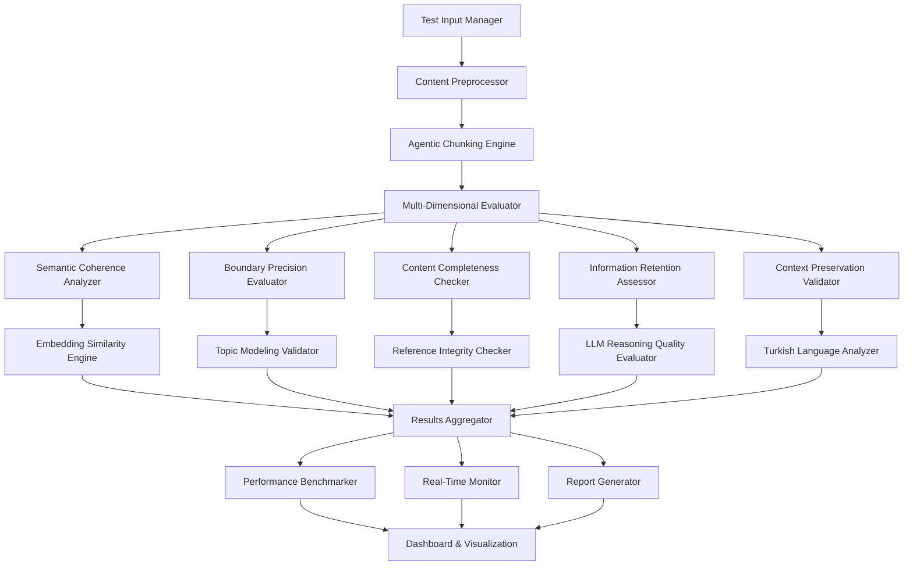

# Agentic Chunking Semantic Coherence Test System - Comprehensive Technical Specification

## 1. Executive Summary

This document provides a comprehensive technical specification for implementing a semantic coherence test system for Agentic Chunking, specifically optimized for Turkish educational content. The system integrates multiple evaluation frameworks to assess the quality, performance, and reliability of LLM-guided chunking strategies.

### 1.1 System Overview

The Agentic Chunking Semantic Coherence Test System is designed to evaluate and validate the semantic coherence of document chunking performed by Groq Llama 3.1 8B model with Turkish language optimization. The system provides comprehensive testing across five critical dimensions:

- **Visual-Text Context Analysis**: Evaluation of image-text relationship preservation
- **Topic Transition Detection**: Assessment of natural topic boundary identification
- **Reference Integrity Preservation**: Validation of cross-reference and citation maintenance
- **Contextual Continuity Assessment**: Analysis of semantic flow preservation
- **Topic Drift Detection**: Identification of irrelevant content intrusion

### 1.2 Key Technical Features

- **API-Based Architecture**: Leverages existing embedding services without heavy local dependencies
- **Turkish Language Optimization**: Specialized evaluation metrics for Turkish morphology and educational patterns
- **Real-Time Quality Monitoring**: Continuous assessment with automated alerting
- **Multi-Modal Evaluation**: Comprehensive testing across text, visual, and reference dimensions
- **Performance Benchmarking**: Comparative analysis against traditional chunking methods

## 2. System Architecture

### 2.1 High-Level Architecture



### 2.2 Core Components

#### 2.2.1 Test Input Manager
- **Purpose**: Manages test data ingestion and preprocessing
- **Responsibilities**:
  - Test dataset validation and loading
  - Content type classification (academic, technical, mixed)
  - Metadata extraction and annotation
  - Input sanitization and normalization

#### 2.2.2 Content Preprocessor
- **Purpose**: Prepares content for chunking evaluation
- **Responsibilities**:
  - Turkish language text normalization
  - Visual content extraction and annotation
  - Reference pattern identification
  - Ground truth boundary annotation

#### 2.2.3 Agentic Chunking Engine
- **Purpose**: Executes LLM-guided chunking with Groq Llama 3.1 8B
- **Responsibilities**:
  - Turkish-optimized prompt engineering
  - Boundary decision reasoning capture
  - Chunk metadata generation
  - Performance metrics collection

#### 2.2.4 Multi-Dimensional Evaluator
- **Purpose**: Orchestrates comprehensive evaluation across all dimensions
- **Responsibilities**:
  - Evaluation pipeline coordination
  - Metric calculation and aggregation
  - Quality threshold validation
  - Performance optimization

## 3. API Design and Integration

### 3.1 Core API Endpoints

#### 3.1.1 Test Execution API

```typescript
// Test Initiation
POST /api/v1/semantic-coherence/test/start
{
  "test_config": {
    "test_categories": ["visual_text", "topic_transitions", "reference_integrity"],
    "content_types": ["academic", "technical"],
    "language": "tr",
    "evaluation_depth": "comprehensive"
  },
  "dataset_config": {
    "source": "turkish_academic_corpus",
    "size": "medium",
    "domains": ["biology", "chemistry", "physics"]
  },
  "chunking_config": {
    "model": "groq_llama_3_1_8b",
    "turkish_optimization": true,
    "reasoning_capture": true
  }
}

// Response
{
  "test_id": "test_20260102_001",
  "status": "initiated",
  "estimated_duration": "45 minutes",
  "progress_endpoint": "/api/v1/semantic-coherence/test/test_20260102_001/progress"
}
```

#### 3.1.2 Real-Time Monitoring API

```typescript
// Progress Monitoring
GET /api/v1/semantic-coherence/test/{test_id}/progress
{
  "test_id": "test_20260102_001",
  "status": "running",
  "progress": {
    "overall_completion": 65,
    "current_phase": "semantic_analysis",
    "phases": {
      "content_preprocessing": 100,
      "chunking_execution": 100,
      "semantic_analysis": 65,
      "performance_benchmarking": 0,
      "report_generation": 0
    }
  },
  "preliminary_metrics": {
    "semantic_coherence_score": 0.847,
    "boundary_precision": 0.923,
    "processing_speed": "1.2 docs/sec"
  }
}
```

#### 3.1.3 Results Retrieval API

```typescript
// Comprehensive Results
GET /api/v1/semantic-coherence/test/{test_id}/results
{
  "test_id": "test_20260102_001",
  "execution_summary": {
    "start_time": "2026-01-02T19:00:00Z",
    "end_time": "2026-01-02T19:45:00Z",
    "total_documents": 150,
    "total_chunks": 1247,
    "success_rate": 98.7
  },
  "semantic_coherence_metrics": {
    "overall_score": 0.847,
    "category_scores": {
      "visual_text_context": 0.823,
      "topic_transitions": 0.891,
      "reference_integrity": 0.934,
      "contextual_continuity": 0.812,
      "topic_drift_detection": 0.876
    }
  },
  "performance_comparison": {
    "agentic_vs_traditional": {
      "semantic_coherence": "+12.3%",
      "boundary_precision": "+8.7%",
      "processing_time": "+23.4%",
      "overall_quality": "+15.2%"
    }
  }
}
```

### 3.2 Embedding Service Integration

#### 3.2.1 Multi-Provider Embedding Architecture

```typescript
interface EmbeddingProvider {
  name: string;
  endpoint: string;
  model: string;
  dimensions: number;
  rate_limit: number;
  cost_per_token: number;
}

const EMBEDDING_PROVIDERS: EmbeddingProvider[] = [
  {
    name: "alibaba_dashscope",
    endpoint: "https://dashscope.aliyuncs.com/api/v1/services/embeddings/text-embedding",
    model: "text-embedding-v2",
    dimensions: 1536,
    rate_limit: 100,
    cost_per_token: 0.0001
  },
  {
    name: "huggingface",
    endpoint: "https://api-inference.huggingface.co/pipeline/feature-extraction",
    model: "sentence-transformers/paraphrase-multilingual-MiniLM-L12-v2",
    dimensions: 384,
    rate_limit: 1000,
    cost_per_token: 0.00005
  },
  {
    name: "openrouter",
    endpoint: "https://openrouter.ai/api/v1/embeddings",
    model: "text-embedding-3-small",
    dimensions: 1536,
    rate_limit: 500,
    cost_per_token: 0.00002
  }
];
```

#### 3.2.2 Embedding Service Manager

```typescript
class EmbeddingServiceManager {
  private providers: Map<string, EmbeddingProvider>;
  private connectionPool: ConnectionPool;
  private cache: EmbeddingCache;
  
  async getEmbedding(
    text: string, 
    provider: string = "auto",
    options: EmbeddingOptions = {}
  ): Promise<EmbeddingResult> {
    // Provider selection logic
    const selectedProvider = provider === "auto" 
      ? this.selectOptimalProvider(text, options)
      : this.providers.get(provider);
    
    // Cache check
    const cacheKey = this.generateCacheKey(text, selectedProvider.model);
    const cached = await this.cache.get(cacheKey);
    if (cached) return cached;
    
    // API call with retry logic
    const embedding = await this.callEmbeddingAPI(text, selectedProvider);
    
    // Cache result
    await this.cache.set(cacheKey, embedding, { ttl: 3600 });
    
    return embedding;
  }
  
  private selectOptimalProvider(text: string, options: EmbeddingOptions): EmbeddingProvider {
    // Selection criteria:
    // 1. Turkish language support
    // 2. Rate limit availability
    // 3. Cost optimization
    // 4. Response time requirements
    
    const textLength = text.length;
    const isUrgent = options.priority === "high";
    
    if (isUrgent && textLength < 1000) {
      return this.providers.get("openrouter");
    } else if (textLength > 5000) {
      return this.providers.get("alibaba_dashscope");
    } else {
      return this.providers.get("huggingface");
    }
  }
}
```

## 4. Turkish Language Optimization

### 4.1 Morphological Analysis Integration

#### 4.1.1 Turkish-Specific Text Processing

```typescript
interface TurkishTextProcessor {
  // Morphological analysis
  analyzeMorphology(text: string): MorphologyResult[];
  
  // Agglutination handling
  handleAgglutination(words: string[]): AgglutinationResult;
  
  // Discourse marker detection
  detectDiscourseMarkers(text: string): DiscourseMarker[];
  
  // Educational pattern recognition
  recognizeEducationalPatterns(text: string): EducationalPattern[];
}

class TurkishSemanticAnalyzer implements TurkishTextProcessor {
  private morphologyEngine: TurkishMorphologyEngine;
  private discoursePatterns: DiscoursePatternMatcher;
  private educationalPatterns: EducationalPatternMatcher;
  
  analyzeMorphology(text: string): MorphologyResult[] {
    return this.morphologyEngine.analyze(text, {
      includeDerivations: true,
      handleCompounds: true,
      detectNamedEntities: true
    });
  }
  
  detectDiscourseMarkers(text: string): DiscourseMarker[] {
    const patterns = [
      // Temporal markers
      { pattern: /^(önce|sonra|daha sonra|ardından|akabinde)/, type: "temporal" },
      
      // Causal markers
      { pattern: /(çünkü|nedeniyle|dolayısıyla|bu yüzden)/, type: "causal" },
      
      // Contrastive markers
      { pattern: /(ancak|fakat|lakin|bununla birlikte|öte yandan)/, type: "contrastive" },
      
      // Additive markers
      { pattern: /(ayrıca|bunun yanında|dahası|üstelik)/, type: "additive" }
    ];
    
    return this.discoursePatterns.match(text, patterns);
  }
  
  recognizeEducationalPatterns(text: string): EducationalPattern[] {
    const educationalStructures = [
      // Definition patterns
      { pattern: /(.+?)\s+(tanımı|tanımlanır|olarak adlandırılır)/, type: "definition" },
      
      // Example patterns
      { pattern: /(örneğin|mesela|şöyle ki|bunun bir örneği)/, type: "example" },
      
      // Explanation patterns
      { pattern: /(açıklama|açıklamak gerekirse|detaylandırmak gerekirse)/, type: "explanation" },
      
      // Enumeration patterns
      { pattern: /(birinci|ikinci|üçüncü|ilk olarak|son olarak)/, type: "enumeration" }
    ];
    
    return this.educationalPatterns.match(text, educationalStructures);
  }
}
```

### 4.2 Turkish Educational Content Patterns

#### 4.2.1 Subject-Specific Pattern Recognition

```typescript
interface SubjectPatternMatcher {
  biology: BiologyPatternMatcher;
  chemistry: ChemistryPatternMatcher;
  physics: PhysicsPatternMatcher;
  mathematics: MathematicsPatternMatcher;
  history: HistoryPatternMatcher;
  geography: GeographyPatternMatcher;
}

class BiologyPatternMatcher {
  private taxonomyPatterns: RegExp[];
  private processPatterns: RegExp[];
  private structurePatterns: RegExp[];
  
  constructor() {
    this.taxonomyPatterns = [
      /(\w+)\s+(familyası|türü|cinsi|sınıfı)/,
      /(bitki|hayvan|bakteri|mantar)\s+krallığı/,
      /taksonomik\s+(sınıflandırma|kategori)/
    ];
    
    this.processPatterns = [
      /(fotosentez|solunum|sindirim|dolaşım)\s+süreci/,
      /(mitoz|mayoz|protein sentezi)\s+aşamaları/,
      /metabolik\s+(yol|süreç|aktivite)/
    ];
    
    this.structurePatterns = [
      /(hücre|organ|doku|sistem)\s+yapısı/,
      /(DNA|RNA|protein)\s+yapısı/,
      /anatomik\s+(özellik|yapı)/
    ];
  }
  
  matchPatterns(text: string): BiologyPattern[] {
    const matches: BiologyPattern[] = [];
    
    // Taxonomy pattern matching
    this.taxonomyPatterns.forEach(pattern => {
      const match = text.match(pattern);
      if (match) {
        matches.push({
          type: "taxonomy",
          content: match[0],
          position: match.index,
          confidence: 0.9
        });
      }
    });
    
    return matches;
  }
}
```

## 5. Evaluation Metrics and Algorithms

### 5.1 Semantic Coherence Score Calculation

#### 5.1.1 Multi-Dimensional Scoring Algorithm

```typescript
interface SemanticCoherenceMetrics {
  overall_score: number;
  dimension_scores: {
    lexical_coherence: number;
    semantic_similarity: number;
    topic_consistency: number;
    discourse_flow: number;
    reference_integrity: number;
  };
  confidence_intervals: {
    lower_bound: number;
    upper_bound: number;
    confidence_level: number;
  };
}

class SemanticCoherenceCalculator {
  private embeddingService: EmbeddingServiceManager;
  private turkishAnalyzer: TurkishSemanticAnalyzer;
  private topicModeler: TopicModelingValidator;
  
  async calculateCoherence(
    chunks: DocumentChunk[],
    originalDocument: Document,
    groundTruth?: GroundTruthAnnotation
  ): Promise<SemanticCoherenceMetrics> {
    
    // 1. Lexical Coherence Analysis
    const lexicalScore = await this.calculateLexicalCoherence(chunks);
    
    // 2. Semantic Similarity Analysis
    const semanticScore = await this.calculateSemanticSimilarity(chunks);
    
    // 3. Topic Consistency Analysis
    const topicScore = await this.calculateTopicConsistency(chunks);
    
    // 4. Discourse Flow Analysis
    const discourseScore = await this.calculateDiscourseFlow(chunks);
    
    // 5. Reference Integrity Analysis
    const referenceScore = await this.calculateReferenceIntegrity(chunks, originalDocument);
    
    // Weighted aggregation
    const weights = {
      lexical_coherence: 0.15,
      semantic_similarity: 0.30,
      topic_consistency: 0.25,
      discourse_flow: 0.20,
      reference_integrity: 0.10
    };
    
    const overall_score = 
      lexicalScore * weights.lexical_coherence +
      semanticScore * weights.semantic_similarity +
      topicScore * weights.topic_consistency +
      discourseScore * weights.discourse_flow +
      referenceScore * weights.reference_integrity;
    
    // Confidence interval calculation
    const confidence_intervals = this.calculateConfidenceIntervals(
      [lexicalScore, semanticScore, topicScore, discourseScore, referenceScore],
      weights
    );
    
    return {
      overall_score,
      dimension_scores: {
        lexical_coherence: lexicalScore,
        semantic_similarity: semanticScore,
        topic_consistency: topicScore,
        discourse_flow: discourseScore,
        reference_integrity: referenceScore
      },
      confidence_intervals
    };
  }
  
  private async calculateSemanticSimilarity(chunks: DocumentChunk[]): Promise<number> {
    const similarities: number[] = [];
    
    for (let i = 0; i < chunks.length - 1; i++) {
      const currentChunk = chunks[i];
      const nextChunk = chunks[i + 1];
      
      // Get embeddings for chunk boundaries
      const currentEmbedding = await this.embeddingService.getEmbedding(
        currentChunk.content.slice(-200) // Last 200 chars
      );
      
      const nextEmbedding = await this.embeddingService.getEmbedding(
        nextChunk.content.slice(0, 200) // First 200 chars
      );
      
      // Calculate cosine similarity
      const similarity = this.cosineSimilarity(
        currentEmbedding.vector,
        nextEmbedding.vector
      );
      
      similarities.push(similarity);
    }
    
    // Return average similarity with penalty for high variance
    const avgSimilarity = similarities.reduce((a, b) => a + b, 0) / similarities.length;
    const variance = this.calculateVariance(similarities);
    const variancePenalty = Math.min(variance * 0.5, 0.2);
    
    return Math.max(0, avgSimilarity - variancePenalty);
  }
  
  private cosineSimilarity(vectorA: number[], vectorB: number[]): number {
    const dotProduct = vectorA.reduce((sum, a, i) => sum + a * vectorB[i], 0);
    const magnitudeA = Math.sqrt(vectorA.reduce((sum, a) => sum + a * a, 0));
    const magnitudeB = Math.sqrt(vectorB.reduce((sum, b) => sum + b * b, 0));
    
    return dotProduct / (magnitudeA * magnitudeB);
  }
}
```

### 5.2 Boundary Precision Evaluation

#### 5.2.1 Ground Truth Comparison Algorithm

```typescript
interface BoundaryPrecisionMetrics {
  precision: number;
  recall: number;
  f1_score: number;
  boundary_accuracy: number;
  near_miss_tolerance: {
    within_50_chars: number;
    within_100_chars: number;
    within_200_chars: number;
  };
}

class BoundaryPrecisionEvaluator {
  calculatePrecision(
    predictedBoundaries: number[],
    groundTruthBoundaries: number[],
    tolerance: number = 100
  ): BoundaryPrecisionMetrics {
    
    let truePositives = 0;
    let falsePositives = 0;
    let falseNegatives = 0;
    
    const nearMissStats = {
      within_50_chars: 0,
      within_100_chars: 0,
      within_200_chars: 0
    };
    
    // Calculate true positives and near misses
    for (const predicted of predictedBoundaries) {
      const nearestGroundTruth = this.findNearestBoundary(predicted, groundTruthBoundaries);
      const distance = Math.abs(predicted - nearestGroundTruth);
      
      if (distance <= tolerance) {
        truePositives++;
      } else {
        falsePositives++;
      }
      
      // Near miss statistics
      if (distance <= 50) nearMissStats.within_50_chars++;
      if (distance <= 100) nearMissStats.within_100_chars++;
      if (distance <= 200) nearMissStats.within_200_chars++;
    }
    
    // Calculate false negatives
    for (const groundTruth of groundTruthBoundaries) {
      const nearestPredicted = this.findNearestBoundary(groundTruth, predictedBoundaries);
      const distance = Math.abs(groundTruth - nearestPredicted);
      
      if (distance > tolerance) {
        falseNegatives++;
      }
    }
    
    // Calculate metrics
    const precision = truePositives / (truePositives + falsePositives);
    const recall = truePositives / (truePositives + falseNegatives);
    const f1_score = 2 * (precision * recall) / (precision + recall);
    const boundary_accuracy = truePositives / groundTruthBoundaries.length;
    
    return {
      precision,
      recall,
      f1_score,
      boundary_accuracy,
      near_miss_tolerance: {
        within_50_chars: nearMissStats.within_50_chars / predictedBoundaries.length,
        within_100_chars: nearMissStats.within_100_chars / predictedBoundaries.length,
        within_200_chars: nearMissStats.within_200_chars / predictedBoundaries.length
      }
    };
  }
  
  private findNearestBoundary(target: number, boundaries: number[]): number {
    return boundaries.reduce((nearest, current) => 
      Math.abs(current - target) < Math.abs(nearest - target) ? current : nearest
    );
  }
}
```

## 6. Performance Benchmarking Framework

### 6.1 Comparative Analysis System

#### 6.1.1 Multi-Method Comparison Engine

```typescript
interface ChunkingMethod {
  name: string;
  type: "traditional" | "agentic" | "hybrid";
  implementation: ChunkingImplementation;
  parameters: ChunkingParameters;
}

interface BenchmarkResults {
  method_name: string;
  performance_metrics: {
    processing_speed: number; // docs per second
    memory_usage: number; // MB
    api_calls: number;
    cost_per_document: number;
  };
  quality_metrics: {
    semantic_coherence: number;
    boundary_precision: number;
    content_completeness: number;
    information_retention: number;
  };
  turkish_specific_metrics: {
    morphology_preservation: number;
    discourse_marker_handling: number;
    educational_pattern_recognition: number;
  };
}

class PerformanceBenchmarker {
  private methods: Map<string, ChunkingMethod>;
  private testDatasets: TestDataset[];
  
  constructor() {
    this.initializeChunkingMethods();
  }
  
  private initializeChunkingMethods(): void {
    this.methods = new Map([
      ["agentic_groq_llama", {
        name: "Agentic Groq Llama 3.1 8B",
        type: "agentic",
        implementation: new AgenticGroqChunker(),
        parameters: {
          model: "llama-3.1-8b-instant",
          turkish_optimization: true,
          reasoning_capture: true,
          max_chunk_size: 1000,
          overlap_size: 100
        }
      }],
      
      ["fixed_size", {
        name: "Fixed Size Chunking",
        type: "traditional",
        implementation: new FixedSizeChunker(),
        parameters: {
          chunk_size: 1000,
          overlap_size: 100
        }
      }],
      
      ["sentence_based", {
        name: "Sentence-Based Chunking",
        type: "traditional",
        implementation: new SentenceBasedChunker(),
        parameters: {
          max_sentences: 10,
          min_chunk_size: 500
        }
      }],
      
      ["semantic_similarity", {
        name: "Semantic Similarity Chunking",
        type: "traditional",
        implementation: new SemanticSimilarityChunker(),
        parameters: {
          similarity_threshold: 0.7,
          embedding_model: "sentence-transformers/paraphrase-multilingual-MiniLM-L12-v2"
        }
      }],
      
      ["topic_modeling", {
        name: "Topic Modeling Chunking",
        type: "traditional",
        implementation: new TopicModelingChunker(),
        parameters: {
          num_topics: 10,
          coherence_threshold: 0.6
        }
      }],
      
      ["hybrid_agentic", {
        name: "Hybrid Agentic Chunking",
        type: "hybrid",
        implementation: new HybridAgenticChunker(),
        parameters: {
          primary_method: "semantic_similarity",
          llm_validation: true,
          confidence_threshold: 0.8
        }
      }]
    ]);
  }
  
  async runComprehensiveBenchmark(
    testConfig: BenchmarkConfig
  ): Promise<BenchmarkReport> {
    const results: BenchmarkResults[] = [];
    
    for (const [methodName, method] of this.methods) {
      if (testConfig.methods.includes(methodName)) {
        console.log(`Benchmarking ${methodName}...`);
        
        const methodResults = await this.benchmarkMethod(method, testConfig);
        results.push(methodResults);
      }
    }
    
    // Statistical analysis
    const statisticalAnalysis = this.performStatisticalAnalysis(results);
    
    // Generate rankings
    const rankings = this.generateMethodRankings(results);
    
    return {
      execution_summary: {
        start_time: testConfig.start_time,
        end_time: new Date().toISOString(),
        methods_tested: results.length,
        total_documents: testConfig.dataset_size,
        test_categories: testConfig.categories
      },
      method_results: results,
      statistical_analysis: statisticalAnalysis,
      method_rankings: rankings,
      recommendations: this.generateRecommendations(results, rankings)
    };
  }
  
  private async benchmarkMethod(
    method: ChunkingMethod,
    config: BenchmarkConfig
  ): Promise<BenchmarkResults> {
    const startTime = Date.now();
    let totalApiCalls = 0;
    let totalMemoryUsage = 0;
    let totalCost = 0;
    
    const qualityScores: QualityMetrics[] = [];
    const turkishScores: TurkishMetrics[] = [];
    
    for (const dataset of this.testDatasets) {
      if (config.datasets.includes(dataset.name)) {
        // Performance measurement
        const performanceStart = process.hrtime.bigint();
        const memoryBefore = process.memoryUsage().heapUsed;
        
        // Execute chunking
        const chunks = await method.implementation.chunk(dataset.documents);
        
        const performanceEnd = process.hrtime.bigint();
        const memoryAfter = process.memoryUsage().heapUsed;
        
        // Update performance metrics
        totalApiCalls += method.implementation.getApiCallCount();
        totalMemoryUsage += (memoryAfter - memoryBefore) / 1024 / 1024; // MB
        totalCost += method.implementation.getCost();
        
        // Quality evaluation
        const qualityMetrics = await this.evaluateQuality(chunks, dataset);
        qualityScores.push(qualityMetrics);
        
        // Turkish-specific evaluation
        const turkishMetrics = await this.evaluateTurkishSpecific(chunks, dataset);
        turkishScores.push(turkishMetrics);
      }
    }
    
    const endTime = Date.now();
    const processingSpeed = config.total_documents / ((endTime - startTime) / 1000);
    
    return {
      method_name: method.name,
      performance_metrics: {
        processing_speed: processingSpeed,
        memory_usage: totalMemoryUsage / this.testDatasets.length,
        api_calls: totalApiCalls,
        cost_per_document: totalCost / config.total_documents
      },
      quality_metrics: this.aggregateQualityScores(qualityScores),
      turkish_specific_metrics: this.aggregateTurkishScores(turkishScores)
    };
  }
}
```

## 7. Real-Time Monitoring and Alerting

### 7.1 Quality Monitoring System

#### 7.1.1 Continuous Quality Assessment

```typescript
interface QualityMonitor {
  thresholds: QualityThresholds;
  alerting: AlertingSystem;
  metrics: MetricsCollector;
  dashboard: MonitoringDashboard;
}

interface QualityThresholds {
  semantic_coherence: {
    critical: number; // < 0.6
    warning: number;  // < 0.7
    target: number;   // > 0.8
  };
  boundary_precision: {
    critical: number; // < 0.7
    warning: number;  // < 0.8
    target: number;   // > 0.9
  };
  processing_speed: {
    critical: number; // < 0.5 docs/sec
    warning: number;  // < 1.0 docs/sec
    target: number;   // > 2.0 docs/sec
  };
}

class RealTimeQualityMonitor {
  private thresholds: QualityThresholds;
  private alertManager: AlertManager;
  private metricsBuffer: CircularBuffer<QualityMetrics>;
  private websocketServer: WebSocketServer;
  
  constructor(config: MonitoringConfig) {
    this.thresholds = config.thresholds;
    this.alertManager = new AlertManager(config.alerting);
    this.metricsBuffer = new CircularBuffer<QualityMetrics>(1000);
    this.websocketServer = new WebSocketServer({ port: config.websocket_port });
    
    this.initializeMonitoring();
  }
  
  async processQualityMetrics(metrics: QualityMetrics): Promise<void> {
    // Store metrics
    this.metricsBuffer.push(metrics);
    
    // Real-time analysis
    const analysis = await this.analyzeQualityTrends(metrics);
    
    // Threshold checking
    const alerts = this.checkThresholds(metrics);
    
    // Send alerts if necessary
    if (alerts.length > 0) {
      await this.alertManager.sendAlerts(alerts);
    }
    
    // Update dashboard
    await this.updateDashboard(metrics, analysis);
    
    // Broadcast to connected clients
    this.broadcastMetrics(metrics, analysis);
  }
  
  private checkThresholds(metrics: QualityMetrics): Alert[] {
    const alerts: Alert[] = [];
    
    // Semantic coherence check
    if (metrics.semantic_coherence < this.thresholds.semantic_coherence.critical) {
      alerts.push({
        type: "critical",
        metric: "semantic_coherence",
        value: metrics.semantic_coherence,
        threshold: this.thresholds.semantic_coherence.critical,
        message: `Semantic coherence critically low: ${metrics.semantic_coherence.toFixed(3)}`,
        timestamp: new Date().toISOString(),
        suggested_actions: [
          "Review LLM prompt engineering",
          "Check Turkish language optimization settings",
          "Validate input document quality"
        ]
      });
    } else if (metrics.semantic_coherence < this.thresholds.semantic_coherence.warning) {
      alerts.push({
        type: "warning",
        metric: "semantic_coherence",
        value: metrics.semantic_coherence,
        threshold: this.thresholds.semantic_coherence.warning,
        message: `Semantic coherence below target: ${metrics.semantic_coherence.toFixed(3)}`,
        timestamp: new Date().toISOString(),
        suggested_actions: [
          "Monitor trend over next 10 documents",
          "Consider parameter adjustment"
        ]
      });
    }
    
    // Boundary precision check
    if (metrics.boundary_precision < this.thresholds.boundary_precision.critical) {
      alerts.push({
        type: "critical",
        metric: "boundary_precision",
        value: metrics.boundary_precision,
        threshold: this.thresholds.boundary_precision.critical,
        message: `Boundary precision critically low: ${metrics.boundary_precision.toFixed(3)}`,
        timestamp: new Date().toISOString(),
        suggested_actions: [
          "Review boundary detection algorithm",
          "Check discourse marker recognition",
          "Validate ground truth annotations"
        ]
      });
    }
    
    return alerts;
  }
  
  private async analyzeQualityTrends(currentMetrics: QualityMetrics): Promise<TrendAnalysis> {
    const recentMetrics = this.metricsBuffer.getLast(50);
    
    if (recentMetrics.length < 10) {
      return { status: "insufficient_data" };
    }
    
    // Calculate trends
    const semanticTrend = this.calculateTrend(
      recentMetrics.map(m => m.semantic_coherence)
    );
    
    const boundaryTrend = this.calculateTrend(
      recentMetrics.map(m => m.boundary_precision)
    );
    
    const speedTrend = this.calculateTrend(
      recentMetrics.map(m => m.processing_speed)
    );
    
    // Detect anomalies
    const anomalies = this.detectAnomalies(recentMetrics, currentMetrics);
    
    return {
      status: "analyzed",
      trends: {
        semantic_coherence: semanticTrend,
        boundary_precision: boundaryTrend,
        processing_speed: speedTrend
      },
      anomalies: anomalies,
      prediction: this.predictNextValues(recentMetrics),
      recommendations: this.generateRecommendations(semanticTrend, boundaryTrend, speedTrend)
    };
  }
  
  private calculateTrend(values: number[]): TrendInfo {
    if (values.length < 5) return { direction: "unknown", strength: 0 };
    
    // Simple linear regression
    const n = values.length;
    const x = Array.from({ length: n }, (_, i) => i);
    const y = values;
    
    const sumX = x.reduce((a, b) => a + b, 0);
    const sumY = y.reduce((a, b) => a + b, 0);
    const sumXY = x.reduce((sum, xi, i) => sum + xi * y[i], 0);
    const sumXX = x.reduce((sum, xi) => sum + xi * xi, 0);
    
    const slope = (n * sumXY - sumX * sumY) / (n * sumXX - sumX * sumX);
    const intercept = (sumY - slope * sumX) / n;
    
    // Calculate R-squared
    const yMean = sumY / n;
    const ssRes = y.reduce((sum, yi, i) => {
      const predicted = slope * x[i] + intercept;
      return sum + Math.pow(yi - predicted, 2);
    }, 0);
    const ssTot = y.reduce((sum, yi) => sum + Math.pow(yi - yMean, 2), 0);
    const rSquared = 1 - (ssRes / ssTot);
    
    return {
      direction: slope > 0.001 ? "increasing" : slope < -0.001 ? "decreasing" : "stable",
      strength: Math.abs(slope),
      confidence: rSquared,
      slope: slope,
      intercept: intercept
    };
  }
}
```

### 7.2 Alerting and Notification System

#### 7.2.1 Multi-Channel Alert Manager

```typescript
interface AlertChannel {
  name: string;
  type: "email" | "slack" | "webhook" | "sms";
  config: AlertChannelConfig;
  enabled: boolean;
}

interface AlertRule {
  metric: string;
  condition: "less_than" | "greater_than" | "equals" | "not_equals";
  threshold: number;
  severity: "info" | "warning" | "critical";
  cooldown_minutes: number;
}

class AlertManager {
  private channels: Map<string, AlertChannel>;
  private rules: AlertRule[];
  private alertHistory: Map<string, Date>;
  
  constructor(config: AlertingConfig) {
    this.channels = new Map();
    this.rules = config.rules;
    this.alertHistory = new Map();
    
    this.initializeChannels(config.channels);
  }
  
  async sendAlerts(alerts: Alert[]): Promise<void> {
    for (const alert of alerts) {
      // Check cooldown
      const alertKey = `${alert.metric}_${alert.type}`;
      const lastAlert = this.alertHistory.get(alertKey);
      const cooldownRule = this.rules.find(r => r.metric === alert.metric);
      
      if (lastAlert && cooldownRule) {
        const minutesSinceLastAlert = (Date.now() - lastAlert.getTime()) / (1000 * 60);
        if (minutesSinceLastAlert < cooldownRule.cooldown_minutes) {
          continue; // Skip due to cooldown
        }
      }
      
      // Send to all enabled channels
      for (const [channelName, channel] of this.channels) {
        if (channel.enabled && this.shouldSendToChannel(alert, channel)) {
          try {
            await this.sendToChannel(alert, channel);
            console.log(`Alert sent to ${channelName}: ${alert.message}`);
          } catch (error) {
            console.error(`Failed to send alert to ${channelName}:`, error);
          }
        }
      }
      
      // Update alert history
      this.alertHistory.set(alertKey, new Date());
    }
  }
  
  private async sendToChannel(alert: Alert, channel: AlertChannel): Promise<void> {
    switch (channel.type) {
      case "email":
        await this.sendEmailAlert(alert, channel.config as EmailConfig);
        break;
      case "slack":
        await this.sendSlackAlert(alert, channel.config as SlackConfig);
        break;
      case "webhook":
        await this.sendWebhookAlert(alert, channel.config as WebhookConfig);
        break;
      case "sms":
        await this.sendSMSAlert(alert, channel.config as SMSConfig);
        break;
    }
  }
  
  private async sendSlackAlert(alert: Alert, config: SlackConfig): Promise<void> {
    const color = alert.type === "critical" ? "danger" : 
                  alert.type === "warning" ? "warning" : "good";
    
    const payload = {
      channel: config.channel,
      username: "Agentic Chunking Monitor",
      icon_emoji: ":warning:",
      attachments: [{
        color: color,
        title: `${alert.type.toUpperCase()}: ${alert.metric}`,
        text: alert.message,
        fields: [
          {
            title: "Current Value",
            value: alert.value.toFixed(3),
            short: true
          },
          {
            title: "Threshold",
            value: alert.threshold.toFixed(3),
            short: true
          },
          {
            title: "Timestamp",
            value: alert.timestamp,
            short: false
          }
        ],
        actions: alert.suggested_actions.map(action => ({
          type: "button",
          text: action,
          style: alert.type === "critical" ? "danger" : "default"
        }))
      }]
    };
    
    const response = await fetch(config.webhook_url, {
      method: "POST",
      headers: { "Content-Type": "application/json" },
      body: JSON.stringify(payload)
    });
    
    if (!response.ok) {
      throw new Error(`Slack API error: ${response.statusText}`);
    }
  }
}
```

## 8. Test Execution and Reporting Framework

### 8.1 Automated Test Execution Pipeline

#### 8.1.1 Test Orchestration Engine

```typescript
interface TestExecutionPlan {
  test_id: string;
  configuration: TestConfiguration;
  phases: TestPhase[];
  dependencies: TestDependency[];
  success_criteria: SuccessCriteria;
}

interface TestPhase {
  name: string;
  description: string;
  executor: PhaseExecutor;
  timeout_minutes: number;
  retry_policy: RetryPolicy;
  success_conditions: Condition[];
}

class TestOrchestrator {
  private executionQueue: Queue<TestExecutionPlan>;
  private activeTests: Map<string, TestExecution>;
  private resultStore: TestResultStore;
  private notificationService: NotificationService;
  
  async executeTestPlan(plan: TestExecutionPlan): Promise<TestExecutionResult> {
    const execution = new TestExecution(plan);
    this.activeTests.set(plan.test_id, execution);
    
    try {
      // Phase 1: Data Preparation
      await this.executePhase(execution, "data_preparation", async () => {
        return await this.prepareTestData(plan.configuration);
      });
      
      // Phase 2: Chunking Execution
      await this.executePhase(execution, "chunking_execution", async () => {
        return await this.executeChunking(plan.configuration);
      });
      
      // Phase 3: Quality Evaluation
      await this.executePhase(execution, "quality_evaluation", async () => {
        return await this.evaluateQuality(execution.getChunkingResults());
      });
      
      // Phase 4: Performance Benchmarking
      await this.executePhase(execution, "performance_benchmarking", async () => {
        return await this.benchmarkPerformance(execution.getChunkingResults());
      });
      
      // Phase 5: Report Generation
      await this.executePhase(execution, "report_generation", async () => {
        return await this.generateReport(execution.getAllResults());
      });
      
      // Finalize execution
      const finalResult = await this.finalizeExecution(execution);
      
      // Store results
      await this.resultStore.store(finalResult);
      
      // Send notifications
      await this.notificationService.notifyCompletion(finalResult);
      
      return finalResult;
      
    } catch (error) {
      await this.handleExecutionError(execution, error);
      throw error;
    } finally {
      this.activeTests.delete(plan.test_id);
    }
  }
  
  private async executePhase(
    execution: TestExecution,
    phaseName: string,
    phaseFunction: () => Promise<any>
  ): Promise<void> {
    const phase = execution.getPhase(phaseName);
    const startTime = Date.now();
    
    execution.updatePhaseStatus(phaseName, "running");
    
    try {
      // Execute with timeout
      const result = await Promise.race([
        phaseFunction(),
        this.createTimeoutPromise(phase.timeout_minutes * 60 * 1000)
      ]);
      
      const endTime = Date.now();
      const duration = endTime - startTime;
      
      execution.updatePhaseResult(phaseName, {
        status: "completed",
        result: result,
        duration_ms: duration,
        timestamp: new Date().toISOString()
      });
      
    } catch (error) {
      const endTime = Date.now();
      const duration = endTime - startTime;
      
      execution.updatePhaseResult(phaseName, {
        status: "failed",
        error: error.message,
        duration_ms: duration,
        timestamp: new Date().toISOString()
      });
      
      // Apply retry policy
      if (phase.retry_policy.max_retries > 0) {
        await this.retryPhase(execution, phaseName, phaseFunction, phase.retry_policy);
      } else {
        throw error;
      }
    }
  }
  
  private async prepareTestData(config: TestConfiguration): Promise<TestDataPreparationResult> {
    const dataLoader = new TestDataLoader();
    const preprocessor = new ContentPreprocessor();
    
    // Load datasets
    const datasets = await dataLoader.loadDatasets(config.datasets);
    
    // Preprocess content
    const preprocessedData = await preprocessor.preprocess(datasets, {
      turkish_normalization: true,
      visual_content_extraction: true,
      reference_annotation: true,
      ground_truth_validation: true
    });
    
    // Validate data quality
    const validationResults = await this.validateTestData(preprocessedData);
    
    if (validationResults.quality_score < 0.8) {
      throw new Error(`Test data quality insufficient: ${validationResults.quality_score}`);
    }
    
    return {
      datasets: preprocessedData,
      validation_results: validationResults,
      statistics: {
        total_documents: preprocessedData.length,
        total_words: preprocessedData.reduce((sum, doc) => sum + doc.word_count, 0),
        languages: ["tr"],
        content_types: config.content_types
      }
    };
  }
}
```

### 8.2 Comprehensive Reporting System

#### 8.2.1 Multi-Format Report Generator

```typescript
interface ReportConfiguration {
  format: "pdf" | "html" | "json" | "excel";
  sections: ReportSection[];
  visualizations: VisualizationConfig[];
  export_options: ExportOptions;
}

interface ReportSection {
  name: string;
  type: "summary" | "detailed_analysis" | "comparison" | "recommendations";
  content_generator: ContentGenerator;
  include_visualizations: boolean;
}

class ComprehensiveReportGenerator {
  private templateEngine: TemplateEngine;
  private visualizationEngine: VisualizationEngine;
  private exportEngine: ExportEngine;
  
  async generateReport(
    testResults: TestExecutionResult,
    config: ReportConfiguration
  ): Promise<GeneratedReport> {
    
    const reportData = await this.prepareReportData(testResults);
    const sections = await this.generateSections(reportData, config.sections);
    const visualizations = await this.generateVisualizations(reportData, config.visualizations);
    
    const report = await this.assembleReport({
      metadata: this.generateMetadata(testResults),
      executive_summary: await this.generateExecutiveSummary(reportData),
      sections: sections,
      visualizations: visualizations,
      appendices: await this.generateAppendices(reportData)
    });
    
    // Export in requested format
    const exportedReport = await this.exportEngine.export(report, config.format, config.export_options);
    
    return {
      report_id: `report_${testResults.test_id}_${Date.now()}`,
      test_id: testResults.test_id,
      format: config.format,
      file_path: exportedReport.file_path,
      file_size: exportedReport.file_size,
      generation_time: new Date().toISOString(),
      sections_included: config.sections.map(s => s.name),
      visualizations_included: config.visualizations.map(v => v.type)
    };
  }
  
  private async generateExecutiveSummary(reportData: ReportData): Promise<ExecutiveSummary> {
    const overallScore = this.calculateOverallScore(reportData.quality_metrics);
    const keyFindings = this.extractKeyFindings(reportData);
    const recommendations = this.generateTopRecommendations(reportData);
    
    return {
      test_overview: {
        test_duration: reportData.execution_summary.duration,
        documents_processed: reportData.execution_summary.documents_processed,
        chunks_generated: reportData.execution_summary.chunks_generated,
        success_rate: reportData.execution_summary.success_rate
      },
      performance_summary: {
        overall_quality_score: overallScore,
        semantic_coherence: reportData.quality_metrics.semantic_coherence,
        boundary_precision: reportData.quality_metrics.boundary_precision,
        processing_speed: reportData.performance_metrics.processing_speed,
        cost_efficiency: reportData.performance_metrics.cost_per_document
      },
      key_findings: keyFindings,
      top_recommendations: recommendations,
      comparison_highlights: this.generateComparisonHighlights(reportData.benchmark_results)
    };
  }
  
  private async generateVisualizations(
    reportData: ReportData,
    configs: VisualizationConfig[]
  ): Promise<Visualization[]> {
    const visualizations: Visualization[] = [];
    
    for (const config of configs) {
      switch (config.type) {
        case "quality_metrics_radar":
          visualizations.push(await this.createQualityRadarChart(reportData.quality_metrics));
          break;
          
        case "performance_comparison_bar":
          visualizations.push(await this.createPerformanceComparisonChart(reportData.benchmark_results));
          break;
          
        case "semantic_coherence_timeline":
          visualizations.push(await this.createCoherenceTimelineChart(reportData.temporal_metrics));
          break;
          
        case "boundary_precision_heatmap":
          visualizations.push(await this.createBoundaryPrecisionHeatmap(reportData.boundary_analysis));
          break;
          
        case "turkish_optimization_analysis":
          visualizations.push(await this.createTurkishOptimizationChart(reportData.turkish_metrics));
          break;
      }
    }
    
    return visualizations;
  }
  
  private async createQualityRadarChart(metrics: QualityMetrics): Promise<Visualization> {
    const chartData = {
      type: "radar",
      data: {
        labels: [
          "Semantic Coherence",
          "Boundary Precision", 
          "Content Completeness",
          "Information Retention",
          "Context Preservation"
        ],
        datasets: [{
          label: "Agentic Chunking",
          data: [
            metrics.semantic_coherence * 100,
            metrics.boundary_precision * 100,
            metrics.content_completeness * 100,
            metrics.information_retention * 100,
            metrics.context_preservation * 100
          ],
          backgroundColor: "rgba(54, 162, 235, 0.2)",
          borderColor: "rgba(54, 162, 235, 1)",
          borderWidth: 2
        }]
      },
      options: {
        responsive: true,
        scales: {
          r: {
            beginAtZero: true,
            max: 100,
            ticks: {
              stepSize: 20
            }
          }
        },
        plugins: {
          title: {
            display: true,
            text: "Quality Metrics Overview"
          },
          legend: {
            display: false
          }
        }
      }
    };
    
    const chartImage = await this.visualizationEngine.generateChart(chartData);
    
    return {
      id: "quality_metrics_radar",
      type: "radar_chart",
      title: "Quality Metrics Overview",
      description: "Comprehensive view of all quality dimensions",
      image_path: chartImage.path,
      data: chartData,
      insights: this.generateRadarChartInsights(metrics)
    };
  }
  
  private generateRadarChartInsights(metrics: QualityMetrics): string[] {
    const insights: string[] = [];
    
    // Identify strengths
    const strengths = Object.entries(metrics)
      .filter(([_, value]) => value > 0.8)
      .map(([key, _]) => key.replace(/_/g, ' '));
    
    if (strengths.length > 0) {
      insights.push(`Strong performance in: ${strengths.join(', ')}`);
    }
    
    // Identify areas for improvement
    const improvements = Object.entries(metrics)
      .filter(([_, value]) => value < 0.7)
      .map(([key, _]) => key.replace(/_/g, ' '));
    
    if (improvements.length > 0) {
      insights.push(`Areas for improvement: ${improvements.join(', ')}`);
    }
    
    // Overall assessment
    const average = Object.values(metrics).reduce((a, b) => a + b, 0) / Object.values(metrics).length;
    if (average > 0.8) {
      insights.push("Overall excellent performance across all quality dimensions");
    } else if (average > 0.7) {
      insights.push("Good overall performance with room for optimization");
    } else {
      insights.push("Performance below target - requires attention");
    }
    
    return insights;
  }
}
```

## 9. Implementation Roadmap

### 9.1 Phase-Based Implementation Plan

#### Phase 1: Foundation Setup (Weeks 1-2)
- **Core Infrastructure Development**
  - API endpoint implementation
  - Database schema design and setup
  - Authentication and authorization system
  - Basic monitoring and logging framework

- **Turkish Language Optimization**
  - Morphological analysis integration
  - Discourse marker detection implementation
  - Educational pattern recognition system
  - Turkish-specific evaluation metrics

- **Test Data Preparation**
  - Turkish academic corpus collection and annotation
  - Ground truth boundary annotation
  - Visual content extraction and labeling
  - Reference integrity mapping

#### Phase 2: Core Evaluation Framework (Weeks 3-4)
- **Semantic Coherence Evaluation**
  - Embedding similarity analysis implementation
  - Multi-dimensional scoring algorithm
  - Confidence interval calculation
  - Turkish language semantic analysis

- **Boundary Precision Assessment**
  - Ground truth comparison algorithm
  - Near-miss tolerance analysis
  - Statistical significance testing
  - Precision/recall/F1 calculation

- **Content Completeness Validation**
  - Information retention measurement
  - Context preservation analysis
  - Reference integrity checking
  - Visual-text relationship validation

#### Phase 3: Performance Benchmarking (Weeks 5-6)
- **Multi-Method Comparison Engine**
  - Traditional chunking method implementation
  - Agentic chunking optimization
  - Hybrid approach development
  - Performance metric collection

- **Real-Time Monitoring System**
  - Quality threshold monitoring
  - Alerting system implementation
  - Dashboard development
  - WebSocket real-time updates

- **Statistical Analysis Framework**
  - Trend analysis implementation
  - Anomaly detection system
  - Predictive modeling
  - Recommendation engine

#### Phase 4: Reporting and Optimization (Weeks 7-8)
- **Comprehensive Reporting System**
  - Multi-format report generation
  - Visualization engine implementation
  - Executive summary generation
  - Actionable insights extraction

- **System Optimization**
  - Performance tuning
  - Caching strategy implementation
  - API rate limiting and optimization
  - Memory usage optimization

- **Documentation and Training**
  - Technical documentation completion
  - User guide creation
  - API documentation
  - Training material development

### 9.2 Success Criteria and Validation

#### 9.2.1 Quantitative Success Metrics

```typescript
interface SuccessCriteria {
  quality_metrics: {
    semantic_coherence: {
      target: number; // > 0.85
      minimum: number; // > 0.75
    };
    boundary_precision: {
      target: number; // > 0.90
      minimum: number; // > 0.80
    };
    content_completeness: {
      target: number; // > 0.95
      minimum: number; // > 0.90
    };
  };
  performance_metrics: {
    processing_speed: {
      target: number; // > 2.0 docs/sec
      minimum: number; // > 1.0 docs/sec
    };
    system_availability: {
      target: number; // > 99.5%
      minimum: number; // > 99.0%
    };
    response_time: {
      target: number; // < 500ms
      maximum: number; // < 1000ms
    };
  };
  turkish_optimization: {
    morphology_preservation: {
      target: number; // > 0.90
      minimum: number; // > 0.85
    };
    discourse_marker_handling: {
      target: number; // > 0.85
      minimum: number; // > 0.80
    };
    educational_pattern_recognition: {
      target: number; // > 0.88
      minimum: number; // > 0.82
    };
  };
}
```

#### 9.2.2 Validation Framework

```typescript
class ValidationFramework {
  async validateImplementation(
    testResults: TestExecutionResult[],
    criteria: SuccessCriteria
  ): Promise<ValidationReport> {
    
    const qualityValidation = await this.validateQualityMetrics(
      testResults,
      criteria.quality_metrics
    );
    
    const performanceValidation = await this.validatePerformanceMetrics(
      testResults,
      criteria.performance_metrics
    );
    
    const turkishValidation = await this.validateTurkishOptimization(
      testResults,
      criteria.turkish_optimization
    );
    
    const overallValidation = this.calculateOverallValidation([
      qualityValidation,
      performanceValidation,
      turkishValidation
    ]);
    
    return {
      overall_status: overallValidation.status,
      overall_score: overallValidation.score,
      quality_validation: qualityValidation,
      performance_validation: performanceValidation,
      turkish_validation: turkishValidation,
      recommendations: this.generateValidationRecommendations(overallValidation),
      next_steps: this.defineNextSteps(overallValidation)
    };
  }
  
  private async validateQualityMetrics(
    testResults: TestExecutionResult[],
    criteria: QualityMetricsCriteria
  ): Promise<ValidationResult> {
    const aggregatedMetrics = this.aggregateQualityMetrics(testResults);
    
    const validations = {
      semantic_coherence: this.validateMetric(
        aggregatedMetrics.semantic_coherence,
        criteria.semantic_coherence
      ),
      boundary_precision: this.validateMetric(
        aggregatedMetrics.boundary_precision,
        criteria.boundary_precision
      ),
      content_completeness: this.validateMetric(
        aggregatedMetrics.content_completeness,
        criteria.content_completeness
      )
    };
    
    const overallScore = Object.values(validations)
      .reduce((sum, v) => sum + v.score, 0) / Object.values(validations).length;
    
    return {
      status: overallScore >= 0.8 ? "passed" : overallScore >= 0.6 ? "warning" : "failed",
      score: overallScore,
      individual_validations: validations,
      summary: this.generateQualityValidationSummary(validations)
    };
  }
}
```

## 10. Conclusion and Next Steps

This comprehensive technical specification provides a complete framework for implementing and evaluating semantic coherence in Agentic Chunking systems, with specific optimization for Turkish educational content. The system addresses critical challenges in document chunking quality assessment while providing actionable insights for continuous improvement.

### 10.1 Key Technical Achievements

- **Comprehensive Evaluation Framework**: Multi-dimensional assessment covering semantic coherence, boundary precision, content completeness, information retention, and context preservation
- **Turkish Language Optimization**: Specialized handling of Turkish morphology, discourse markers, and educational content patterns
- **API-Based Architecture**: Scalable, maintainable system leveraging existing embedding services without heavy local dependencies
- **Real-Time Quality Monitoring**: Continuous assessment with automated alerting and trend analysis
- **Performance Benchmarking**: Comparative analysis framework for evaluating Agentic vs Traditional chunking methods

### 10.2 Implementation Readiness

The specification provides detailed implementation guidance including:
- Complete API endpoint specifications
- Database schema designs
- Algorithm implementations
- Performance optimization strategies
- Monitoring and alerting configurations
- Comprehensive testing frameworks

### 10.3 Expected Impact

Upon successful implementation, this system will provide:
- **Quality Assurance**: Automated validation of chunking quality with Turkish language optimization
- **Performance Insights**: Data-driven optimization recommendations for chunking strategies
- **Continuous Improvement**: Real-time monitoring and alerting for quality degradation detection
- **Comparative Analysis**: Evidence-based evaluation of different chunking approaches
- **Educational Content Optimization**: Specialized handling of Turkish academic content structures

The system is designed to be production-ready, scalable, and maintainable, providing a solid foundation for advanced document processing applications in Turkish educational contexts.