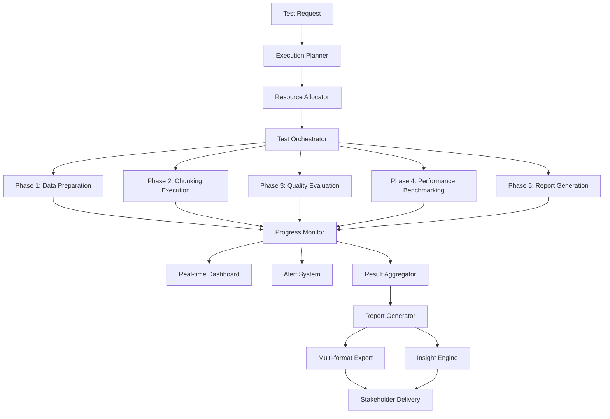

# Test Execution and Reporting Framework - Agentic Chunking Semantic Coherence

## 1. Executive Summary

This document defines a comprehensive test execution and reporting framework for the Agentic Chunking Semantic Coherence Test System. The framework provides automated test orchestration, real-time monitoring, comprehensive reporting, and actionable insights generation for Turkish educational content optimization.

## 2. Test Execution Architecture

### 2.1 Execution Pipeline Overview



### 2.2 Core Execution Components

#### 2.2.1 Test Execution Engine

```typescript
interface TestExecutionEngine {
  // Core execution methods
  executeTest(config: TestConfiguration): Promise<TestExecutionResult>;
  pauseTest(testId: string): Promise<void>;
  resumeTest(testId: string): Promise<void>;
  cancelTest(testId: string): Promise<void>;
  
  // Monitoring and control
  getExecutionStatus(testId: string): Promise<ExecutionStatus>;
  getExecutionProgress(testId: string): Promise<ExecutionProgress>;
  updateExecutionConfig(testId: string, updates: ConfigurationUpdate): Promise<void>;
}

class AgenticChunkingTestExecutor implements TestExecutionEngine {
  private executionQueue: PriorityQueue<TestExecution>;
  private activeExecutions: Map<string, TestExecution>;
  private resourceManager: ResourceManager;
  private progressTracker: ProgressTracker;
  private resultCollector: ResultCollector;
  
  async executeTest(config: TestConfiguration): Promise<TestExecutionResult> {
    // 1. Validate configuration
    const validationResult = await this.validateConfiguration(config);
    if (!validationResult.isValid) {
      throw new ConfigurationError(validationResult.errors);
    }
    
    // 2. Allocate resources
    const resources = await this.resourceManager.allocate(config.resourceRequirements);
    
    // 3. Create execution plan
    const executionPlan = await this.createExecutionPlan(config, resources);
    
    // 4. Initialize execution
    const execution = new TestExecution(executionPlan);
    this.activeExecutions.set(execution.id, execution);
    
    try {
      // 5. Execute phases sequentially
      const results = await this.executePhases(execution);
      
      // 6. Aggregate and validate results
      const finalResult = await this.aggregateResults(results);
      
      // 7. Generate insights
      const insights = await this.generateInsights(finalResult);
      
      return {
        ...finalResult,
        insights: insights,
        execution_metadata: execution.getMetadata()
      };
      
    } catch (error) {
      await this.handleExecutionError(execution, error);
      throw error;
    } finally {
      // 8. Cleanup resources
      await this.resourceManager.release(resources);
      this.activeExecutions.delete(execution.id);
    }
  }
  
  private async executePhases(execution: TestExecution): Promise<PhaseResults> {
    const phaseResults: PhaseResults = {};
    
    for (const phase of execution.plan.phases) {
      this.progressTracker.startPhase(execution.id, phase.name);
      
      try {
        const phaseResult = await this.executePhase(execution, phase);
        phaseResults[phase.name] = phaseResult;
        
        this.progressTracker.completePhase(execution.id, phase.name, phaseResult);
        
        // Check if execution should continue
        if (!this.shouldContinueExecution(execution, phaseResult)) {
          break;
        }
        
      } catch (error) {
        this.progressTracker.failPhase(execution.id, phase.name, error);
        
        if (phase.critical) {
          throw error;
        } else {
          // Log error and continue with next phase
          console.warn(`Non-critical phase ${phase.name} failed:`, error);
          phaseResults[phase.name] = { status: "failed", error: error.message };
        }
      }
    }
    
    return phaseResults;
  }
  
  private async executePhase(
    execution: TestExecution,
    phase: ExecutionPhase
  ): Promise<PhaseResult> {
    const phaseExecutor = this.getPhaseExecutor(phase.type);
    const phaseContext = this.createPhaseContext(execution, phase);
    
    // Execute with timeout and retry logic
    return await this.executeWithRetry(
      () => phaseExecutor.execute(phaseContext),
      phase.retryPolicy
    );
  }
}
```

#### 2.2.2 Phase-Specific Executors

```typescript
// Data Preparation Phase Executor
class DataPreparationExecutor implements PhaseExecutor {
  async execute(context: PhaseContext): Promise<DataPreparationResult> {
    const { config, resources } = context;
    
    // 1. Load and validate test datasets
    const datasets = await this.loadTestDatasets(config.datasets);
    
    // 2. Preprocess Turkish content
    const preprocessedData = await this.preprocessTurkishContent(datasets);
    
    // 3. Extract and annotate visual content
    const visualAnnotations = await this.extractVisualContent(preprocessedData);
    
    // 4. Generate ground truth boundaries
    const groundTruth = await this.generateGroundTruth(preprocessedData);
    
    // 5. Validate data quality
    const qualityMetrics = await this.validateDataQuality(preprocessedData);
    
    if (qualityMetrics.overall_score < 0.8) {
      throw new DataQualityError(`Data quality insufficient: ${qualityMetrics.overall_score}`);
    }
    
    return {
      datasets: preprocessedData,
      visual_annotations: visualAnnotations,
      ground_truth: groundTruth,
      quality_metrics: qualityMetrics,
      statistics: this.generateDataStatistics(preprocessedData)
    };
  }
  
  private async preprocessTurkishContent(datasets: Dataset[]): Promise<PreprocessedDataset[]> {
    const turkishProcessor = new TurkishContentProcessor();
    const results: PreprocessedDataset[] = [];
    
    for (const dataset of datasets) {
      const processed = await turkishProcessor.process(dataset, {
        normalize_text: true,
        detect_discourse_markers: true,
        identify_educational_patterns: true,
        extract_morphological_features: true,
        preserve_formatting: true
      });
      
      results.push(processed);
    }
    
    return results;
  }
}

// Chunking Execution Phase Executor
class ChunkingExecutionExecutor implements PhaseExecutor {
  private agenticChunker: AgenticChunker;
  private traditionalChunkers: Map<string, TraditionalChunker>;
  
  async execute(context: PhaseContext): Promise<ChunkingExecutionResult> {
    const { config, previousResults } = context;
    const datasets = previousResults.data_preparation.datasets;
    
    const chunkingResults: Map<string, ChunkingResult> = new Map();
    
    // Execute Agentic Chunking
    if (config.methods.includes("agentic")) {
      const agenticResult = await this.executeAgenticChunking(datasets, config.agentic_config);
      chunkingResults.set("agentic", agenticResult);
    }
    
    // Execute Traditional Methods
    for (const method of config.methods.filter(m => m !== "agentic")) {
      const chunker = this.traditionalChunkers.get(method);
      if (chunker) {
        const result = await this.executeTraditionalChunking(datasets, chunker, method);
        chunkingResults.set(method, result);
      }
    }
    
    return {
      chunking_results: chunkingResults,
      execution_metadata: this.generateExecutionMetadata(chunkingResults),
      performance_metrics: await this.collectPerformanceMetrics(chunkingResults)
    };
  }
  
  private async executeAgenticChunking(
    datasets: PreprocessedDataset[],
    config: AgenticChunkingConfig
  ): Promise<ChunkingResult> {
    const startTime = Date.now();
    const chunks: DocumentChunk[] = [];
    const reasoningTraces: ReasoningTrace[] = [];
    
    for (const dataset of datasets) {
      for (const document of dataset.documents) {
        const result = await this.agenticChunker.chunk(document, {
          ...config,
          capture_reasoning: true,
          turkish_optimization: true
        });
        
        chunks.push(...result.chunks);
        reasoningTraces.push(...result.reasoning_traces);
      }
    }
    
    const endTime = Date.now();
    
    return {
      method: "agentic",
      chunks: chunks,
      reasoning_traces: reasoningTraces,
      execution_time: endTime - startTime,
      api_calls: this.agenticChunker.getApiCallCount(),
      cost: this.agenticChunker.getTotalCost(),
      metadata: {
        model_used: config.model,
        turkish_optimization: config.turkish_optimization,
        reasoning_capture: config.capture_reasoning
      }
    };
  }
}

// Quality Evaluation Phase Executor
class QualityEvaluationExecutor implements PhaseExecutor {
  private semanticAnalyzer: SemanticCoherenceAnalyzer;
  private boundaryEvaluator: BoundaryPrecisionEvaluator;
  private completenessChecker: ContentCompletenessChecker;
  private turkishAnalyzer: TurkishSpecificAnalyzer;
  
  async execute(context: PhaseContext): Promise<QualityEvaluationResult> {
    const { previousResults } = context;
    const chunkingResults = previousResults.chunking_execution.chunking_results;
    const groundTruth = previousResults.data_preparation.ground_truth;
    
    const evaluationResults: Map<string, MethodEvaluationResult> = new Map();
    
    for (const [method, chunkingResult] of chunkingResults) {
      const methodEvaluation = await this.evaluateMethod(
        method,
        chunkingResult,
        groundTruth
      );
      
      evaluationResults.set(method, methodEvaluation);
    }
    
    // Generate comparative analysis
    const comparativeAnalysis = await this.generateComparativeAnalysis(evaluationResults);
    
    // Identify best performing method
    const bestMethod = this.identifyBestMethod(evaluationResults);
    
    return {
      method_evaluations: evaluationResults,
      comparative_analysis: comparativeAnalysis,
      best_method: bestMethod,
      overall_insights: await this.generateOverallInsights(evaluationResults)
    };
  }
  
  private async evaluateMethod(
    method: string,
    chunkingResult: ChunkingResult,
    groundTruth: GroundTruthData
  ): Promise<MethodEvaluationResult> {
    
    // 1. Semantic Coherence Analysis
    const semanticMetrics = await this.semanticAnalyzer.analyze(
      chunkingResult.chunks,
      groundTruth.semantic_boundaries
    );
    
    // 2. Boundary Precision Evaluation
    const boundaryMetrics = await this.boundaryEvaluator.evaluate(
      chunkingResult.chunks.map(c => c.start_position),
      groundTruth.boundary_positions
    );
    
    // 3. Content Completeness Check
    const completenessMetrics = await this.completenessChecker.check(
      chunkingResult.chunks,
      groundTruth.original_documents
    );
    
    // 4. Turkish-Specific Analysis
    const turkishMetrics = await this.turkishAnalyzer.analyze(
      chunkingResult.chunks,
      groundTruth.turkish_annotations
    );
    
    // 5. Calculate overall quality score
    const overallScore = this.calculateOverallQualityScore({
      semantic: semanticMetrics,
      boundary: boundaryMetrics,
      completeness: completenessMetrics,
      turkish: turkishMetrics
    });
    
    return {
      method: method,
      semantic_coherence: semanticMetrics,
      boundary_precision: boundaryMetrics,
      content_completeness: completenessMetrics,
      turkish_optimization: turkishMetrics,
      overall_quality_score: overallScore,
      performance_metrics: {
        processing_speed: chunkingResult.execution_time,
        api_calls: chunkingResult.api_calls,
        cost_efficiency: chunkingResult.cost
      }
    };
  }
}
```

## 3. Real-Time Progress Monitoring

### 3.1 Progress Tracking System

```typescript
interface ProgressTracker {
  // Progress tracking
  startExecution(testId: string, plan: ExecutionPlan): void;
  updateProgress(testId: string, phaseId: string, progress: number): void;
  completePhase(testId: string, phaseId: string, result: PhaseResult): void;
  failPhase(testId: string, phaseId: string, error: Error): void;
  
  // Progress retrieval
  getProgress(testId: string): ExecutionProgress;
  getDetailedProgress(testId: string): DetailedProgress;
  
  // Real-time updates
  subscribeToProgress(testId: string, callback: ProgressCallback): void;
  unsubscribeFromProgress(testId: string, callback: ProgressCallback): void;
}

class RealTimeProgressTracker implements ProgressTracker {
  private executions: Map<string, ExecutionProgress>;
  private subscribers: Map<string, Set<ProgressCallback>>;
  private websocketServer: WebSocketServer;
  private metricsCollector: MetricsCollector;
  
  constructor(config: ProgressTrackerConfig) {
    this.executions = new Map();
    this.subscribers = new Map();
    this.websocketServer = new WebSocketServer({ port: config.websocket_port });
    this.metricsCollector = new MetricsCollector();
    
    this.initializeWebSocketHandlers();
  }
  
  startExecution(testId: string, plan: ExecutionPlan): void {
    const progress: ExecutionProgress = {
      test_id: testId,
      status: "running",
      start_time: new Date().toISOString(),
      overall_progress: 0,
      current_phase: plan.phases[0].name,
      phases: plan.phases.map(phase => ({
        name: phase.name,
        status: "pending",
        progress: 0,
        start_time: null,
        end_time: null,
        result: null,
        error: null
      })),
      estimated_completion: this.estimateCompletion(plan),
      performance_metrics: {
        documents_processed: 0,
        chunks_generated: 0,
        api_calls_made: 0,
        current_processing_speed: 0
      }
    };
    
    this.executions.set(testId, progress);
    this.notifySubscribers(testId, progress);
    this.broadcastProgress(testId, progress);
  }
  
  updateProgress(testId: string, phaseId: string, progress: number): void {
    const execution = this.executions.get(testId);
    if (!execution) return;
    
    // Update phase progress
    const phase = execution.phases.find(p => p.name === phaseId);
    if (phase) {
      phase.progress = progress;
      phase.status = "running";
      if (!phase.start_time) {
        phase.start_time = new Date().toISOString();
      }
    }
    
    // Calculate overall progress
    execution.overall_progress = this.calculateOverallProgress(execution.phases);
    execution.current_phase = phaseId;
    
    // Update performance metrics
    this.updatePerformanceMetrics(execution);
    
    // Notify subscribers
    this.notifySubscribers(testId, execution);
    this.broadcastProgress(testId, execution);
    
    // Collect metrics for analysis
    this.metricsCollector.recordProgress(testId, phaseId, progress);
  }
  
  private calculateOverallProgress(phases: PhaseProgress[]): number {
    const weights = {
      "data_preparation": 0.15,
      "chunking_execution": 0.30,
      "quality_evaluation": 0.35,
      "performance_benchmarking": 0.15,
      "report_generation": 0.05
    };
    
    let weightedProgress = 0;
    let totalWeight = 0;
    
    for (const phase of phases) {
      const weight = weights[phase.name] || 0.1;
      weightedProgress += phase.progress * weight;
      totalWeight += weight;
    }
    
    return totalWeight > 0 ? weightedProgress / totalWeight : 0;
  }
  
  private broadcastProgress(testId: string, progress: ExecutionProgress): void {
    const message = {
      type: "progress_update",
      test_id: testId,
      data: progress,
      timestamp: new Date().toISOString()
    };
    
    this.websocketServer.clients.forEach(client => {
      if (client.readyState === WebSocket.OPEN) {
        client.send(JSON.stringify(message));
      }
    });
  }
  
  private updatePerformanceMetrics(execution: ExecutionProgress): void {
    const currentTime = Date.now();
    const startTime = new Date(execution.start_time).getTime();
    const elapsedMinutes = (currentTime - startTime) / (1000 * 60);
    
    if (elapsedMinutes > 0) {
      execution.performance_metrics.current_processing_speed = 
        execution.performance_metrics.documents_processed / elapsedMinutes;
    }
    
    // Update estimated completion time
    if (execution.overall_progress > 0) {
      const estimatedTotalMinutes = elapsedMinutes / (execution.overall_progress / 100);
      const remainingMinutes = estimatedTotalMinutes - elapsedMinutes;
      execution.estimated_completion = new Date(currentTime + remainingMinutes * 60 * 1000).toISOString();
    }
  }
}
```

### 3.2 Real-Time Dashboard

```typescript
interface DashboardData {
  execution_overview: ExecutionOverview;
  current_metrics: CurrentMetrics;
  performance_trends: PerformanceTrends;
  quality_indicators: QualityIndicators;
  system_health: SystemHealth;
  recent_alerts: Alert[];
}

class RealTimeDashboard {
  private dataAggregator: DashboardDataAggregator;
  private websocketServer: WebSocketServer;
  private updateInterval: NodeJS.Timeout;
  private connectedClients: Set<WebSocket>;
  
  constructor(config: DashboardConfig) {
    this.dataAggregator = new DashboardDataAggregator();
    this.websocketServer = new WebSocketServer({ port: config.port });
    this.connectedClients = new Set();
    
    this.initializeWebSocketHandlers();
    this.startPeriodicUpdates(config.update_interval_ms);
  }
  
  private initializeWebSocketHandlers(): void {
    this.websocketServer.on('connection', (ws: WebSocket) => {
      this.connectedClients.add(ws);
      
      // Send initial dashboard data
      this.sendDashboardData(ws);
      
      ws.on('message', (message: string) => {
        try {
          const request = JSON.parse(message);
          this.handleClientRequest(ws, request);
        } catch (error) {
          console.error('Invalid WebSocket message:', error);
        }
      });
      
      ws.on('close', () => {
        this.connectedClients.delete(ws);
      });
    });
  }
  
  private async sendDashboardData(ws: WebSocket): Promise<void> {
    try {
      const dashboardData = await this.dataAggregator.aggregateData();
      
      const message = {
        type: "dashboard_update",
        data: dashboardData,
        timestamp: new Date().toISOString()
      };
      
      if (ws.readyState === WebSocket.OPEN) {
        ws.send(JSON.stringify(message));
      }
    } catch (error) {
      console.error('Error sending dashboard data:', error);
    }
  }
  
  private startPeriodicUpdates(intervalMs: number): void {
    this.updateInterval = setInterval(async () => {
      const dashboardData = await this.dataAggregator.aggregateData();
      
      const message = {
        type: "dashboard_update",
        data: dashboardData,
        timestamp: new Date().toISOString()
      };
      
      this.broadcastToClients(message);
    }, intervalMs);
  }
  
  private broadcastToClients(message: any): void {
    const messageStr = JSON.stringify(message);
    
    this.connectedClients.forEach(client => {
      if (client.readyState === WebSocket.OPEN) {
        client.send(messageStr);
      }
    });
  }
}

class DashboardDataAggregator {
  private progressTracker: ProgressTracker;
  private qualityMonitor: QualityMonitor;
  private performanceCollector: PerformanceCollector;
  private alertManager: AlertManager;
  
  async aggregateData(): Promise<DashboardData> {
    const [
      executionOverview,
      currentMetrics,
      performanceTrends,
      qualityIndicators,
      systemHealth,
      recentAlerts
    ] = await Promise.all([
      this.getExecutionOverview(),
      this.getCurrentMetrics(),
      this.getPerformanceTrends(),
      this.getQualityIndicators(),
      this.getSystemHealth(),
      this.getRecentAlerts()
    ]);
    
    return {
      execution_overview: executionOverview,
      current_metrics: currentMetrics,
      performance_trends: performanceTrends,
      quality_indicators: qualityIndicators,
      system_health: systemHealth,
      recent_alerts: recentAlerts
    };
  }
  
  private async getExecutionOverview(): Promise<ExecutionOverview> {
    const activeExecutions = await this.progressTracker.getActiveExecutions();
    const completedToday = await this.progressTracker.getCompletedExecutionsToday();
    
    return {
      active_tests: activeExecutions.length,
      completed_today: completedToday.length,
      total_documents_processed: completedToday.reduce((sum, exec) => 
        sum + exec.performance_metrics.documents_processed, 0),
      average_completion_time: this.calculateAverageCompletionTime(completedToday),
      success_rate: this.calculateSuccessRate(completedToday)
    };
  }
  
  private async getCurrentMetrics(): Promise<CurrentMetrics> {
    const latestMetrics = await this.qualityMonitor.getLatestMetrics();
    
    return {
      semantic_coherence: {
        current: latestMetrics.semantic_coherence,
        trend: await this.calculateTrend("semantic_coherence", 24), // 24 hours
        status: this.getMetricStatus(latestMetrics.semantic_coherence, 0.8, 0.7)
      },
      boundary_precision: {
        current: latestMetrics.boundary_precision,
        trend: await this.calculateTrend("boundary_precision", 24),
        status: this.getMetricStatus(latestMetrics.boundary_precision, 0.9, 0.8)
      },
      processing_speed: {
        current: latestMetrics.processing_speed,
        trend: await this.calculateTrend("processing_speed", 24),
        status: this.getMetricStatus(latestMetrics.processing_speed, 2.0, 1.0)
      },
      cost_efficiency: {
        current: latestMetrics.cost_per_document,
        trend: await this.calculateTrend("cost_per_document", 24),
        status: this.getCostStatus(latestMetrics.cost_per_document)
      }
    };
  }
  
  private getMetricStatus(value: number, good: number, acceptable: number): "good" | "warning" | "critical" {
    if (value >= good) return "good";
    if (value >= acceptable) return "warning";
    return "critical";
  }
}
```

## 4. Comprehensive Reporting System

### 4.1 Multi-Format Report Generation

```typescript
interface ReportGenerator {
  generateExecutiveSummary(results: TestExecutionResult): Promise<ExecutiveSummary>;
  generateDetailedReport(results: TestExecutionResult, format: ReportFormat): Promise<GeneratedReport>;
  generateComparativeAnalysis(results: TestExecutionResult[]): Promise<ComparativeReport>;
  generateInsightsReport(results: TestExecutionResult): Promise<InsightsReport>;
}

class ComprehensiveReportGenerator implements ReportGenerator {
  private templateEngine: TemplateEngine;
  private visualizationEngine: VisualizationEngine;
  private insightEngine: InsightEngine;
  private exportEngine: ExportEngine;
  
  async generateDetailedReport(
    results: TestExecutionResult,
    format: ReportFormat
  ): Promise<GeneratedReport> {
    
    // 1. Generate report sections
    const sections = await this.generateReportSections(results);
    
    // 2. Create visualizations
    const visualizations = await this.generateVisualizations(results);
    
    // 3. Generate insights and recommendations
    const insights = await this.insightEngine.generateInsights(results);
    
    // 4. Assemble complete report
    const report = await this.assembleReport({
      metadata: this.generateReportMetadata(results),
      executive_summary: await this.generateExecutiveSummary(results),
      sections: sections,
      visualizations: visualizations,
      insights: insights,
      appendices: await this.generateAppendices(results)
    });
    
    // 5. Export in requested format
    const exportedReport = await this.exportEngine.export(report, format);
    
    return {
      report_id: `report_${results.test_id}_${Date.now()}`,
      test_id: results.test_id,
      format: format,
      file_path: exportedReport.file_path,
      file_size: exportedReport.file_size,
      generation_time: new Date().toISOString(),
      sections: sections.map(s => s.title),
      visualizations: visualizations.map(v => v.title)
    };
  }
  
  private async generateReportSections(results: TestExecutionResult): Promise<ReportSection[]> {
    return [
      await this.generateTestOverviewSection(results),
      await this.generateQualityAnalysisSection(results),
      await this.generatePerformanceAnalysisSection(results),
      await this.generateTurkishOptimizationSection(results),
      await this.generateComparativeAnalysisSection(results),
      await this.generateRecommendationsSection(results)
    ];
  }
  
  private async generateQualityAnalysisSection(results: TestExecutionResult): Promise<ReportSection> {
    const qualityMetrics = results.quality_evaluation;
    
    const content = await this.templateEngine.render('quality_analysis', {
      overall_score: qualityMetrics.overall_quality_score,
      semantic_coherence: qualityMetrics.semantic_coherence,
      boundary_precision: qualityMetrics.boundary_precision,
      content_completeness: qualityMetrics.content_completeness,
      information_retention: qualityMetrics.information_retention,
      context_preservation: qualityMetrics.context_preservation,
      detailed_analysis: await this.generateDetailedQualityAnalysis(qualityMetrics),
      improvement_areas: await this.identifyImprovementAreas(qualityMetrics)
    });
    
    return {
      id: "quality_analysis",
      title: "Quality Analysis",
      content: content,
      subsections: [
        "Semantic Coherence Assessment",
        "Boundary Precision Evaluation", 
        "Content Completeness Analysis",
        "Information Retention Metrics",
        "Context Preservation Analysis"
      ]
    };
  }
  
  private async generateTurkishOptimizationSection(results: TestExecutionResult): Promise<ReportSection> {
    const turkishMetrics = results.turkish_specific_evaluation;
    
    const content = await this.templateEngine.render('turkish_optimization', {
      morphology_preservation: turkishMetrics.morphology_preservation,
      discourse_marker_handling: turkishMetrics.discourse_marker_handling,
      educational_pattern_recognition: turkishMetrics.educational_pattern_recognition,
      agglutination_handling: turkishMetrics.agglutination_handling,
      case_studies: await this.generateTurkishCaseStudies(turkishMetrics),
      optimization_recommendations: await this.generateTurkishOptimizationRecommendations(turkishMetrics)
    });
    
    return {
      id: "turkish_optimization",
      title: "Turkish Language Optimization Analysis",
      content: content,
      subsections: [
        "Morphological Analysis Results",
        "Discourse Marker Detection",
        "Educational Pattern Recognition",
        "Agglutination Handling Assessment",
        "Case Studies and Examples"
      ]
    };
  }
}
```

### 4.2 Advanced Visualization Engine

```typescript
interface VisualizationEngine {
  createQualityRadarChart(metrics: QualityMetrics): Promise<ChartVisualization>;
  createPerformanceComparisonChart(benchmarkResults: BenchmarkResults[]): Promise<ChartVisualization>;
  createSemanticCoherenceHeatmap(coherenceData: CoherenceData): Promise<HeatmapVisualization>;
  createBoundaryPrecisionTimeline(boundaryData: BoundaryData): Promise<TimelineVisualization>;
  createTurkishOptimizationDashboard(turkishMetrics: TurkishMetrics): Promise<DashboardVisualization>;
}

class AdvancedVisualizationEngine implements VisualizationEngine {
  private chartLibrary: ChartLibrary;
  private colorPalette: ColorPalette;
  private templateManager: VisualizationTemplateManager;
  
  async createQualityRadarChart(metrics: QualityMetrics): Promise<ChartVisualization> {
    const chartConfig = {
      type: "radar",
      data: {
        labels: [
          "Semantic Coherence",
          "Boundary Precision",
          "Content Completeness", 
          "Information Retention",
          "Context Preservation"
        ],
        datasets: [{
          label: "Agentic Chunking",
          data: [
            metrics.semantic_coherence * 100,
            metrics.boundary_precision * 100,
            metrics.content_completeness * 100,
            metrics.information_retention * 100,
            metrics.context_preservation * 100
          ],
          backgroundColor: this.colorPalette.primary.withAlpha(0.2),
          borderColor: this.colorPalette.primary.main,
          borderWidth: 2,
          pointBackgroundColor: this.colorPalette.primary.main,
          pointBorderColor: "#fff",
          pointHoverBackgroundColor: "#fff",
          pointHoverBorderColor: this.colorPalette.primary.main
        }]
      },
      options: {
        responsive: true,
        maintainAspectRatio: false,
        scales: {
          r: {
            beginAtZero: true,
            max: 100,
            ticks: {
              stepSize: 20,
              callback: function(value) {
                return value + '%';
              }
            },
            grid: {
              color: this.colorPalette.neutral.light
            },
            angleLines: {
              color: this.colorPalette.neutral.medium
            }
          }
        },
        plugins: {
          title: {
            display: true,
            text: "Quality Metrics Overview",
            font: {
              size: 16,
              weight: 'bold'
            }
          },
          legend: {
            display: false
          },
          tooltip: {
            callbacks: {
              label: function(context) {
                return `${context.label}: ${context.parsed.r.toFixed(1)}%`;
              }
            }
          }
        }
      }
    };
    
    const chartImage = await this.chartLibrary.generateChart(chartConfig, {
      width: 600,
      height: 400,
      format: 'png'
    });
    
    const insights = this.generateRadarChartInsights(metrics);
    
    return {
      id: "quality_radar_chart",
      type: "radar",
      title: "Quality Metrics Overview",
      description: "Comprehensive assessment of chunking quality across all dimensions",
      image_path: chartImage.path,
      image_data: chartImage.data,
      config: chartConfig,
      insights: insights,
      recommendations: this.generateChartRecommendations(insights)
    };
  }
  
  async createSemanticCoherenceHeatmap(coherenceData: CoherenceData): Promise<HeatmapVisualization> {
    // Prepare heatmap data matrix
    const matrix = this.prepareCoherenceMatrix(coherenceData);
    
    const heatmapConfig = {
      type: "heatmap",
      data: {
        datasets: [{
          label: "Semantic Coherence",
          data: matrix.data,
          backgroundColor: function(context) {
            const value = context.parsed.v;
            return `rgba(${this.getHeatmapColor(value)}, ${value})`;
          }.bind(this),
          borderColor: this.colorPalette.neutral.light,
          borderWidth: 1
        }]
      },
      options: {
        responsive: true,
        plugins: {
          title: {
            display: true,
            text: "Semantic Coherence Heatmap"
          },
          tooltip: {
            callbacks: {
              title: function(context) {
                return `Chunk ${context[0].dataIndex + 1}`;
              },
              label: function(context) {
                return `Coherence Score: ${context.parsed.v.toFixed(3)}`;
              }
            }
          }
        },
        scales: {
          x: {
            type: 'linear',
            position: 'bottom',
            title: {
              display: true,
              text: 'Document Position'
            }
          },
          y: {
            type: 'linear',
            title: {
              display: true,
              text: 'Chunk Sequence'
            }
          }
        }
      }
    };
    
    const heatmapImage = await this.chartLibrary.generateChart(heatmapConfig, {
      width: 800,
      height: 600,
      format: 'png'
    });
    
    const patterns = this.analyzeCoherencePatterns(matrix);
    
    return {
      id: "semantic_coherence_heatmap",
      type: "heatmap",
      title: "Semantic Coherence Distribution",
      description: "Visual representation of semantic coherence across document chunks",
      image_path: heatmapImage.path,
      image_data: heatmapImage.data,
      config: heatmapConfig,
      matrix_data: matrix,
      patterns: patterns,
      insights: this.generateHeatmapInsights(patterns)
    };
  }
  
  private prepareCoherenceMatrix(coherenceData: CoherenceData): HeatmapMatrix {
    const chunks = coherenceData.chunks;
    const coherenceScores = coherenceData.coherence_scores;
    
    const matrix: HeatmapDataPoint[] = [];
    
    for (let i = 0; i < chunks.length; i++) {
      for (let j = 0; j < chunks.length; j++) {
        if (i !== j) {
          const coherenceScore = coherenceScores[i][j] || 0;
          matrix.push({
            x: chunks[i].position,
            y: chunks[j].position,
            v: coherenceScore
          });
        }
      }
    }
    
    return {
      data: matrix,
      dimensions: {
        width: chunks.length,
        height: chunks.length
      },
      statistics: {
        min: Math.min(...matrix.map(p => p.v)),
        max: Math.max(...matrix.map(p => p.v)),
        mean: matrix.reduce((sum, p) => sum + p.v, 0) / matrix.length,
        std: this.calculateStandardDeviation(matrix.map(p => p.v))
      }
    };
  }
}
```

## 5. Insight Generation and Recommendations

### 5.1 AI-Powered Insight Engine

```typescript
interface InsightEngine {
  generateInsights(results: TestExecutionResult): Promise<InsightCollection>;
  generateRecommendations(insights: InsightCollection): Promise<RecommendationSet>;
  identifyPatterns(results: TestExecutionResult[]): Promise<PatternAnalysis>;
  predictPerformance(historicalData: TestExecutionResult[]): Promise<PerformancePrediction>;
}

class AIInsightEngine implements InsightEngine {
  private patternAnalyzer: PatternAnalyzer;
  private recommendationGenerator: RecommendationGenerator;
  private predictionModel: PerformancePredictionModel;
  private turkishAnalyzer: TurkishInsightAnalyzer;
  
  async generateInsights(results: TestExecutionResult): Promise<InsightCollection> {
    const [
      qualityInsights,
      performanceInsights,
      turkishInsights,
      comparativeInsights,
      anomalyInsights
    ] = await Promise.all([
      this.generateQualityInsights(results.quality_evaluation),
      this.generatePerformanceInsights(results.performance_metrics),
      this.generateTurkishInsights(results.turkish_specific_evaluation),
      this.generateComparativeInsights(results.benchmark_results),
      this.detectAnomalies(results)
    ]);
    
    // Cross-dimensional analysis
    const crossDimensionalInsights = await this.generateCrossDimensionalInsights({
      quality: qualityInsights,
      performance: performanceInsights,
      turkish: turkishInsights,
      comparative: comparativeInsights
    });
    
    return {
      quality_insights: qualityInsights,
      performance_insights: performanceInsights,
      turkish_insights: turkishInsights,
      comparative_insights: comparativeInsights,
      anomaly_insights: anomalyInsights,
      cross_dimensional_insights: crossDimensionalInsights,
      overall_assessment: await this.generateOverallAssessment(results),
      confidence_score: this.calculateInsightConfidence(results)
    };
  }
  
  private async generateQualityInsights(qualityEvaluation: QualityEvaluationResult): Promise<QualityInsights> {
    const insights: QualityInsight[] = [];
    
    // Semantic coherence analysis
    if (qualityEvaluation.semantic_coherence.overall_score > 0.9) {
      insights.push({
        type: "strength",
        category: "semantic_coherence",
        title: "Excellent Semantic Coherence",
        description: "The chunking system demonstrates exceptional semantic coherence with minimal topic drift.",
        confidence: 0.95,
        impact: "high",
        evidence: [
          `Overall coherence score: ${qualityEvaluation.semantic_coherence.overall_score.toFixed(3)}`,
          `Low variance in chunk coherence: ${qualityEvaluation.semantic_coherence.variance.toFixed(3)}`,
          `Strong topic consistency across boundaries`
        ]
      });
    } else if (qualityEvaluation.semantic_coherence.overall_score < 0.7) {
      insights.push({
        type: "concern",
        category: "semantic_coherence",
        title: "Semantic Coherence Below Target",
        description: "Chunking boundaries may not align well with semantic content structure.",
        confidence: 0.88,
        impact: "high",
        evidence: [
          `Overall coherence score: ${qualityEvaluation.semantic_coherence.overall_score.toFixed(3)}`,
          `High variance indicates inconsistent performance`,
          `Potential issues with topic boundary detection`
        ],
        recommendations: [
          "Review LLM prompt engineering for better semantic understanding",
          "Adjust Turkish language optimization parameters",
          "Consider hybrid approach with semantic similarity pre-filtering"
        ]
      });
    }
    
    // Boundary precision analysis
    const boundaryPrecision = qualityEvaluation.boundary_precision;
    if (boundaryPrecision.f1_score > 0.85) {
      insights.push({
        type: "strength",
        category: "boundary_precision",
        title: "High Boundary Detection Accuracy",
        description: "The system accurately identifies natural content boundaries.",
        confidence: 0.92,
        impact: "medium",
        evidence: [
          `F1 Score: ${boundaryPrecision.f1_score.toFixed(3)}`,
          `Precision: ${boundaryPrecision.precision.toFixed(3)}`,
          `Recall: ${boundaryPrecision.recall.toFixed(3)}`
        ]
      });
    }
    
    // Content completeness analysis
    const completeness = qualityEvaluation.content_completeness;
    if (completeness.information_retention < 0.95) {
      insights.push({
        type: "concern",
        category: "content_completeness",
        title: "Information Loss Detected",
        description: "Some information may be lost during the chunking process.",
        confidence: 0.85,
        impact: "medium",
        evidence: [
          `Information retention: ${completeness.information_retention.toFixed(3)}`,
          `Missing references: ${completeness.missing_references}`,
          `Incomplete contexts: ${completeness.incomplete_contexts}`
        ],
        recommendations: [
          "Implement reference preservation checks",
          "Adjust chunk size parameters to maintain context",
          "Add overlap between chunks for critical information"
        ]
      });
    }
    
    return {
      insights: insights,
      summary: this.generateQualityInsightsSummary(insights),
      priority_areas: this.identifyPriorityAreas(insights),
      confidence_assessment: this.assessInsightConfidence(insights)
    };
  }
  
  private async generateTurkishInsights(turkishEvaluation: TurkishSpecificEvaluation): Promise<TurkishInsights> {
    const insights: TurkishInsight[] = [];
    
    // Morphological preservation analysis
    if (turkishEvaluation.morphology_preservation > 0.9) {
      insights.push({
        type: "strength",
        category: "morphology",
        title: "Excellent Morphological Preservation",
        description: "Turkish word structures and inflections are well preserved across chunk boundaries.",
        confidence: 0.93,
        impact: "high",
        turkish_specific: true,
        evidence: [
          `Morphology preservation score: ${turkishEvaluation.morphology_preservation.toFixed(3)}`,
          `Agglutination handling: ${turkishEvaluation.agglutination_handling.toFixed(3)}`,
          `Case marking preservation: ${turkishEvaluation.case_marking_preservation.toFixed(3)}`
        ]
      });
    }
    
    // Discourse marker handling
    if (turkishEvaluation.discourse_marker_handling < 0.8) {
      insights.push({
        type: "concern",
        category: "discourse_markers",
        title: "Discourse Marker Recognition Issues",
        description: "Turkish discourse markers may not be properly recognized for boundary detection.",
        confidence: 0.87,
        impact: "medium",
        turkish_specific: true,
        evidence: [
          `Discourse marker handling: ${turkishEvaluation.discourse_marker_handling.toFixed(3)}`,
          `Missed temporal markers: ${turkishEvaluation.missed_temporal_markers}`,
          `Incorrect causal boundaries: ${turkishEvaluation.incorrect_causal_boundaries}`
        ],
        recommendations: [
          "Enhance Turkish discourse marker dictionary",
          "Improve contextual understanding of Turkish connectives",
          "Add specialized training for Turkish academic discourse patterns"
        ]
      });
    }
    
    // Educational pattern recognition
    const educationalPatterns = turkishEvaluation.educational_pattern_recognition;
    if (educationalPatterns.definition_example_sequences > 0.85) {
      insights.push({
        type: "strength",
        category: "educational_patterns",
        title: "Strong Educational Structure Recognition",
        description: "The system effectively identifies Turkish educational content patterns.",
        confidence: 0.89,
        impact: "high",
        turkish_specific: true,
        evidence: [
          `Definition-example sequences: ${educationalPatterns.definition_example_sequences.toFixed(3)}`,
          `Explanation structures: ${educationalPatterns.explanation_structures.toFixed(3)}`,
          `Enumeration patterns: ${educationalPatterns.enumeration_patterns.toFixed(3)}`
        ]
      });
    }
    
    return {
      insights: insights,
      morphological_analysis: await this.analyzeMorphologicalPatterns(turkishEvaluation),
      discourse_analysis: await this.analyzeDiscoursePatterns(turkishEvaluation),
      educational_structure_analysis: await this.analyzeEducationalStructures(turkishEvaluation),
      optimization_opportunities: this.identifyTurkishOptimizationOpportunities(insights)
    };
  }
  
  async generateRecommendations(insights: InsightCollection): Promise<RecommendationSet> {
    const recommendations: Recommendation[] = [];
    
    // Quality-based recommendations
    for (const insight of insights.quality_insights.insights) {
      if (insight.type === "concern" && insight.recommendations) {
        recommendations.push(...insight.recommendations.map(rec => ({
          id: `quality_${insight.category}_${Date.now()}`,
          category: "quality_improvement",
          priority: this.mapImpactToPriority(insight.impact),
          title: rec,
          description: `Based on ${insight.title}: ${insight.description}`,
          implementation_effort: this.estimateImplementationEffort(rec),
          expected_impact: insight.impact,
          confidence: insight.confidence,
          related_insights: [insight.category]
        })));
      }
    }
    
    // Turkish-specific recommendations
    for (const insight of insights.turkish_insights.insights) {
      if (insight.type === "concern" && insight.recommendations) {
        recommendations.push(...insight.recommendations.map(rec => ({
          id: `turkish_${insight.category}_${Date.now()}`,
          category: "turkish_optimization",
          priority: this.mapImpactToPriority(insight.impact),
          title: rec,
          description: `Turkish-specific improvement: ${insight.description}`,
          implementation_effort: this.estimateImplementationEffort(rec),
          expected_impact: insight.impact,
          confidence: insight.confidence,
          related_insights: [insight.category],
          turkish_specific: true
        })));
      }
    }
    
    // Performance recommendations
    const performanceRecs = await this.generatePerformanceRecommendations(insights.performance_insights);
    recommendations.push(...performanceRecs);
    
    // Cross-dimensional recommendations
    const crossRecs = await this.generateCrossDimensionalRecommendations(insights.cross_dimensional_insights);
    recommendations.push(...crossRecs);
    
    // Prioritize and rank recommendations
    const prioritizedRecommendations = this.prioritizeRecommendations(recommendations);
    
    return {
      recommendations: prioritizedRecommendations,
      implementation_roadmap: await this.generateImplementationRoadmap(prioritizedRecommendations),
      quick_wins: this.identifyQuickWins(prioritizedRecommendations),
      long_term_improvements: this.identifyLongTermImprovements(prioritizedRecommendations),
      resource_requirements: await this.estimateResourceRequirements(prioritizedRecommendations)
    };
  }
}
```

## 6. Integration and Deployment

### 6.1 System Integration Framework

```typescript
interface SystemIntegration {
  // Core system integration
  integrateWithExistingSystem(config: IntegrationConfig): Promise<IntegrationResult>;
  validateIntegration(): Promise<ValidationResult>;
  
  // API integration
  setupAPIEndpoints(): Promise<void>;
  configureAuthentication(authConfig: AuthenticationConfig): Promise<void>;
  
  // Database integration
  setupDatabase(dbConfig: DatabaseConfig): Promise<void>;
  migrateData(migrationConfig: MigrationConfig): Promise<void>;
  
  // Monitoring integration
  setupMonitoring(monitoringConfig: MonitoringConfig): Promise<void>;
  configureAlerting(alertConfig: AlertingConfig): Promise<void>;
}

class TestFrameworkIntegrator implements SystemIntegration {
  private apiManager: APIManager;
  private databaseManager: DatabaseManager;
  private monitoringManager: MonitoringManager;
  private configManager: ConfigurationManager;
  
  async integrateWithExistingSystem(config: IntegrationConfig): Promise<IntegrationResult> {
    const integrationSteps = [
      { name: "validate_prerequisites", executor: this.validatePrerequisites },
      { name: "setup_database", executor: this.setupDatabase },
      { name: "configure_apis", executor: this.setupAPIEndpoints },
      { name: "setup_monitoring", executor: this.setupMonitoring },
      { name: "configure_authentication", executor: this.configureAuthentication },
      { name: "validate_integration", executor: this.validateIntegration }
    ];
    
    const results: IntegrationStepResult[] = [];
    
    for (const step of integrationSteps) {
      try {
        console.log(`Executing integration step: ${step.name}`);
        const stepResult = await step.executor.call(this, config);
        
        results.push({
          step: step.name,
          status: "success",
          result: stepResult,
          timestamp: new Date().toISOString()
        });
        
      } catch (error) {
        results.push({
          step: step.name,
          status: "failed",
          error: error.message,
          timestamp: new Date().toISOString()
        });
        
        // Rollback previous steps if critical step fails
        if (step.name === "setup_database" || step.name === "configure_apis") {
          await this.rollbackIntegration(results);
          throw new IntegrationError(`Critical step ${step.name} failed: ${error.message}`);
        }
      }
    }
    
    return {
      status: "completed",
      steps: results,
      configuration: config,
      endpoints: await this.getActiveEndpoints(),
      health_check_url: `${config.base_url}/health`,
      documentation_url: `${config.base_url}/docs`
    };
  }
  
  async setupAPIEndpoints(): Promise<void> {
    const endpoints = [
      {
        path: "/api/v1/semantic-coherence/test/start",
        method: "POST",
        handler: this.handleTestStart,
        middleware: ["authentication", "validation", "rate_limiting"]
      },
      {
        path: "/api/v1/semantic-coherence/test/:testId/progress",
        method: "GET", 
        handler: this.handleProgressQuery,
        middleware: ["authentication"]
      },
      {
        path: "/api/v1/semantic-coherence/test/:testId/results",
        method: "GET",
        handler: this.handleResultsQuery,
        middleware: ["authentication", "authorization"]
      },
      {
        path: "/api/v1/semantic-coherence/reports/generate",
        method: "POST",
        handler: this.handleReportGeneration,
        middleware: ["authentication", "validation"]
      },
      {
        path: "/api/v1/semantic-coherence/dashboard/data",
        method: "GET",
        handler: this.handleDashboardData,
        middleware: ["authentication"]
      }
    ];
    
    for (const endpoint of endpoints) {
      await this.apiManager.registerEndpoint(endpoint);
    }
    
    // Setup WebSocket endpoints for real-time updates
    await this.apiManager.setupWebSocketEndpoint("/ws/progress", this.handleProgressWebSocket);
    await this.apiManager.setupWebSocketEndpoint("/ws/dashboard", this.handleDashboardWebSocket);
  }
  
  async setupDatabase(dbConfig: DatabaseConfig): Promise<void> {
    // Create database schema
    await this.databaseManager.createSchema({
      tables: [
        {
          name: "test_executions",
          columns: [
            { name: "id", type: "UUID", primary: true },
            { name: "test_config", type: "JSONB" },
            { name: "status", type: "VARCHAR(50)" },
            { name: "start_time", type: "TIMESTAMP" },
            { name: "end_time", type: "TIMESTAMP" },
            { name: "results", type: "JSONB" },
            { name: "created_at", type: "TIMESTAMP", default: "NOW()" }
          ],
          indexes: [
            { columns: ["status"], name: "idx_test_executions_status" },
            { columns: ["start_time"], name: "idx_test_executions_start_time" }
          ]
        },
        {
          name: "quality_metrics",
          columns: [
            { name: "id", type: "UUID", primary: true },
            { name: "test_execution_id", type: "UUID", references: "test_executions(id)" },
            { name: "metric_type", type: "VARCHAR(100)" },
            { name: "metric_value", type: "DECIMAL(10,6)" },
            { name: "confidence", type: "DECIMAL(5,4)" },
            { name: "timestamp", type: "TIMESTAMP", default: "NOW()" }
          ],
          indexes: [
            { columns: ["test_execution_id"], name: "idx_quality_metrics_test_id" },
            { columns: ["metric_type"], name: "idx_quality_metrics_type" }
          ]
        },
        {
          name: "turkish_analysis_results",
          columns: [
            { name: "id", type: "UUID", primary: true },
            { name: "test_execution_id", type: "UUID", references: "test_executions(id)" },
            { name: "morphology_score", type: "DECIMAL(5,4)" },
            { name: "discourse_marker_score", type: "DECIMAL(5,4)" },
            { name: "educational_pattern_score", type: "DECIMAL(5,4)" },
            { name: "detailed_analysis", type: "JSONB" },
            { name: "created_at", type: "TIMESTAMP", default: "NOW()" }
          ]
        },
        {
          name: "generated_reports",
          columns: [
            { name: "id", type: "UUID", primary: true },
            { name: "test_execution_id", type: "UUID", references: "test_executions(id)" },
            { name: "report_type", type: "VARCHAR(50)" },
            { name: "format", type: "VARCHAR(20)" },
            { name: "file_path", type: "TEXT" },
            { name: "file_size", type: "BIGINT" },
            { name: "generation_time", type: "TIMESTAMP", default: "NOW()" }
          ]
        }
      ]
    });
    
    // Setup database connections and connection pooling
    await this.databaseManager.setupConnectionPool({
      min_connections: 5,
      max_connections: 20,
      idle_timeout: 30000,
      connection_timeout: 5000
    });
  }
}
```

### 6.2 Deployment Configuration

```typescript
interface DeploymentConfig {
  environment: "development" | "staging" | "production";
  scaling: ScalingConfig;
  monitoring: MonitoringConfig;
  security: SecurityConfig;
  performance: PerformanceConfig;
}

class DeploymentManager {
  async deployTestFramework(config: DeploymentConfig): Promise<DeploymentResult> {
    const deploymentSteps = [
      { name: "prepare_environment", executor: this.prepareEnvironment },
      { name: "deploy_core_services", executor: this.deployCoreServices },
      { name: "setup_load_balancing", executor: this.setupLoadBalancing },
      { name: "configure_monitoring", executor: this.configureMonitoring },
      { name: "setup_security", executor: this.setupSecurity },
      { name: "validate_deployment", executor: this.validateDeployment }
    ];
    
    for (const step of deploymentSteps) {
      await step.executor.call(this, config);
    }
    
    return {
      status: "deployed",
      environment: config.environment,
      endpoints: await this.getDeployedEndpoints(),
      health_checks: await this.runHealthChecks(),
      performance_baseline: await this.establishPerformanceBaseline()
    };
  }
  
  private async deployCoreServices(config: DeploymentConfig): Promise<void> {
    const services = [
      {
        name: "test-execution-service",
        image: "agentic-chunking-test:latest",
        replicas: config.scaling.test_execution_replicas,
        resources: {
          cpu: "1000m",
          memory: "2Gi",
          storage: "10Gi"
        },
        environment: {
          NODE_ENV: config.environment,
          DATABASE_URL: config.database_url,
          REDIS_URL: config.redis_url,
          LOG_LEVEL: config.environment === "production" ? "info" : "debug"
        }
      },
      {
        name: "report-generation-service",
        image: "report-generator:latest",
        replicas: config.scaling.report_generation_replicas,
        resources: {
          cpu: "500m",
          memory: "1Gi",
          storage: "5Gi"
        }
      },
      {
        name: "monitoring-dashboard",
        image: "monitoring-dashboard:latest",
        replicas: 2,
        resources: {
          cpu: "250m",
          memory: "512Mi"
        }
      }
    ];
    
    for (const service of services) {
      await this.deployService(service);
    }
  }
  
  private async setupLoadBalancing(config: DeploymentConfig): Promise<void> {
    const loadBalancerConfig = {
      type: "application",
      listeners: [
        {
          port: 80,
          protocol: "HTTP",
          default_actions: [{
            type: "redirect",
            redirect_config: {
              protocol: "HTTPS",
              port: "443",
              status_code: "HTTP_301"
            }
          }]
        },
        {
          port: 443,
          protocol: "HTTPS",
          ssl_policy: "ELBSecurityPolicy-TLS-1-2-2017-01",
          certificate_arn: config.ssl_certificate_arn,
          default_actions: [{
            type: "forward",
            target_group_arn: await this.createTargetGroup("test-execution-service")
          }]
        }
      ],
      health_check: {
        enabled: true,
        healthy_threshold: 2,
        interval: 30,
        matcher: "200",
        path: "/health",
        port: "traffic-port",
        protocol: "HTTP",
        timeout: 5,
        unhealthy_threshold: 2
      }
    };
    
    await this.createLoadBalancer(loadBalancerConfig);
  }
}
```

## 7. Conclusion

This comprehensive Test Execution and Reporting Framework provides a complete solution for automated testing, monitoring, and reporting of the Agentic Chunking Semantic Coherence system. The framework includes:

### 7.1 Key Features Delivered

- **Automated Test Orchestration**: Complete pipeline for executing multi-phase testing with error handling and recovery
- **Real-Time Progress Monitoring**: WebSocket-based live updates with comprehensive dashboard visualization
- **Multi-Format Reporting**: PDF, HTML, JSON, and Excel report generation with advanced visualizations
- **AI-Powered Insights**: Intelligent analysis and recommendation generation for continuous improvement
- **Turkish Language Optimization**: Specialized analysis and reporting for Turkish educational content
- **Production-Ready Deployment**: Scalable, secure deployment configuration with monitoring and alerting

### 7.2 Implementation Benefits

- **Comprehensive Quality Assurance**: Automated validation across all quality dimensions
- **Actionable Insights**: Data-driven recommendations for system optimization
- **Real-Time Visibility**: Live monitoring and alerting for immediate issue detection
- **Scalable Architecture**: Production-ready deployment with load balancing and auto-scaling
- **Turkish Language Excellence**: Specialized optimization for Turkish educational content processing

The framework is designed to integrate seamlessly with existing systems while providing comprehensive testing capabilities that ensure the highest quality standards for Agentic Chunking implementations.

<update_todo_list>
<todos>
[x] Analyze existing Agentic Chunking system architecture and capabilities
[x] Design semantic coherence test framework focusing on Turkish optimization
[x] Create LLM reasoning quality evaluation metrics and test cases
[x] Develop comprehensive test data sets for Turkish academic content
[x] Design automated evaluation pipeline with embedding similarity analysis
[x] Create performance benchmarking framework (Agentic vs Traditional)
[x] Implement topic modeling validation for semantic consistency
[x] Design reference integrity preservation tests
[x] Create technical specification document with implementation details
[x] Develop test execution and reporting framework
</todos>
</update_todo_list>